# FAB Assistant 고도화 — As-Is → To-Be

`feat/adv_integrate`에 병합한 4개 브랜치의 변경 내용과, 이후 확장한 15분 주기 FAB 데이터 시뮬레이션을 정리한다. 각 영역을 펼치면 변경 전후 흐름, 구현 차이, 동작 예시, 검증 범위를 확인할 수 있다.

**전체 변화:** 질문에 맞는 Agent를 호출하고 결과를 보여주는 구조에서, **질문의 조건을 계획에 명시하고 → 실제 데이터와 문서로 검증하고 → 부족한 근거를 복구하고 → 사용자가 답변과 근거를 함께 확인하는 구조**로 강화했다.

| 영역 | As-Is | To-Be | 브랜치 / 병합 PR |
|---|---|---|---|
| Planner + Supervisor | 질문 유형과 Agent 경로 중심의 계획, 오류·검토 실패 중심 복구 | 대상·기간·답변 요건을 구조화하고, 성공 결과도 검토하며 후속 근거까지 갱신 | `fix/adv_pl_sp` · [#11](https://github.com/gaaaaaaang/master_pjt/pull/11) |
| RAG | 로컬 어휘 검색 또는 Milvus 벡터 검색, 검색 청크를 답변 근거로 전달 | 구조 보존 청크 + 하이브리드 검색 + 재정렬 + 원문 인용·주장 검증 | `fix/rag_adv` · [#8](https://github.com/gaaaaaaang/master_pjt/pull/8) |
| Text2SQL | 코드 중심 스키마·규칙과 LLM SQL 생성·검증 | 공통 메타 탐색 → 의미 계획 → 계획 검증 → SQL 생성 → SQL과 계획 대조 | `fix/adv_t2s` · [#9](https://github.com/gaaaaaaang/master_pjt/pull/9), [#10](https://github.com/gaaaaaaang/master_pjt/pull/10) |
| 화면 | 실행 로그·평가·원본 응답이 크게 노출되는 화면 | 답변·차트·표 우선, 근거와 실행 내역은 필요할 때 펼치는 작업 화면 | `fix/frontend_adv` · [#7](https://github.com/gaaaaaaang/master_pjt/pull/7) |
| 데이터 시뮬레이션 | 원천 데이터와 구간별 시뮬레이션 스냅샷 중심 | 15분마다 FAB별 페르소나·이전 상태를 반영한 raw event 누적 | PR 이후 확장 · 현재 로컬 구현 및 활성 적재 예약 |

1~4절의 비교 기준은 고도화 PR 병합 전 통합 브랜치 `d0953ff`와 4개 브랜치 병합 완료 시점 `4ebf833`이다. 브랜치별 출발점과 평가 시점은 달라서 아래 검증 수치에 별도로 표시했다. 문서 작성일은 2026-09-09이며, 1~4절에는 현재 작업 폴더의 미커밋 수정을 포함하지 않는다. 5절의 데이터 시뮬레이션은 사용자 요청에 따라 현재 로컬 구현과 활성 예약 설정까지 확인해 추가한 별도 확장 내용이다. 4개 브랜치이지만 Text2SQL 산출물 보완 PR이 있어 병합 PR은 총 5개다.

<strong>1. Planner + Supervisor — 실행 경로 중심에서, 질문 요건과 실제 근거를 관리하는 실행 제어로</strong>

### 핵심 변화

기존에도 Planner, 계획 승인, 동적 Dispatcher, Agent Reflection, 제한된 재시도·재계획, 최종 답변 검증은 있었다. 이번 변경은 이 구조에 **“무엇을 충족해야 답할 수 있는가”라는 명시적 계약과 “지금 유효한 근거는 무엇인가”라는 실행 상태 관리**를 추가한 것이다.

### As-Is 흐름

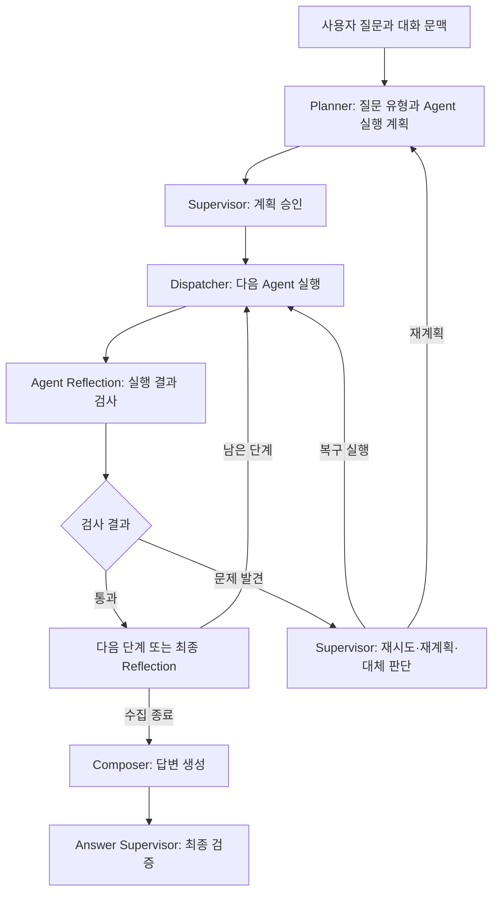

**보완이 필요했던 지점:** 실행 성공과 질문 충족은 다르다. SQL이 정상 실행되어도 요청한 FAB·제품·기간을 놓칠 수 있고, 상위 SQL을 다시 조회했을 때 이전 검색·계산·차트가 함께 남을 수 있다. Planner와 Text2SQL의 조건 해석도 더 일관되게 연결할 필요가 있었다.

### To-Be 흐름

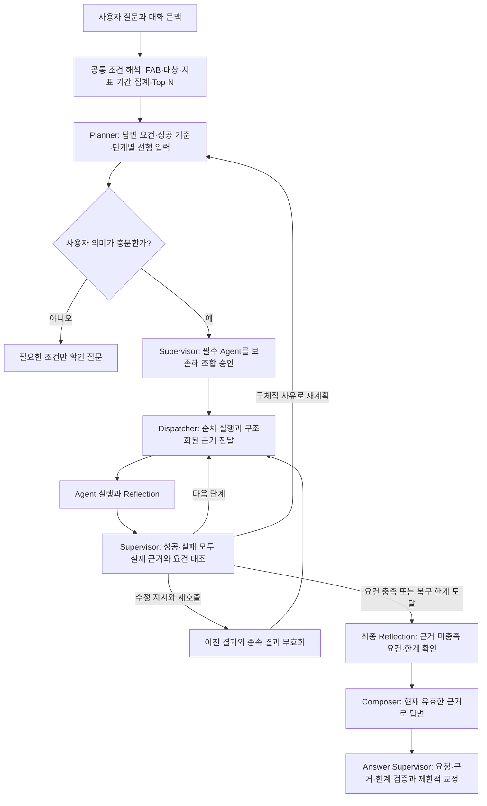

복구 한계에 도달한 응답은 미충족 요건과 제한사항을 포함한다. Supervisor의 조기 `compose` 선택으로 미해결 요건을 건너뛰는 것은 차단한다.

### 상세 비교

| 항목 | As-Is | To-Be |
|---|---|---|
| 질문 해석 | 질문 유형·의도·FAB·Agent 선택 중심 | `IntentAnalysis`에 복수 제품/설비, 공정·라인, 지표, 날짜 기준, 집계 단위, 임계값, Top-N 등을 구조화 |
| 조건의 출처 | Planner와 SQL의 해석을 맞추는 계약이 상대적으로 약함 | 공통 파서를 사용하고, LLM 보완 값에는 원문 구간을 요구. 파서가 확정한 값의 임의 덮어쓰기 차단 |
| 실행 계획 | Agent별 작업·필수 여부·선택 이유 | `answer_requirements`, `success_criteria`, `depends_on`, `input_requirements`로 답변 요건과 선행 입력 명시 |
| 계획 승인 | 승인 결과의 Agent 조합 반영과 `proceed=false` 처리에 빈틈 | 승인된 조합 반영, 필수 Agent 보존, 실행 거절을 실행 승인으로 해석하지 않도록 보완 |
| 결과 검토 | Agent Reflection에서 문제를 찾으면 Supervisor 복구 판단 | 성공한 결과도 매번 원 질문·현재 근거·남은 단계·요건 충족 상태와 대조 |
| 복구 선택 | 다음 단계, 동일 Agent 재시도, 재계획, 대체 Agent | 기존 선택에 Agent 조합 재호출과 요건 충족에 따른 답변 생성 판단 추가 |
| 후속 Agent 입력 | 공유 state와 Agent별 입력 경로 중심 | 확정 범위·상위 실제 결과·한계·수정 지시를 구조화한 handoff로 전달 |
| 재실행 근거 | 실행 이력과 최종 사용 근거의 분리가 충분하지 않음 | `active_results`와 전체 이력을 분리. SQL 갱신 시 이전 검색·진단·영향 계산·차트를 무효화하고 필요한 소비자 재계산 |
| 최종 답변 | Composer와 Answer Supervisor가 검증 | 명시적 답변 요건을 연결하고, 교정문에서 빠진 한계를 복원·재검증. 근거 없는 진단 주제 추가 차단 |
| 대화 연결 | 대화 문맥을 저장·복원 | Planner에서 확정한 FAB 등의 조건을 HTTP와 SSE 양쪽의 다음 대화 문맥에 반영 |

### 질문 예시로 보는 변화

> “fab10 말고 M13 WIP 증가 원인 알려줘.”

- **As-Is의 취약점:** 제외한 FAB이나 화면 기본 FAB가 개입할 여지가 있고, SQL 조회 결과와 후속 문서·사례 검색 조건을 일관되게 유지하는 계약이 약했다.
- **To-Be:** FAB13을 확정한 계획으로 SQL을 조회하고, 실제 조회 대상과 근거를 RAG·사례 검색에 전달한다. 조회가 성공해도 요청 범위가 맞는지 다시 검토한다. 원인 답변은 관측값·문서의 원인 후보·유사 사례의 한계를 구분한다.
- **복구 예시:** SQL 재조회로 대상이 바뀌면 이전 대상의 검색 결과와 차트를 최종 답변에 재사용하지 않고 필요한 후속 단계를 다시 실행한다.

예시는 구현된 계약을 설명한 것이며 별도의 신규 실측 결과가 아니다.

### 검증 결과와 남은 범위

- PR 통합 시 Python **647 passed**, 웹 **25 passed**, 변경 Python Ruff 및 diff 검사 통과.
- 병합 전 실제 LLM 평가: 계획 **16/16**, 추가 표현 **12/12**, 복구 판단 **6/6**. 실제 LLM + 합성 도구 결과의 전체 graph 마지막 실행은 **4/4**였으나 중간 실행 실패도 기록돼 있다.
- 병합 전 DB release 비교에서는 기준 브랜치와 47개 지표가 같았지만, 기준부터 미달한 7개 지표가 있어 **release gate 통과는 아니었다**. 최신 Text2SQL 통합 후 외부 LLM·실제 DB 전체 graph 평가는 재실행하지 않았다.
- 명시 재시도는 Agent당 1회·전체 2회, 재계획 1회, 대체 Agent 1회로 제한한다. 복수 FAB의 실제 동시 비교, 동일 Agent의 여러 독립 작업을 일반 DAG로 관리하는 기능은 아직 범위 밖이다.

근거: [PR #11](https://github.com/gaaaaaaang/master_pjt/pull/11), [상세 작업·평가 기록](planner_supervisor_hackathon_20260908.md). 주요 구현: [intent.py](../apps/assistant/src/app/agents/intent.py), [execution.py](../apps/assistant/src/app/agents/execution.py), [graph.py](../apps/assistant/src/app/agents/graph.py), [supervisor.py](../apps/assistant/src/app/agents/supervisor.py).

<strong>2. RAG — 문서 검색에서, 원문 조건과 인용까지 확인하는 근거 기반 답변으로</strong>

### 핵심 변화

**검색 품질과 답변의 근거 충실도를 함께 개선했다.** 페이지·절차 구조를 살려 문서를 나누고, 키워드와 의미 검색을 결합한 뒤, 생성된 답변의 인용·수치·필수 조건을 원문과 대조한다.

### As-Is 흐름

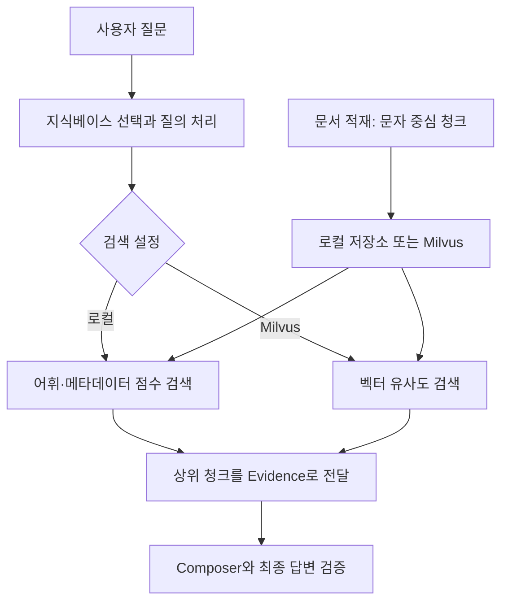

통합 기준 `d0953ff`에는 이미 한국어·용어 정규화, issue 정합성, 무관한 로컬 검색 결과 거절 등의 보완이 있었다. RAG 작업 보고서의 초기 기준 `94eba81`보다 발전한 상태이므로, 이 기능들을 모두 이번 PR의 신규 기능으로 세지 않는다.

### To-Be 흐름

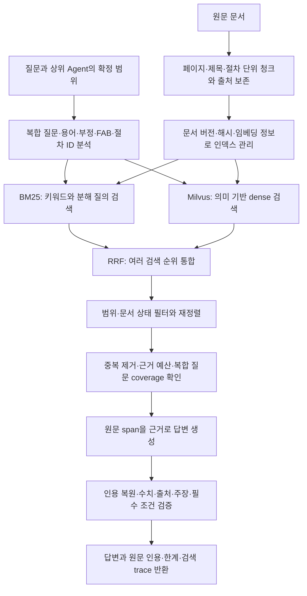

Dense 검색과 LLM reranker는 설정된 경우 사용한다. 미설정·실패 시에는 로컬 BM25/feature reranker 등 가능한 경로와 제한사항을 기록한다. 문서 전용 답변의 원문 검증 경로와 SQL·사례가 섞인 답변의 최종 검토 경로는 구분한다.

### 상세 비교

| 항목 | As-Is | To-Be |
|---|---|---|
| 문서 분할 | 문자 단위 분할에서 페이지·절차 경계가 섞일 수 있음 | 페이지·Markdown 제목·절차 구조를 보존한 55개 청크와 청크별 메타데이터 |
| 검색 방식 | 로컬 어휘 검색 또는 Milvus 벡터 검색 중 한 경로 | BM25와 dense 후보를 RRF로 합치고 복합 질문의 분해 질의도 반영 |
| 검색 범위 | 선택한 KB와 issue 정합성 중심 | 복합 KB, FAB 범위, 명시 절차 ID, 폐기 문서 제외 등을 검색 과정에 반영 |
| 상위 결과 선택 | 각 검색 경로의 점수 중심 | feature reranker 및 선택적 제한형 LLM reranker, 동점 시 검색 순위 보존 |
| 근거 구성 | 상위 청크를 전달 | 중복 제거, 전체 문자 예산, 주제별 필수 근거 coverage 확인 |
| 인용 | 청크 단위 evidence와 출처 | 원문 span ID로 인용을 복원하고 인용문이 실제 corpus에 있는지 대조 |
| 답변 완전성 | 일반 답변 검토 중심 | 생성 후 주장·질문 coverage를 검토하고 승인자·전제 조건·기록 의무를 원문 기준으로 보존 |
| 인덱스 관리 | 검색 저장소와 임베딩 설정 중심 | 문서 해시·버전·임베딩 모델/차원을 manifest로 관리, 불일치 검사와 이전 인덱스 보존 |
| API·화면 연결 | 검색 근거를 응답에 전달 | 빈 근거·오류·검색 trace·인용·모델 사용량을 HTTP/SSE와 화면에 연결 |

### 질문 예시로 보는 변화

> “PM을 연기하려면 어떤 승인과 기록이 필요해?”

- **As-Is의 취약점:** PM 관련 문서를 찾아도 요약 과정에서 승인자나 위험 조건, 복구 후 기록 요건이 빠질 수 있다.
- **To-Be:** 관련 절차를 함께 검색하고, Engineer 승인, 단기 연기의 low risk·Manager 승인·risk memo, 복구 후 qualification 또는 dummy run 기록 같은 원문 조건을 보존하도록 검사한다. 화면에서 인용 원문을 펼쳐 확인할 수 있다.
- **의미:** 관련 문서를 찾았다는 사실에 더해, 답변이 중요한 조건을 빠뜨리지 않았는지도 검사한다. 다만 같은 모델의 사후 검토가 모든 누락을 보장해 잡아내는 것은 아니다.

이 예시의 조건은 현재 시뮬레이션 corpus 내용이며 실제 FAB 승인 SOP를 뜻하지 않는다.

### 검증 결과와 남은 범위

- PR 통합 시 Python **468 passed**, 웹 **25 passed**, 변경 Python Ruff·웹 빌드·로컬 release quality gate 통과.
- 초기 오프라인 검색 평가의 필수 근거 Recall@3: 기본 세트 **0.700 → 1.000**, 도전 세트 **0.638 → 0.862**. 이 비교의 As-Is는 `94eba81`이며, 통합 기준 `d0953ff`와의 직접 비교 수치가 아니다. 문서 분할도 바뀌었고 개발 중 사용한 평가이므로 검색 알고리즘만의 독립 성능 향상으로 해석하지 않는다.
- 병합 전 실제 임베딩·LLM·격리 Milvus로 55청크 저장·검색과 chat API를 검증했다. 추가 SSE 10문항 중 답변 가능한 7문항의 필수 검색 근거를 모두 찾았지만 **답변 정확도 100%를 의미하지 않는다**.
- 마지막 PM API 재시험은 **14.402초**, 원문 조건 3개 보존, 인용 4개 corpus 대조 통과. 단일 사례 지연시간이며 평균 성능 수치가 아니다.
- 최신 병합 후 유료 외부 API는 재실행하지 않았다. 실제 승인 SOP 확보, 추가 복합 질문 검증, 배포망·운영 부하 검증은 남아 있다. GraphRAG는 이번 구현 범위에 포함하지 않았다.

근거: [PR #8](https://github.com/gaaaaaaang/master_pjt/pull/8), [초기 비교 평가](rag_hackathon_20260907.md), [원문 검증 확장 기록](rag_extension_20260908.md), [검색 실행 안내](rag_search_runbook.md). 주요 구현: [search.py](../apps/assistant/src/app/rag/search.py), [ingest.py](../apps/assistant/src/app/rag/ingest.py), [manifest.py](../apps/assistant/src/app/rag/manifest.py), [RAG adapter](../apps/assistant/src/app/sub_agent/rag.py).

<strong>3. Text2SQL — SQL을 생성하는 Agent에서, 메타를 탐색하고 의미를 검증하는 Agent로</strong>

### 핵심 변화

**“실행 가능한 SQL인가?”뿐 아니라 “사용자가 의도한 계산을 하는 SQL인가?”를 검사하도록 강화했다.** 실제 스키마와 공통 메타로 관련 테이블을 찾고, SQL을 쓰기 전에 테이블·조건·집계·시간 기준을 계획으로 명시한다.

### As-Is 흐름

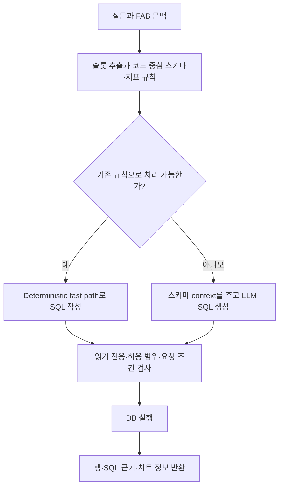

기존에도 날짜·대상·집계 규칙, SQL allowlist와 read-only 검증, fast path가 있었다. 다만 코드에 미리 정의된 범위를 벗어난 업무 테이블 탐색과, 복잡한 SQL의 집계·조인 의미를 명시적 계획과 대조하는 구조가 부족했다.

### To-Be 흐름

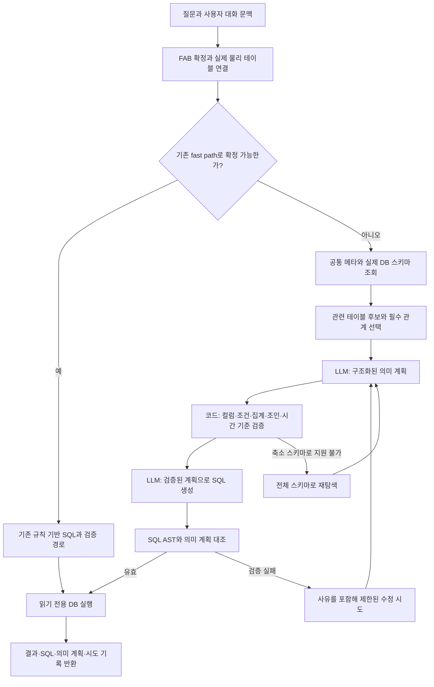

도식은 실제 메타 기반 LLM 경로를 중심으로 표현했다. 후보 생성은 최대 2회이며, 실패 원인에 따라 같은 스키마에서 수정하거나 전체 스키마로 재탐색한다. 모든 질문이 무조건 계획·SQL의 두 LLM 호출을 거치는 것은 아니다.

### 상세 비교

| 항목 | As-Is | To-Be |
|---|---|---|
| FAB 선택 | 질문·화면·대화 문맥 해석 과정에서 충돌 가능 | 현재 질문의 명시 FAB를 우선하고 요청 FAB·최근 사용자 문맥을 연결. 미지정·지원 밖·복수 FAB는 필요한 확인 수행 |
| 물리 테이블명 | 기존 FAB별 테이블 이름과 코드 참조 | `{fab}.{logical_table}_{fab}`로 통일, 공통 바인딩·이름 변경/역변경·메타 동기화 스크립트 추가 |
| 스키마 지식 | 코드 중심 테이블 목록과 지표 규칙 | `agent_meta.table_catalog`와 실제 PostgreSQL 구조에 설명·동의어·단위·집계·출처 정보를 결합 |
| 테이블 선택 | 제공된 스키마 범위에서 SQL 생성 | 관련성 점수의 양수 후보 최대 6개를 기본 선택하고, 명시 테이블·필수 후보·검증된 관계 이웃 보존 |
| SQL 전 계획 | 생성 SQL과 기존 슬롯·규칙 검사 중심 | 테이블·컬럼·필터·집계·조인·최신 범위·결과 grain을 구조화한 의미 계획을 먼저 검증 |
| SQL 검증 | 읽기 전용·allowlist·기존 요청 조건 검사 | SQLGlot AST로 실제 소스, 집계·차원, GROUP BY, 필터, 최신 MAX, CTE 계보를 계획과 대조 |
| 수치 의미 | 사전 규칙이 다루는 계산에 의존 | `COUNT(*)`와 `COUNT(column)`, 조인으로 생긴 중복, 지표 별칭의 역할 바뀜 등을 구별 |
| 시간 의미 | 파싱된 날짜와 기존 SQL 규칙 중심 | 메타 기본 시간 열과 사용자 명시 시간 열을 구분하고, 시작/종료 열 및 최신값의 global/filtered 범위 검사 |
| 실패 복구 | 스키마 탐색이 막히거나 이전 실패가 새 질문에 영향 | 검증 사유를 포함한 제한적 재생성, 축소 스키마에서 전체 스키마로 재탐색. 과거 실패만으로 새 조회를 차단하지 않음 |
| 사용자 재질문 | 물리 테이블명을 요구하며 조회를 멈추는 사례 | 테이블·컬럼 탐색은 Text2SQL이 수행하고 FAB·지표·날짜 의미처럼 사용자가 결정할 부분만 확인 |

### 질문 예시로 보는 변화

> 화면은 FAB10인 상태에서 “FAB13에서 lot_id가 NULL인 행 수를 보여줘.”

- **As-Is의 취약점:** 화면 FAB와 질문 FAB의 충돌, `COUNT(lot_id)` 사용으로 NULL 행 누락, 후속 질문에 이전 필터가 섞이는 문제를 방어할 필요가 있었다.
- **To-Be:** FAB13을 우선하고, 실제 메타에서 컬럼을 확인한 뒤 `lot_id IS NULL` 조건과 NULL을 포함하는 행 개수 의미를 계획한다. SQL이 이 조건·집계를 구현했는지 검사한다.
- **당시 실제 화면 검증:** 결과 **864**를 확인했고, 이어진 새로운 `equipment_id IS NOT NULL` 질문에서는 기존 `lot_id` 필터를 섞지 않고 **2592**를 조회했다. 이는 당시 데이터의 검증값이며 현재 데이터의 고정 정답은 아니다.

### 검증 결과와 남은 범위

- Text2SQL PR 병합 시 전체 Python **601 passed**. 기존 실제 DB 회귀 **79/79**, 저장 SQL 재검증 **43/43**. 저장 SQL 재검증은 새로운 질문에서 SQL을 새로 생성한 평가와 다르다.
- 최초 별도 고정 평가 **14/16**. 발견한 오류 수정 후 개발 회귀 **5/5**, 동일 실패 문항 반복 **2/2**. 사후 수정 결과를 최초 평가에 합쳐 16/16로 표시하지 않는다.
- 같은 질문 19개의 첫 계획 입력 문자 수 중앙값 **33,906 → 18,823**, 약 **44.5% 감소**. 과금 토큰·비용·전체 요청 사용량의 감소율은 아니다.
- 기존 DB 적용에는 물리 테이블명 마이그레이션과 공통 메타 동기화가 필요하다. PR 병합만으로 외부 DB가 바뀌는 것은 아니다.
- 업무 지표·조인·시간 기준의 담당자 검토와 더 큰 외부 평가가 필요하다. AST 검증은 임의 SQL의 의미 동치 증명이 아니며, PANDA·MARS/TriSQL의 아이디어를 참고했지만 논문 전체 학습 절차를 재현한 구현은 아니다.

근거: [PR #9](https://github.com/gaaaaaaang/master_pjt/pull/9), [추가 산출물 PR #10](https://github.com/gaaaaaaang/master_pjt/pull/10), [메타 설계](text2sql_metadata_catalog_design.md), [일반화 검증 결과](text2sql_generalization_results_20260908.md). 주요 구현: [metadata_catalog.py](../apps/assistant/src/app/db/metadata_catalog.py), [schema_retrieval.py](../apps/assistant/src/app/db/schema_retrieval.py), [semantic_plan.py](../apps/assistant/src/app/sub_agent/semantic_plan.py), [text2sql.py](../apps/assistant/src/app/sub_agent/text2sql.py).

<strong>4. 화면 — 실행·평가 화면에서, 답변과 근거를 탐색하는 사용자 작업 화면으로</strong>

### 핵심 변화

**사용자가 결과를 먼저 읽고, 필요할 때 SQL·원문·실행 내역을 확인하도록 화면의 우선순위를 바꿨다.** 표 탐색·공유뿐 아니라 대화 초안, 새로고침, 실패 후 재시도 같은 실제 사용 흐름을 보완했다.

### As-Is 흐름

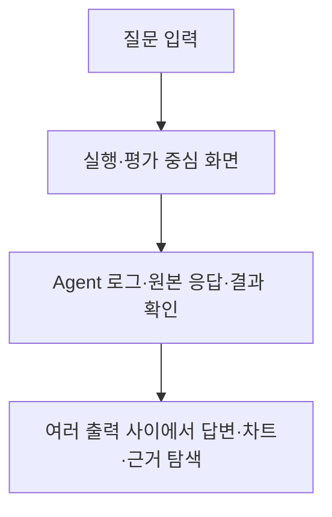

### To-Be 흐름

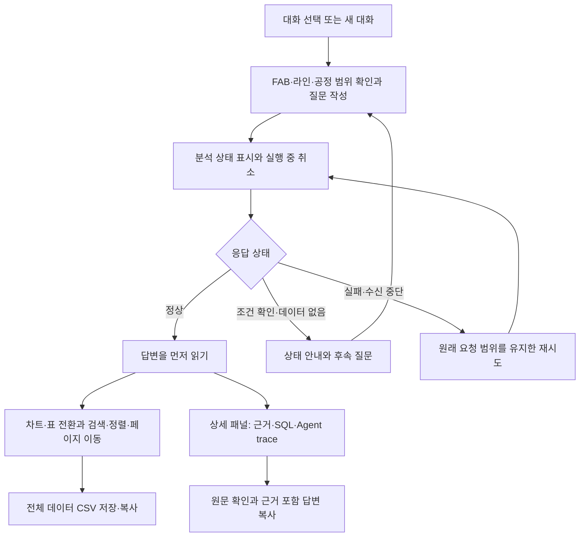

### 상세 비교

| 항목 | As-Is | To-Be |
|---|---|---|
| 첫 화면의 중심 | 실행 로그·평가·원본 JSON | 답변·차트·표, 고정 입력창과 대화 사이드바 |
| 실행 과정 | 상세 출력이 본문 공간을 차지 | 접힌 Agent별 trace 요약, 필요할 때 상세 패널에서 확인 |
| 근거 확인 | 결과와 원본 데이터를 찾아 읽음 | 근거 탭·데이터/SQL 탭·원본 응답 상세로 구분 |
| 표 탐색 | 결과 표 확인 중심 | 검색·정렬·페이지 이동, 전체 데이터 CSV 내보내기 및 복사 |
| 답변 표현 | 기술 출력과 결과가 함께 노출 | Markdown 표·목록 렌더링, 다중 시리즈 차트와 결측값 표현 보완 |
| 대화 유지 | 활성 대화와 입력 초안의 복원 보완 필요 | 대화별 초안, 활성 대화, 새로고침 후 중단 상태 복원 |
| 재시도 | 설정 변경 후 다른 범위로 재요청될 수 있음 | 원래 payload의 분석 범위·대화 ID를 유지하고 다음 질문 초안 보존 |
| 스트림 오류 | 끊김·취소·비정상 종료의 구분 보완 필요 | 실패·취소·수신 중단·timeout을 구분하고 미완료 스트림을 성공으로 처리하지 않음 |
| 공유·피드백 | 단순 답변 확인 중심 | 근거 포함 답변 복사, 클립보드 fallback, 실패한 피드백의 재시도 상태 복구 |
| 모바일·키보드 | 사용자 작업 흐름에 맞춘 보완 필요 | 반응형 화면, 한글 조합 입력, 탭 방향키, dialog 포커스·Escape 동작 |
| 평가 화면 | 사용자 화면에 평가 도구가 함께 존재 | 기존 React 평가 대시보드는 `/trace`에 보존, 사용자 화면은 `/`로 제공 |

RAG PR에서 추가한 **원문 인용 펼침과 모델 사용량 연결**도 최종 통합 화면에 포함된다. 이 부분은 화면 브랜치 단독 성과와 구분한다. 화면 브랜치는 React UI를 대상으로 했으며, Text2SQL의 추가 산출물 PR에는 별도의 Streamlit 변경도 포함됐다.

### 사용 예시로 보는 변화

> “제품별 지표를 비교하고, 근거를 확인해서 결과를 공유하고 싶다.”

- **As-Is:** 실행 로그와 원본 응답 사이에서 결과·SQL·근거를 찾아 확인한다.
- **To-Be:** 답변과 비교 차트를 읽고 → 표로 전환해 원하는 제품을 검색·정렬하고 → SQL 또는 원문 근거를 펼쳐 확인하고 → 근거를 포함한 답변이나 전체 데이터를 복사한다.
- **오류 상황:** 요청 중 FAB 설정을 바꿨더라도 실패한 메시지의 재시도는 원래 FAB 범위를 유지한다. 다음 질문을 작성 중이었다면 그 초안도 보존한다.

### 검증 결과와 남은 범위

- 웹 테스트 **25 passed**, production build 통과.
- 브라우저에서 모바일·데스크톱, 표 탐색, 초안 복원, 복사, 접힌 trace를 확인했다.
- 로컬 mock으로 실패→재시도, 후속 대화 ID, 취소, 비정상 SSE 종료, 피드백 오류 복구를 검증했다.
- 실제 CSV 파일 다운로드 완료와 운영 서버 피드백 저장 성공은 미검증이다. CSV 클립보드 복사는 확인했다.
- 대화 UI 상태는 현재 탭의 `sessionStorage` 기반이며 여러 기기 동기화는 제공하지 않는다. 운영 환경에서는 API reverse proxy 또는 `VITE_API_BASE` 설정이 필요하다.

근거: [PR #7](https://github.com/gaaaaaaang/master_pjt/pull/7), [화면 개선·브라우저 검토 기록](frontend_adv_review.md). 주요 구현: [workspace.jsx](../apps/web/src/workspace.jsx), [ui.jsx](../apps/web/src/ui.jsx), [chat-model.js](../apps/web/src/chat-model.js), [charts.jsx](../apps/web/src/charts.jsx).

<strong>5. 데이터 시뮬레이션 — 스냅샷 중심에서, FAB별 페르소나를 가진 15분 주기 이벤트 누적으로</strong>

### 핵심 변화

**FAB10~13을 서로 다른 운영 성향을 가진 공장으로 설정하고, 15분마다 직전 구간의 공정 이벤트를 생성·적재한다.** 이전 회차의 WIP·수율 추세·건전성·진행 중 사건을 읽어 다음 회차에 반영하므로, 시간에 따라 변화하는 데이터를 조회·진단·추세 분석에 활용할 수 있다.

여기서 실시간 적재는 **현재 시각에 맞춰 합성 데이터를 주기적으로 갱신하는 방식**이다. 실제 MES나 장비 센서의 실시간 수집 데이터는 아니다. `operator_report`, `equipment_signal` 등의 출처 역시 시뮬레이션 속 현장 역할을 나타낸다.

### As-Is 흐름

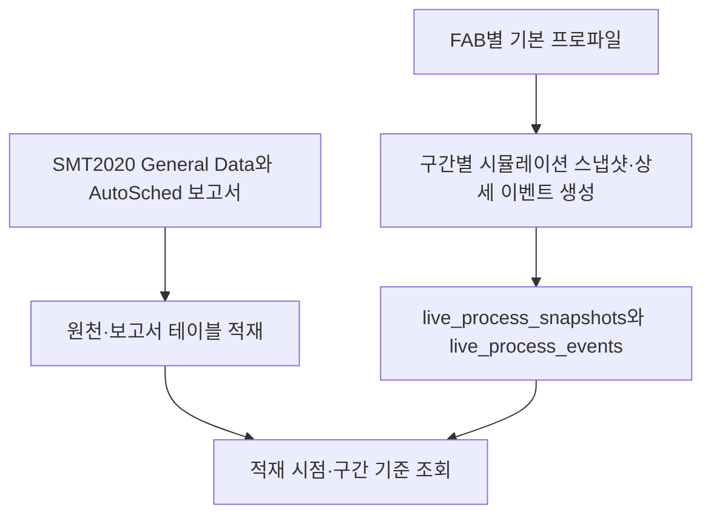

기존 스냅샷 생성기에도 FAB별 프로파일과 일부 이전 이벤트 참조가 있었다. 이번 확장은 **15분 raw event 원장과 별도 상태·사건 테이블**을 두어 사건의 지속과 복구를 명시적으로 이어가는 것이다.

### To-Be 흐름

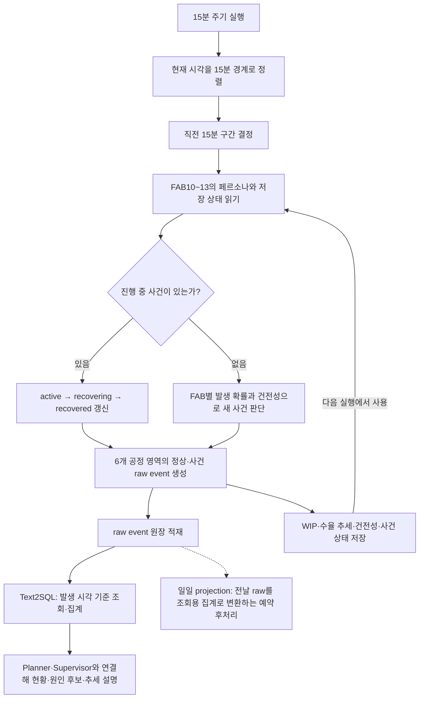

일일 projection의 점선은 예약된 후처리 요구사항이다. 현재 확인한 코드에서 별도 projection 스크립트를 찾지 못했으므로 완료된 데이터 경로로 표시하지 않는다.

### FAB별 페르소나

**FAB10은 안정 생산, FAB11은 노후 설비 관리, FAB12는 신규 공정 안정화, FAB13은 고부하 병목 관리**를 대표한다. 같은 질문을 던져도 서로 다른 운영 상황을 분석할 수 있도록 구성한 시뮬레이션 페르소나다.

아래 운영 특징은 프로파일을 사람이 이해하기 쉽게 풀어쓴 설명이다. 대표 사건은 기존 스냅샷 생성기의 FAB별 사건 목록을 근거로 정리했으며, 현재 raw 생성기에서 FAB마다 그 사건만 발생한다는 의미는 아니다.

| FAB | 한 문장 페르소나 | 운영 특징 | 대표 상황 | 주요 분석 포인트 |
|---|---|---|---|---|
| **FAB10 · 안정 생산형** | “검증된 공정으로 소수 제품을 많이 생산하는 안정적인 공장” | 대량·소품종(HVLM) 운영. 상대적으로 높은 초기 수율과 낮은 사건 발생 확률을 가진 기준 공장 | 경미한 계측 재검사, photo 대기열 관찰 | 정상 상태 대비 작은 이상 징후, 대기열 증가, 안정적인 생산 유지 여부 |
| **FAB11 · 노후 설비 관리형** | “다양한 제품을 소량 생산하면서 노후 설비와 정비 일정을 관리하는 공장” | 소량·다품종(LVHM) 운영. 설비 가용성과 유지보수 이슈를 살펴보는 시나리오 | PM 시간 초과, etch 장비 다운, carrier 대기 | 다운·PM 시간, 설비 복구 상태, 정비 지연과 대기 증가의 동반 여부 |
| **FAB12 · 신규 공정 안정화형** | “새로운 공정과 제품 조합을 적용하며 수율과 레시피를 안정화하는 공장” | 신규 공정·제품 혼합 운영. 공정 조건 조정과 품질 변화를 함께 관찰하는 시나리오 | 레시피 튜닝, 수율 주의, 재작업 증가 | 수율 저하, 불량·재작업, 공정 조정 전후의 변화 |
| **FAB13 · 고부하·증설형** | “생산 물량이 몰리는 증설 국면에서 병목과 재공 증가를 관리하는 공장” | 네 FAB 중 초기 WIP와 신규 사건 기본 발생 확률이 가장 높음. 부하 증가 상황을 분석하는 시나리오 | WIP 급증, 병목 경보, sorter hold, 수율 저하 | 병목 공정, 대기·hold, WIP 누적, 사건 지속·복구에 따른 변화 |

#### FAB10 — 안정 생산형: 작은 이상을 놓치지 않는 기준 공장

`stable_hvlm`은 안정적인 대량·소품종 생산을 나타낸다. 다른 FAB의 변화와 비교할 때 정상 운영의 기준 역할을 하도록 설정했다. 큰 장애를 전제로 하기보다 계측 재검사나 특정 공정의 대기열 증가처럼 작은 변화를 살펴보는 데 초점을 둔다.

**질문 예시:** “FAB10의 최근 1시간 photo 대기시간이 직전 1시간보다 늘었는지 확인해줘.”

#### FAB11 — 노후 설비 관리형: 정비와 복구가 중요한 공장

`aging_lvhm`은 노후 설비를 가정한 소량·다품종 생산을 나타낸다. PM이 예상보다 길어지거나 장비가 멈췄을 때, 어느 공정의 대기가 늘고 사건이 언제 복구 단계로 전환되는지 분석하는 상황에 적합하다. 설비 연식이나 제품 전환 과정 전체를 물리적으로 모델링했다는 뜻은 아니다.

**질문 예시:** “FAB11에서 현재 진행 중인 PM 초과나 장비 다운 사건과 해당 공정의 대기시간을 보여줘.”

#### FAB12 — 신규 공정 안정화형: 수율과 재작업을 함께 보는 공장

`new_process_mix`는 신규 공정과 제품 구성이 섞인 생산 환경을 나타낸다. 레시피 조정, 수율 변화, 재작업 이벤트를 함께 관찰하면서 공정이 안정화되는지 확인하는 시나리오를 담당한다. 이벤트가 함께 나타났다는 사실만으로 레시피 변경을 수율 저하의 확정 원인으로 판단하지 않는다.

**질문 예시:** “FAB12에서 최근 레시피 튜닝과 재작업 이벤트가 발생한 공정을 정리하고 수율 추세도 보여줘.”

#### FAB13 — 고부하·증설형: 밀려드는 물량과 병목을 관리하는 공장

`high_load_expansion`은 높은 생산 부하와 증설 국면을 나타낸다. 높은 초기 WIP에서 출발해 병목·hold 같은 사건과 대기시간 변화를 관찰하기 위한 공장이다. 사건이 발생한 뒤에도 동일 사건의 진행 상태를 이어가므로, 단발성 경보뿐 아니라 다음 구간까지 지속되는 문제를 분석할 수 있다. 실제 증설 설비 투입 일정까지 모델링한 것은 아니다.

**질문 예시:** “FAB13의 활성 병목 사건이 이전 구간보다 회복됐는지, 복구 진행률과 대기시간을 비교해줘.”

위 질문들은 페르소나별 활용 예시이며 새로 수행한 전체 Agent 성공 사례는 아니다.

#### 페르소나를 반영하는 초기 설정값

| FAB | 프로파일 | 운영 성향의 의미 | 초기 WIP | 초기 수율 추세 | 신규 사건 기본 발생 확률 |
|---|---|---|---:|---:|---:|
| FAB10 | `stable_hvlm` | 안정적인 대량·소품종 생산형 | 1,260 | 97.3% | 10% |
| FAB11 | `aging_lvhm` | 노후 설비를 가정한 소량·다품종 생산형 | 920 | 95.8% | 22% |
| FAB12 | `new_process_mix` | 신규 공정·제품 혼합으로 변화가 많은 유형 | 1,110 | 96.2% | 25% |
| FAB13 | `high_load_expansion` | 고부하·증설 국면의 높은 WIP와 사건 위험 유형 | 1,460 | 96.7% | 32% |

표의 수치는 현재 raw 시뮬레이터의 **초기 설정값**이며 실측 KPI가 아니다. 사건 확률은 진행 중 사건이 없을 때 적용하는 기본값이고, 저장된 건전성이 낮아지면 추가 가중한다. 전체 구간의 고장률이나 실제 공장 장애 확률을 뜻하지 않는다.

현재 raw 경로에서 FAB별 차이는 초기 WIP·수율과 사건 발생 확률을 중심으로 구현돼 있다. 사건 종류는 공통 후보인 장비 다운, PM 초과, 수율 저하, 병목 경보, 레시피 튜닝에서 선택한다. FAB마다 특정 사건만 발생하도록 고정하지 않으며, 프로파일에 선언된 모든 변동성·공정시간 파라미터가 raw 생성에 적용된 것은 아니다.

### 상세 비교

| 항목 | As-Is | To-Be |
|---|---|---|
| 적재 단위 | 원천 보고서와 구간 스냅샷·상세 데이터 | 15분마다 직전 구간의 개별 raw event를 생성·누적 |
| 공장별 차이 | 기존 스냅샷 생성기의 FAB별 프로파일 | raw 생성에도 서로 다른 초기 상태·사건 확률을 적용하고 상태를 지속 저장 |
| 사건 연속성 | 이전 이벤트를 일부 참조하는 스냅샷 생성 | 동일 사건 ID로 `active → recovering → recovered` 생명주기 관리 |
| 정상 구간 | 구간별 생성 결과로 표현 | 모든 FAB에 매번 장애를 넣지 않고 정상 이벤트를 기본 생성 |
| 공정 범위 | 스냅샷의 공정별 지표 | `photo`, `etch`, `deposition`, `implant`, `cmp`, `metrology` 6개 영역 |
| 이벤트 내용 | 구간 지표와 설비·lot 상세 | 대기 진입, 공정 시작·종료, 설비 상태, 계측, hold·해제, 재작업 및 사건 기록 |
| 설명 근거 | 지표와 구간 narrative | 발생 시각·설비·lot·제품·공정·심각도·현장 역할·narrative를 가진 행 단위 근거 |
| 분석 시간 | 스냅샷 `interval_end` 등 구간 기준 | raw는 `event_time`으로 발생 시점을 분석하고 종료 시각·생성 시각과 구분 |
| 데이터 보존 | 기존 스냅샷 테이블을 조회 | 기존 데이터는 보존하고 raw 루틴은 새 원장·상태·사건 테이블에 기록 |
| 집계 확장 | 미리 생성된 스냅샷 조회 | raw에서 필요한 집계를 수행하고, 일일 projection 후처리를 예약 요구사항으로 분리 |

### 어떤 데이터가 쌓이는가?

| 테이블 패턴 | 역할 | 주요 정보 |
|---|---|---|
| `{fab}.fab_process_raw_events_{fab}` | 공정 이벤트 이력 | `event_id`, `event_time`, `event_end_time`, `area`, 설비·lot·제품 식별자, 대기·처리·다운·PM 시간, 불량·재작업·WIP 변화량, 출처 역할과 narrative |
| `{fab}.fab_simulation_state_{fab}` | 다음 회차가 읽을 FAB별 최신 상태 | 페르소나, 건전성, WIP, 수율 추세, 활성 사건 ID, 병목 영역, 복구 진행률, 마지막 구간 |
| `{fab}.fab_incidents_{fab}` | 사건 이력과 현재 진행 상태 | 사건 ID·유형·영역·심각도, 시작·예상 종료·복구 시각, 상태·복구 진행률 |

raw 이벤트는 시간 구간별로 누적하고, 상태 테이블은 FAB별 최신값을 갱신하며, 사건 테이블은 같은 사건의 진행 상태를 갱신한다. 따라서 세 테이블 모두가 매회 단순 추가되는 구조는 아니다.

### 질문 예시로 보는 변화

> “FAB13의 최근 15분 병목 이벤트와 대기시간을 보여주고, 이전 구간과 비교해줘.”

- **As-Is:** 적재된 스냅샷 구간을 기준으로 지표를 확인한다.
- **To-Be:** raw의 `event_time`으로 두 구간을 나누어 병목·대기 이벤트를 조회하고, 상태·사건 이력에서 사건이 지속 중인지 복구 중인지 확인하는 분석이 가능해진다.
- **Agent와의 연결:** Text2SQL은 올바른 시간 열과 집계 의미를 선택하고, Planner/Supervisor는 대상·기간과 실제 결과를 검토한다. 필요한 경우 RAG의 대응 절차와 연결해 원인 후보·확인 사항을 설명한다.

이는 데이터가 지원하는 활용 예시이며 이 복합 질문의 전체 Agent 실행을 새로 검증한 결과는 아니다. 특히 raw 이벤트의 평균 대기시간과 공장 전체 WIP 같은 상태 지표는 집계 의미가 달라 서로 대체하지 않는다.

### 확인된 설정과 구현 범위

- 활성 예약 `FAB raw event 15분 적재 + 일일 projection`은 **15분 간격**이며 raw 생성기를 **`--interval-minutes 15`**로 실행하도록 설정돼 있다. 스크립트 자체 기본값은 20분이므로 예약 실행의 명시 인자가 중요하다.
- 매회 현재 시각 기준 직전 15분을 생성한다. 예약은 과거 전체 구간을 자동 보정하도록 지시하지 않으므로, 실행이 누락된 구간까지 자동 채워졌다고 가정하지 않는다.
- KST 자정 직후에는 전날 raw를 일일 projection하도록 예약돼 있으나, 별도 구현·완료 여부는 이번 문서 작업에서 확인하지 않았다.
- 이번 확인 범위는 로컬 생성 코드·기존 테스트 내용·활성 예약 설정이다. 최신 DB 적재 시각, 실제 누적 행 수, 무중단 실행 여부를 새로 조회·검증한 것은 아니다.

근거: [현재 raw event 생성기](../apps/assistant/scripts/simulate_fab_raw_events.py), [상태·사건 연속성 테스트](../apps/assistant/tests/test_fab_raw_event_simulator.py), [기존 스냅샷 생성기](../apps/assistant/scripts/insert_fab_live_process_snapshot.py). 예약 설정은 문서 작성 시점의 로컬 활성 설정을 확인했다.

<strong>6. 통합 흐름 — 데이터 시뮬레이션과 4개 고도화가 한 질문에서 연결되는 방식</strong>

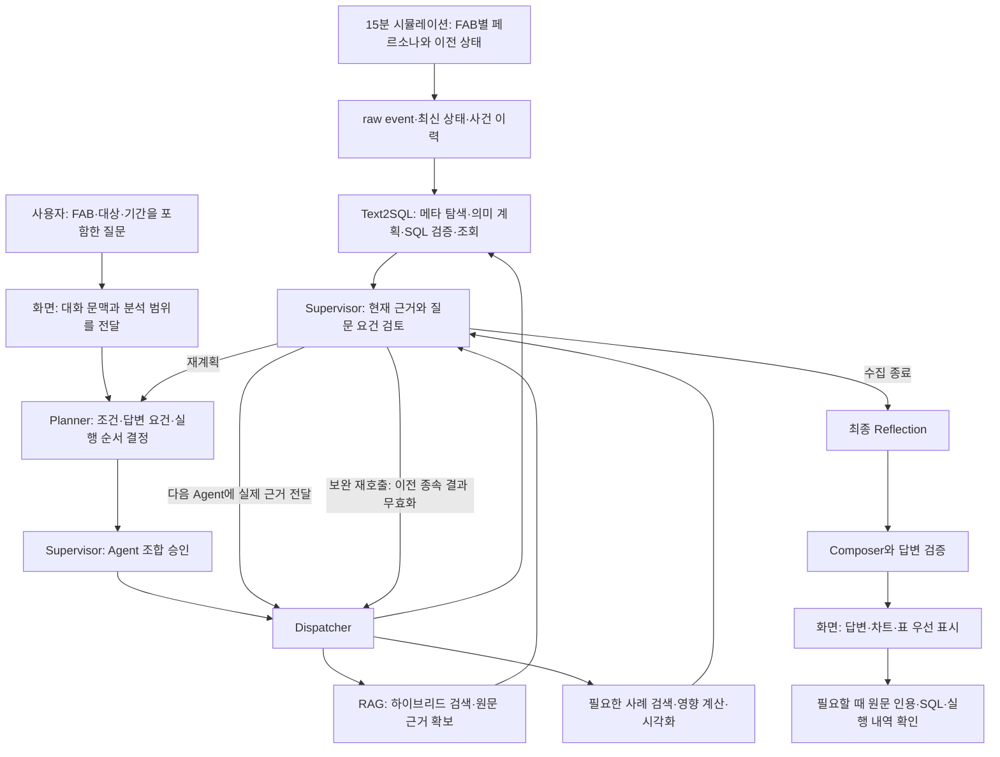

Dispatcher에서 갈라진 선은 **선택 가능한 Agent**를 나타낸다. 실제 실행은 계획에 따라 순차 진행하며, 모든 질문에 모든 Agent를 호출하는 구조는 아니다.

15분 시뮬레이션은 FAB마다 다른 상태와 사건이 시간에 따라 쌓이는 분석 기반을 제공한다. 예를 들어 진단 질문은 SQL의 관측값을 문서·사례 검색에 연결한다. 문서 설명만 필요한 질문은 RAG 중심으로, 데이터 추세 질문은 Text2SQL과 Visualization 중심으로 실행한다. 동일한 FAB·대상·기간과 현재 유효한 근거를 이 과정 전체에서 유지하는 것이 통합 고도화의 연결점이다. 시뮬레이션 조회 결과는 답변에서도 합성 데이터라는 출처를 유지한다.

통합 후 기록된 Python 647개·웹 25개 통과는 회귀 검사 결과다. 각 브랜치의 소규모 LLM·검색·DB 평가를 합산해 시스템 전체 정확도로 표시하지 않는다.

