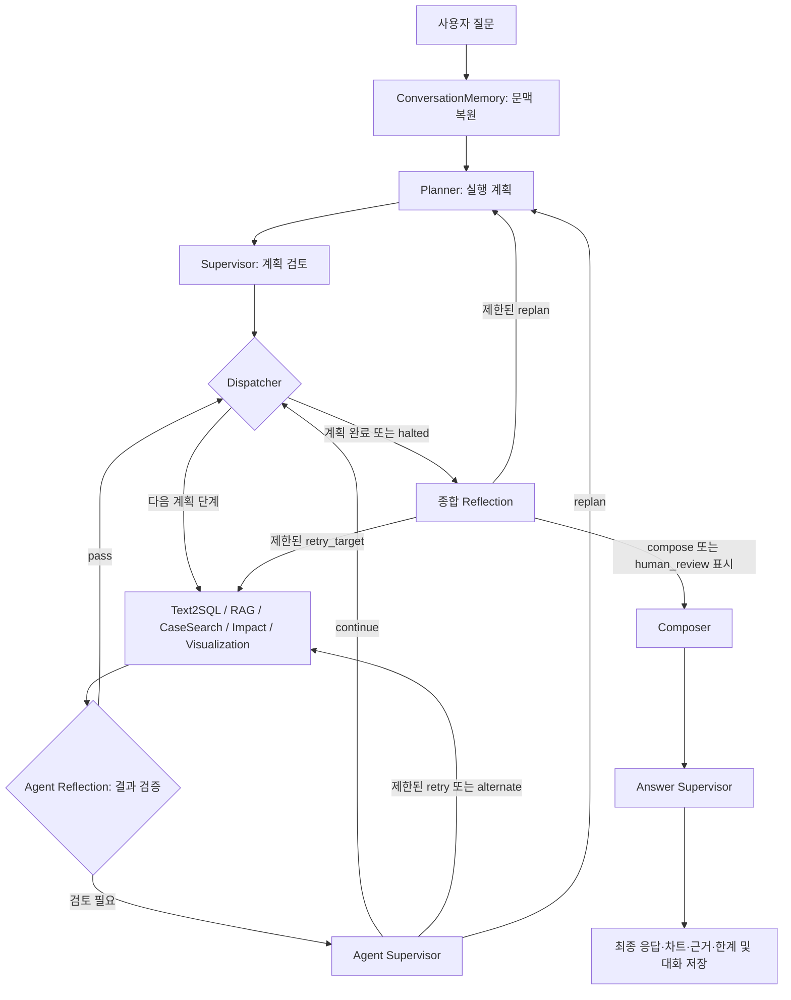

# FAB AI Assistant 인수인계 문서

> 작성일: 2026-09-07 · 확인한 코드 기준: Git `13f3946` 및 현재 작업 폴더
>
> 목적: 각 에이전트를 왜 분리했는지, 어떤 입력을 받아 어떤 순서와 조건으로 처리하는지, 다음 담당자가 어디를 수정하고 검증해야 하는지 설명한다.
>
> [AI Talent Lab 과제: 테스트 및 고도화](https://skax.ai-talentlab.com/master-mentee/task/3342)의 모든 본문 항목을 7장에 반영했다. [Notion 인수인계 양식](https://app.notion.com/p/321c0273dd3b8032b41afa14b8874990?v=320c0273dd3b8087bae6000cdf53d8e5&source=copy_link)의 개선상황, 제약조건, 폴더·파일 설명, 흐름도, 노드별 설계 원칙·책임·처리 로직 구성을 따랐다.
>
> 구현 상태는 코드, 평가 수치는 저장된 보고서, 이번 확인 결과는 직접 실행한 테스트를 기준으로 구분했다. 과제 페이지의 성능 개선 수치는 예시이므로 프로젝트 실적으로 사용하지 않았다. 이 문서는 Notion에 옮겨 사용할 수 있는 Markdown 원고다.

## 1. 서비스 개요와 개선상황

### 1.1 무엇을 만드는 프로젝트인가

FAB 운영자가 자연어로 생산 상태를 조회하고, 지표 악화의 원인 후보를 검토하고, 제한된 조건에서 영향도를 계산하고, 기간별 수치를 비교하는 채팅 서비스다. FastAPI가 요청을 받고 LangGraph가 에이전트 실행을 조율한다. PostgreSQL 조회 결과, 문서, 유사 사례를 근거로 답변과 차트를 만든다.

핵심 설계는 **계획 → 실행 승인 → 필요한 전문 기능 실행 → 결과 검증 및 복구 → 답변 작성 → 최종 검증**이다. 모든 노드가 LLM은 아니다. 계산, 검색 후처리, 차트 생성, SQL 안전 검증, 실행 분기는 코드로 처리하고, 의미 판단과 답변 작성에 LLM을 사용한다.

### 1.2 개선상황

| 항목 | 현재 상태 | 인수 시 확인할 사항 |
| --- | --- | --- |
| Planner | LLM 구조화 계획 + 규칙 기반 경로 보정 및 장애 fallback 구현 | query type별 필수 기능이 빠지지 않는지 확인 |
| 실행 제어 | Dispatcher 기반 선택 실행, 에이전트별 검증, 제한된 retry/replan/alternate 구현 | 고정 직렬 파이프라인으로 이해하지 말 것 |
| Text2SQL | slot 검증 → deterministic fast path 또는 LLM SQL → 검증·실행 → 제한된 보정 구현 | SQL 생성 성공과 실제 DB 조회 성공을 구분 |
| RAG | Milvus 검색 경로와 로컬 JSONL 검색 구현 | 저장된 품질 수치는 로컬 lexical 검색 기준 |
| CaseSearch | 독립 사례 저장소 검색, 출처·검증 메타데이터·기간 정합성 검증 구현 | 실제 검증 사례와 시뮬레이션 참고 사례 구분 |
| Diagnosis Synthesis | 관측·가설·사례 구분, 후보 순위·충돌·근거 부족 계산 구현 | 독립 graph 노드가 아니라 CaseSearch 노드에서 호출 |
| Impact | 가동률 민감도, cycle time 변화 등 제한된 계산 구현 | 전체 생산 시뮬레이션이나 인과 추론 모델은 아님 |
| Visualization | bar/grouped_bar/line, 다중 지표, 누락 구간·coverage 처리 구현 | chart spec과 실제 프런트 표시를 함께 확인 |
| Reflection / Answer Supervisor | 중간 산출물, 종합 근거, 최종 답변을 나눠 검증 | 실패 상태와 답변 문자열을 함께 처리 |
| 대화·피드백 | SQLite 저장, 후속 질문 문맥 복원, 피드백 전달 구현 | 피드백 저장이 자동 학습·프롬프트 변경을 의미하지 않음 |
| 로컬 회귀 검증 | 이번 실행에서 pytest 341개 통과 | Azure LLM 및 실제 Milvus 전체 성능을 뜻하지 않음 |
| 전체 서비스 성능 | 저장된 release report에서 full graph 미측정 | LLM 포함 품질·지연·비용 측정 필요 |

### 1.3 기존 문서와 달라진 부분

`README.md`, `docs/poc_agent_writeup_notion.md`에는 고정 순서 흐름이나 RAG·CaseSearch·Impact placeholder 설명이 남아 있다. 현재 동작은 `agents/graph.py`와 각 `sub_agent` 구현을 우선한다. Text2SQL도 모든 요청에 LLM SQL을 생성하는 구조에서 규칙으로 처리 가능한 질문을 먼저 해결하는 구조로 확장되어 있다.

기획 문서의 Queue Time·수율 질문과 기대 수치는 목표 시나리오다. 현재 catalog가 지원하지 않는 지표까지 구현 완료로 해석하면 안 된다.

## 2. 구현된 제약조건

### 2.1 데이터와 답변의 경계

| 구분 | 사용하는 데이터 | 답변 정책 |
| --- | --- | --- |
| 현재 상태·운영 지표 | AutoSched `autosched_*` report | 적재된 report/snapshot 기준과 기간을 표시한다. 실시간 MES 연결로 표현하지 않는다. |
| 설비·공정·제품 기준정보 | SMT2020 General Data | 모델·시뮬레이션 입력 기준으로 설명한다. live 상태로 대체하지 않는다. |
| 투입 계획 | `lotrelease*` | 시작일/납기일 기준과 제품·route·scenario 등 선택 조건을 확인한다. |
| 공정 기초 설명 | `process_basics` | 교육·참고 설명으로 사용한다. 설비 조작 지시로 전환하지 않는다. |
| 원인·대응 검토 | `incident_playbook` + 유사 사례 | 가능한 원인과 확인 절차를 제시한다. 실제 원인 확정이나 자동 조치로 표현하지 않는다. |
| 영향도 | SQL baseline + 코드에 정의된 계산식 | 입력값·단위·계산식·가정·한계를 함께 반환한다. |

### 2.2 실행 제약

1. PostgreSQL은 단일 `SELECT` 또는 `WITH` 쿼리만 허용하고, 금지 SQL 키워드·schema·table을 검증한다.
2. DB 트랜잭션을 read-only로 실행하고 기본 timeout 5초, 최대 반환 행 200개를 적용한다. 값은 설정으로 변경 가능하다.
3. 현재 허용 schema 기본값은 `fab10,fab11,fab12,fab13`이다.
4. 필요한 FAB·날짜 기준·조회 범위가 없거나 잘못되면 `needs_clarification`으로 재질문한다.
5. 필요한 AutoSched 테이블이나 직접 지원하는 지표가 없으면 `data_unavailable`로 반환한다. General Data로 현재값을 추정하지 않는다.
6. 전체 agent retry 2회, agent별 retry 1회, replan 1회, alternate 1회로 제한한다.
7. `data_unavailable`, `unsupported`, `needs_clarification`, `skipped`는 동일 agent retry 대상이 아니다.
8. 설비 제어, 생산 순서 자동 변경, 자동 dispatch는 서비스 범위 밖이다.
9. SQL 검증기는 정규식·토큰 기반이다. 완전한 SQL AST 분석기로 간주하지 않는다. 주석은 executor에서 제거하며, ‘모든 주석 SQL을 오류로 거절한다’는 설명과도 구분한다.

## 3. 폴더 트리와 파일 설명

### 3.1 폴더 트리

```text
master_pjt/
├─ apps/
│  ├─ assistant/
│  │  ├─ src/app/
│  │  │  ├─ agents/       # 계획, 실행 그래프, Supervisor, LLM 작성·검토
│  │  │  ├─ sub_agent/    # SQL, 검색, 진단 종합, 계산, 차트, 규칙 검증
│  │  │  ├─ db/           # read-only PostgreSQL 실행
│  │  │  ├─ rag/          # 문서 추출·chunk, embedding, Milvus
│  │  │  ├─ services/     # 채팅, 문맥, SQLite, 피드백
│  │  │  ├─ api/          # HTTP·SSE 진입점
│  │  │  ├─ schemas/      # 요청·응답·근거 계약
│  │  │  ├─ data/         # 원천 데이터 적재 지원
│  │  │  ├─ config.py     # 환경 설정
│  │  │  └─ main.py       # FastAPI 앱
│  │  ├─ scripts/         # 적재·평가·release gate 실행
│  │  ├─ tests/           # 단위·계약·라우팅 테스트 및 fixture
│  │  └─ output/          # 로컬 RAG·사례·평가·상태 저장
│  └─ web/
│     ├─ src/             # React Vite 화면
│     └─ app.py           # 별도 Python/Streamlit 화면 코드
├─ docs/                  # 기획, 데이터 계약, 설계, 인수인계
├─ pyproject.toml         # Python 의존성·테스트 설정
└─ docker-compose.yml     # 개발 인프라 구성
```

### 3.2 주요 파일과 수정 지점

아래 경로는 `apps/assistant/src/app/` 기준이다.

| 파일 | 책임 | 주로 수정하는 경우 |
| --- | --- | --- |
| `agents/graph.py` | State, 노드 wrapper, 조건부 edge, 복구 budget, trace | 실행 순서·분기·중단 정책 변경 |
| `agents/planner.py` | PlannerDecision, 필수 route, fallback | 신규 질문 유형·복합 질문 지원 |
| `agents/prompts.py` | Planner/Supervisor/복구/최종검토 프롬프트 | 판단 정책·출력 계약 변경 |
| `agents/supervisor.py` | 계획 승인, agent 결과 복구, 최종 답변 검토 | 재시도·대체·답변 승인 기준 변경 |
| `agents/llm.py` | 공통 Azure Chat Completions structured-output 호출 | 공통 LLM 연결·응답 파싱 변경 |
| `agents/llm_nodes.py` | 종합 Reflection, Composer, 각각의 fallback | 답변 형식·종합 검토 변경 |
| `sub_agent/text2sql.py` | slot, catalog, deterministic SQL, LLM SQL, 보정 | 신규 테이블·지표·기간·필터 지원 |
| `sub_agent/sql_templates.py` | SQL template 관련 코드 | 연결된 template 계약·테스트 확인 |
| `db/read_only.py` | SQL 검증, 제한, DB 실행 | DB 안전 정책 변경 |
| `sub_agent/rag.py` | 지식 베이스 선택, 검색·정렬·후처리 | retrieval 정합성 개선 |
| `rag/ingest.py` | 원문 추출, chunk, JSONL 저장 | 문서 추가·chunk 정책 변경 |
| `rag/embeddings.py`, `rag/milvus_store.py` | embedding 및 vector 저장·검색 | Milvus 연결·색인 변경 |
| `sub_agent/case_search.py` | 독립 사건 사례 검색 | 사례 schema·검증·검색 점수 변경 |
| `sub_agent/issue_intent.py` | 이슈 표현의 부정문 처리 | ‘고장이 아니라…’와 같은 오검색 개선 |
| `sub_agent/diagnosis.py` | 관측·후보·사례 종합과 근거 수준 평가 | 후보 우선순위·출처 충돌 정책 변경 |
| `sub_agent/impact.py` | 단위와 baseline을 검증한 계산 | 승인된 계산식 추가 |
| `sub_agent/visualization.py` | 결과 행을 chart contract로 변환 | 차트·누락 기간·추세 요약 변경 |
| `sub_agent/reflection.py` | agent 및 답변의 deterministic 검증 | 근거 없는 단정·수치·한계 누락 탐지 |
| `services/conversation_memory.py` | 대화 이력 및 요청 context 복원 | 후속 질문의 대상·지표 상속 개선 |
| `services/state_store.py`, `services/feedback_service.py` | SQLite 저장·피드백 | 저장 계약·운영 관리 변경 |
| `services/chat_service.py`, `api/routes.py` | 일반 채팅·SSE·trace·피드백 API | 프런트 연결·응답 계약 변경 |
| `schemas/chat.py` | ChatRequest, ChatResponse, Evidence 등 | API 필드 추가 |

`agents/composer.py`도 존재하지만 현재 graph의 답변 생성 호출은 `agents/llm_nodes.py::compose_with_llm()`이다. 비슷한 이름의 파일을 수정하기 전에 graph에서 실제로 import하는 함수를 확인한다.

## 4. 전체 실행 흐름과 State

### 4.1 전체 흐름도



전문 agent 실행 순서의 기본 정렬은 `text2sql → rag → case_search → impact → visualization`이다. Dispatcher가 `execution_steps`의 다음 항목만 실행하므로 매 질문마다 다섯 개를 모두 호출하지 않는다. Agent Reflection은 각 agent wrapper 안에서 수행되며 독립 graph 노드가 아니다.

`human_review`는 사람이 검토해야 한다는 종료 상태를 만들고 Composer로 이어진다. 실제 승인자를 기다리는 interrupt/승인 화면이 구현되었다는 뜻은 아니다.

### 4.2 질문 유형별 기본 경로

| 유형 | 기본 전문 agent | 업무 의미 |
| --- | --- | --- |
| `status` | Text2SQL | 적재 report의 상태·수치 조회 |
| `master_data_lookup` | Text2SQL | 모델 기준정보 조회 |
| `release_plan_lookup` | Text2SQL | 투입 계획 조회 |
| `knowledge_lookup` | RAG | 공정 개념·문서 설명 |
| `diagnosis` | Text2SQL → RAG → CaseSearch | 수치·문서·사례를 결합한 원인 후보 검토 |
| `impact` | Text2SQL → Impact | baseline 수집 후 영향도 계산 |
| `trend` | Text2SQL → Visualization | 기간·대상 비교와 차트 |
| `unsupported` | 전문 agent 실행 중단 경로 | 지원 범위 안내 |

진단 질문에 ‘영향 계산’ 또는 ‘추세·차트’가 포함되면 Impact/Visualization을 추가할 수 있다. Impact에 차트가 필요한 경우 Visualization을 추가한다. 허용된 조합은 `REQUIRED_AGENT_ROUTES`, `OPTIONAL_COMPOUND_AGENTS`에서 관리한다.

### 4.3 공유 State 계약

| State | 용도 |
| --- | --- |
| `request`, `conversation_id`, `conversation_history` | 질문과 복원된 대화 문맥 |
| `plan` | query type, selected agents, 실행 단계, slot, missing slot |
| `execution_cursor`, `next_agent` | Dispatcher의 현재 위치와 다음 호출 |
| `status`, `halted`, `termination_reason` | 처리 상태, 실행 중단, 종료 사유 |
| `text2sql_result`, `sql`, `chart`, `confidence` | 조회·시각화 산출물 |
| `evidence`, `answer_parts`, `limitations` | 근거, 답변 재료, 한계 |
| `agent_runs`, `agent_reflections` | 개별 agent 실행·검토 기록 |
| `supervisor_reviews`, `supervisor_decisions` | 검토 필요 항목과 복구 결정 |
| `retry_counts`, 각 `*_budget_remaining` | 루프 횟수 제한 |
| `replan_feedback`, `forced_agent` | 재계획 피드백 및 지정 재실행 |
| `reflection`, `reflection_decisions`, `answer_review` | 종합 검토와 최종 승인 결과 |
| `reasoning_state`, `stream_event` | 사용자에게 설명 가능한 실행 요약 및 SSE event |
| `answer` | 최종 답변 텍스트 |

재계획 시 Planner는 기존 evidence·answer_parts·SQL·chart·cursor 등을 초기화하여 새 계획을 시작한다. 누적 제한사항과 복구 이력은 별도로 유지된다. 이전 계획에서 얻은 결과를 무조건 새 계획의 근거로 재사용하는 구조는 아니다.

## 5. 에이전트·노드별 상세 설명

### 5.1 Planner — 질문을 실행 가능한 업무로 분해

**설계 원칙**: 질문 해석과 실제 도구 실행을 분리한다. LLM이 계획을 만들되, 핵심 기능 누락과 잘못된 조합은 코드의 route 계약으로 보정한다.

| 항목 | 내용 |
| --- | --- |
| 구현 | `agents/planner.py::create_plan()` |
| 입력 | 질문, FAB/line/process/product/route/equipment/date_basis/metric, 대화 이력, 재계획 피드백 |
| 출력 | `PlannerDecision`: status, query_type, intent, slots, selected_sub_agents, execution_steps, RAG KB, missing_slots, clarification_question, limitations |
| 판단 방식 | LLM structured output + deterministic route normalization |

처리 흐름:

1. 질문과 요청 context, 대화 이력, 이전 실행 실패 피드백을 구성한다.
2. 공통 LLM client로 Planner JSON을 생성한다. Planner가 직접 SQL을 실행하지 않는다.
3. FAB 및 요청 context를 slot으로 정리한다.
4. RAG가 필요하면 `incident_playbook` 또는 `process_basics`를 정한다.
5. `_normalize_agent_route()`가 유형별 필수 agent와 허용된 추가 agent를 선택하고 실행 순서를 정렬한다.
6. 정보 부족 여부와 clarification 질문을 포함한 계획을 Supervisor로 넘긴다.
7. LLM 호출이 `RuntimeError`로 실패하면 `_create_deterministic_fallback_plan()`을 사용한다. fallback은 전체 LLM과 동등한 자연어 이해를 보장하지 않는다.

**변경·검증**: 새 query type은 schema, 필수 route, 허용 조합, fallback을 함께 수정한다. `test_planner_supervisor_initial.py`, `test_recovery_routing.py`에서 분류·실행 단계 계약을 확인한다.

### 5.2 Supervisor — 계획을 실행해도 되는지 검토

**설계 원칙**: Planner 계획을 별도 판단 단계에서 검토한다. 실제 실행 위치 이동은 Dispatcher가 담당한다.

| 항목 | 내용 |
| --- | --- |
| 구현 | `agents/supervisor.py::review_plan()`, `graph.py::_supervisor_node()` |
| 입력 | 원 질문, PlannerDecision |
| 출력 | 검토한 plan, 승인 사유, halted, 초기 안내 답변 |
| 판단 방식 | 독립 LLM 호출, 호출 장애 시 deterministic plan contract |

처리 흐름:

1. 질문과 계획을 Supervisor 프롬프트에 전달한다.
2. `ready / needs_clarification / data_unavailable / unsupported` 상태와 진행 여부를 검토한다.
3. 승인된 ready 경로에서는 Planner의 agent 순서를 유지한다. 실행 단계는 선택 목록에 맞춰 필터링한다.
4. ready가 아니면 `halted=True`로 두고 정보 부족·데이터 부족·범위 밖 안내를 준비한다.
5. Dispatcher로 넘긴다. halted 상태에서는 전문 agent를 실행하지 않고 종합 Reflection으로 간다.

**변경·검증**: plan status, selected list, execution_steps, state status의 일관성을 확인한다. 프롬프트의 ‘승인’ 표현만으로 실행 정책이 보장된다고 가정하지 말고 wrapper 분기도 확인한다.

### 5.3 Dispatcher — 계획의 다음 단계 선택

**설계 원칙**: 실행 순서와 다음 호출을 명시적인 cursor로 관리한다. LLM을 호출하지 않는 제어 노드다.

| 항목 | 내용 |
| --- | --- |
| 구현 | `graph.py::_dispatcher_node()`, `_route_dispatcher()` |
| 입력 | plan.execution_steps, execution_cursor, halted |
| 출력 | next_agent, 갱신된 execution_cursor |

처리 흐름:

1. halted면 다음 agent를 비워 Reflection으로 보낸다.
2. cursor가 계획 길이 이상이면 전체 실행 완료로 보고 Reflection으로 보낸다.
3. 아니면 해당 단계의 agent를 선택하고 cursor를 1 증가시킨다.
4. conditional edge가 선택한 전문 agent로 이동한다.
5. 전문 agent 검증이 통과하거나 복구 정책이 continue면 다시 돌아온다.

**변경·검증**: 새 agent를 추가할 때 노드 등록, dispatch/recovery target, 허용 agent schema, 성공 기준을 함께 등록한다. 현재 구조는 전문 agent 병렬 실행 구조가 아니다.

### 5.4 Text2SQL — 자연어를 안전한 조회 결과로 변환

**설계 원칙**: 범위·단위·데이터 소스를 먼저 확정한다. 규칙으로 정확히 처리할 수 있는 질문은 deterministic SQL로 만들고, 나머지는 제한된 schema 안에서 LLM이 생성한다.

| 항목 | 내용 |
| --- | --- |
| 구현 | `sub_agent/text2sql.py::answer_question()`, `plan_text2sql()` |
| 입력 | 질문과 context, query_type, 대화 이력, 재시도 피드백 |
| 출력 | `Text2SQLResult`: status, answer, SQL, rows, columns, row_count, confidence, limitations, QueryPlan |
| 실행기 | `db/read_only.py::ReadOnlyQueryExecutor` |

```text
질문 정규화
 → slot 추출
 → FAB·기간·단위·범위 검증
 → 데이터 소스와 query type 결정
 → deterministic fast path / LLM schema-grounded SQL
 → SQL·table 검증
 → read-only DB 실행
 → 오류 또는 빈 결과의 제한된 보정
 → 결과·출처·한계 반환
```

단계별 로직:

1. `_normalize_question()`과 `_extract_slots()`에서 FAB, 제품, route, 설비, metric, 기간, ranking 개수, 임계값 등을 추출한다.
2. FAB 누락, 잘못된 날짜, 비교 기간 중복, Top N의 1~200 범위 위반, percent 단위·0~100 범위 위반을 확인한다.
3. 투입 계획의 `start_date / due_date`가 모호하거나 범위 제한 조건이 부족하면 SQL을 만들기 전에 질문한다.
4. 직접 조회할 Queue Time 지표가 catalog에 없으면 `data_unavailable`을 반환한다.
5. 기본 경로에서 `_deterministic_fast_path()`가 master/release/status/trend 등의 지원 질문을 처리한다. 테스트용 명시 LLM client를 주입하는 경우의 경로는 별도다.
6. 규칙으로 처리되지 않으면 `_schema_context_for_question()`으로 관련 table/column과 허용 table 목록을 좁힌다. LLM이 이 context 안에서 structured SQL JSON을 반환한다.
7. read-only validator와 table allowlist를 적용한다. 실행 시 외부 LIMIT wrapper와 transaction read-only, statement timeout을 적용한다.
8. 실행 오류·0행 결과에는 `_execute_empty_result_repairs()`의 정해진 보정 후보를 적용할 수 있다. 임의로 사용자 조건을 삭제해 결과를 만드는 정책으로 확대하면 안 된다.
9. rows, columns, SQL, QueryPlan을 evidence로 남긴다. graph는 evidence에 최대 20행 sample을 담고 trace에는 더 작은 sample을 전달한다.

분기·주의사항:

| 조건 | 동작 |
| --- | --- |
| 정보 부족·모순 | `needs_clarification` |
| 지원 table/질문 계약 없음 | `unsupported` |
| 필요한 운영 데이터 없음 | `data_unavailable` |
| LLM·검증·DB 실행 실패 | `failed` 및 limitation |
| DSN 미설정 또는 execute=False | SQL 계획만 반환 가능; 실제 조회 완료로 해석 금지 |
| SQL 0행 | 보정 시도 후에도 비면 빈 결과와 한계 유지 |
| 진단에서 SQL 실패 | graph가 다른 진단 근거 수집을 계속할 수 있음 |
| 진단 + 시각화 | Text2SQL query type을 trend로 매핑 |

**변경·검증**: catalog, slot parser, SQL 경로, 데이터 기준 설명, fixture를 함께 수정한다. `test_text2sql_initial.py`, `test_read_only_db.py`, `test_sc001_sql_templates.py` 및 deterministic evaluator가 주요 검증 지점이다.

### 5.5 RAG — 질문에 맞는 문서 근거 검색

**설계 원칙**: 공정 기초 지식과 사건 대응 문서를 나눈다. 검색 점수가 높더라도 질문의 이슈와 어긋난 문서를 근거로 채택하지 않는다.

| 항목 | 내용 |
| --- | --- |
| 구현 | `sub_agent/rag.py::retrieve_knowledge()` |
| 입력 | query, knowledge_base, top_k(기본 5), 선택적 store_path |
| 출력 | `Evidence` 목록; source_type=`rag_chunk` |
| 저장 경로 | Milvus 또는 로컬 JSONL |

처리 흐름:

1. Planner가 지정한 KB를 사용하거나 질문으로 KB를 추론한다.
2. 토큰·동의어·이슈 유형을 추출하고 부정된 이슈를 검색 의도에서 제외한다.
3. `VECTOR_DB_URL`이 있고 store_path가 따로 없으면 질문을 embedding하여 Milvus에서 KB filter를 적용한 vector 검색을 한다.
4. 그렇지 않으면 JSONL에서 해당 KB만 읽고, 토큰 중복·문서 빈도·이슈 정합성을 반영한 점수로 정렬한다.
5. 로컬 경로는 양수 점수 문서를 근거로 변환하고 중복을 제거한 뒤 top_k로 제한한다. incident 문서는 이슈 정합성을 엄격히 확인한다.
6. 문서명·source·chunk·KB·검색 점수·이슈 metadata를 Evidence에 포함한다.
7. 관련 문서가 없으면 `data_unavailable`과 한계를 남긴다. 진단용 playbook을 사용하면 실제 원인 확정에는 SQL/운영 로그가 필요하다는 한계를 추가한다.

**문서 적재 흐름**: `.md/.pdf/.txt/.docx` → 텍스트 추출 → chunk → JSONL → 필요 시 embedding → Milvus. 현재 `rag/ingest.py` 기본 chunk는 **2,400문자, overlap 300문자**다. 토큰 단위 800→500 개선이 적용되었다고 쓰면 안 된다. 설정 기본 embedding은 `text-embedding-3-large`, 3,072차원이고 Milvus 색인은 COSINE을 사용한다.

**실패 정책**: Milvus 경로에서 검색 결과가 없을 때 자동으로 로컬 검색으로 재전환하는 구현은 아니다. 저장소 장애와 관련 근거 부재도 구분해서 운영해야 한다.

**변경·검증**: `test_rag_initial.py`, `test_issue_intent.py`, RAG retrieval/abstention evaluator. 로컬 평가 통과를 Milvus 검색 품질로 일반화하지 않는다.

### 5.6 CaseSearch — 출처가 있는 유사 사건 검색

**설계 원칙**: 일반 대응 문서와 실제 사건 사례를 구분한다. 검증된 사례를 주장하려면 검증자·시점·증빙을 갖춰야 한다.

| 항목 | 내용 |
| --- | --- |
| 구현 | `sub_agent/case_search.py::find_similar_cases()` |
| 입력 | 질문, top_k(기본 5), incident JSONL 경로 |
| 출력 | `similar_case` Evidence 목록 |
| 필수 사례 필드 | case_id, case_type, summary, cause, actions, outcome, source |

처리 흐름:

1. 사례 저장소 파일과 레코드를 읽고 필수 필드 및 중복 case_id를 검사한다.
2. case_type을 `verified / simulated_reference`로 제한한다.
3. verified 사례는 simulation 계열 source를 거절하고 `incident_at`, `verified_at`, `verified_by`, `evidence_refs`를 검사한다. 날짜는 timezone을 포함해야 하고 검증 시점이 사건보다 앞설 수 없다.
4. 질문의 FAB·설비·공정 조건과 사례 metadata를 대조한다.
5. 이슈 정합성, 질문 토큰과 사례 요약의 중복 등으로 점수를 계산한다. 질문 기간 밖 과거 사례는 점수에 0.8을 곱한다.
6. 양수 점수의 상위 사례를 선택한다. 선택 결과에 verified 사례가 없고 검증 사례 점수가 마지막 선택 점수의 75% 이상이면 마지막 자리에 포함할 수 있다.
7. 검증 metadata·원인·출처·기간 정합성을 함께 반환한다. graph의 CaseSearch 노드는 진단 질문이면 Diagnosis Synthesis까지 호출한다.

**실패 정책**: 저장소 없음·비어 있음·관련 사례 없음·잘못된 검증 metadata를 실제 사례 검색 성공으로 처리하지 않는다.

**변경·검증**: `test_case_search.py`, case retrieval evaluator. 최신 사례·과거 사례·시뮬레이션의 순위 및 출처 표기 계약을 함께 확인한다.

### 5.7 Diagnosis Synthesis — 관측과 원인 후보를 분리해 종합

**설계 원칙**: 수치가 관측되었다는 사실과 특정 원인이 입증되었다는 사실을 구분한다. LLM 자유 추론 대신 출처별 근거 구조와 점수 계산을 사용한다.

| 항목 | 내용 |
| --- | --- |
| 구현 | `sub_agent/diagnosis.py::synthesize_diagnosis()` |
| 호출 위치 | `graph.py::_case_search_node()`의 diagnosis 분기 |
| 입력 | SQL·RAG·CaseSearch evidence |
| 출력 | `diagnosis_synthesis` evidence, `conclusion_level=candidate_only` |

처리 흐름:

1. 성공한 SQL의 sample rows를 observations로 정리한다.
2. RAG 문서의 진단 이슈 유형과 질문 정합성을 검사해 원인 후보를 만든다.
3. 사례를 시간 정합 verified, 기간 밖 verified, simulated, unverified로 구분한다.
4. 후보와 사례를 각각 최대 3개씩 종합하고 제외·잘림 건수도 기록한다.
5. 출처의 신뢰 수준별 가중치로 후보를 정렬한다. 현재 주요 가중치는 verified 3.0, historical verified 1.5, guidance 1.0, unverified 0.5, simulation 0.25다.
6. 관련 관측 column이 있으면 0.5, 복수 출처가 후보를 지지하면 1.0을 추가한다. 이는 근거 우선순위 점수이며 원인 발생 확률이 아니다.
7. verified 사례 간 같은 이슈의 원인이 다르면 충돌로 표시한다. 근거 수준을 strong/moderate/weak/conflicting candidate로 구분한다.
8. 부족한 근거와 필요한 추가 확인을 반환한다. `can_confirm_root_cause=False`를 유지한다.

**변경·검증**: 실제 원인 확정 기능을 추가하려면 사건·정비·지표의 시간 연결 계약부터 별도로 설계해야 한다. `test_diagnosis.py`, diagnosis synthesis evaluator에서 후보 순위·출처 충돌·기간 밖 사례를 검증한다.

### 5.8 Impact — 검증 가능한 범위에서 수치 계산

**설계 원칙**: LLM에게 영향 숫자를 만들어 달라고 하지 않는다. SQL baseline, 변화량, 단위, 명시된 계산식을 사용하는 deterministic 계산이다.

| 항목 | 내용 |
| --- | --- |
| 구현 | `sub_agent/impact.py::estimate_output_delta()` |
| 입력 | baseline(rows·출처), scenario(question) |
| 출력 | status, baseline, parsed_changes, inputs, estimates, formulae, provenance, assumptions, limitations |

처리 흐름:

1. baseline의 유효 수치를 모으고 FAB·제품·route·설비·기간 등 서로 다른 차원이 섞였는지 검사한다.
2. 질문에서 지표, 변화량, 증가/감소 방향, `% / %p / hour`를 파싱한다.
3. 차원이 혼합되면 단일 평균 영향값을 계산하지 않는다. 같은 지표 변화가 중복되거나 방향이 모호한 경우도 제한한다.
4. 지표별 허용 함수로 계산한다. 예상 가동률의 0~100 범위, cycle time 양수 조건을 검증한다.
5. 계산값이 있으면 succeeded, 없으면 data_unavailable로 반환한다. 일부 계산만 가능하면 나머지 한계도 함께 반환한다.

| 지원 계산 | 현재 식·조건 |
| --- | --- |
| 가동률 p%p 변화 | 예상 가동률 = 기준 가동률 + 부호 있는 p |
| 가동률 r% 변화 | 예상 가동률 = 기준 가동률 × (1 + r/100) |
| capacity 민감도 | (예상 가동률 / 기준 가동률 − 1) × 100 |
| lotcomps 변화 | lotcomps baseline이 있으면 기준 완료량 × capacity 변화율 / 100 |
| cycle time r% 변화 | 기준 cycleavg × (1 + r/100) |

예: 가동률 80%에서 5%p 증가는 85%이고, 동일 기간 capacity가 가동률에 비례한다는 가정 아래 변화율은 6.25%다. **설명용 계산 예시이며 실제 FAB 측정값은 아니다.**

**미지원 경계**: Queue Time→output, downtime 시간→output, cycle time→납기 준수율의 보정된 인과 모델이 없으면 해당 영향을 계산하지 않는다. 서로 다른 기간의 지표를 무조건 합성하지 않는다.

**변경·검증**: 새 계산식을 추가할 때 baseline 출처·단위·대상/기간 정합성·물리 범위·가정을 함께 정의한다. `test_impact.py`, deterministic impact evaluator가 검증 지점이다.

### 5.9 Visualization — 조회 결과와 일치하는 차트 생성

**설계 원칙**: SQL 결과에 없는 column이나 수치를 만들어 차트를 그리지 않는다. 이 agent는 렌더링된 이미지 대신 프런트가 사용할 chart spec을 만든다.

| 항목 | 내용 |
| --- | --- |
| 구현 | `sub_agent/visualization.py::build_chart_spec()` |
| 입력 | title, rows, chart intent(type/x/y/series/기간/누락 정책) |
| 출력 | type, encoding, rows, series, 필요 시 trend_summary·series_gaps·coverage·imputed_points |

처리 흐름:

1. graph에서 SQL 결과와 chart_intent를 준비한다. rows가 없으면 차트 생성 경로를 건너뛰거나 한계로 처리한다.
2. 차트 유형을 bar/grouped_bar/line 중에서 선택하고 x/y/series가 실제 column에 있는지 확인한다.
3. 수치 타입, 비정상 값, 동일 key 중복, series 충돌을 검사한다.
4. line은 시간·숫자 축으로 정렬한다. 명시된 기간·주기가 있으면 기대되는 x축을 만든다.
5. `missing_policy=zero`가 명시되고 기대 축이 있을 때만 누락값을 0으로 보충하고 imputed_points를 기록한다.
6. 다중 y는 long format으로 변환하고, 필요 시 grouped_bar 또는 series를 만든다.
7. 추세 요약, 누락 구간, coverage를 계산해 답변 근거에 연결한다. 최소 추세 coverage 기준은 0.5다.

**변경·검증**: `test_visualization.py`에서 숫자가 아닌 y, 날짜 역순, 중복, 누락 기간, 다중 series, 0 기준 변화 등을 확인한다. 새 chart type은 React 렌더러에서도 지원해야 한다.

### 5.10 Agent Reflection + Agent Supervisor — 단계별 실패 검토와 복구

**설계 원칙**: 개별 기능의 산출물이 계약을 지켰는지 먼저 규칙으로 검사하고, 실패 후 진행 방법은 별도 Supervisor가 판단한다. 복구 횟수는 코드가 제한한다.

| 컴포넌트 | 책임 |
| --- | --- |
| `reflect_agent_output()` | intent·성공 기준·status·산출물 존재 검증 |
| `_agent_reflection_patch()` | 검토 기록과 pending review를 State에 누적 |
| `review_agent_result()` | continue/retry_same_agent/replan/alternate_agent 판단 |
| `_agent_supervisor_node()` | 예산 차감, feedback, forced_agent, 검토 해결 기록 반영 |

검증 흐름:

1. agent 이름·계획 의도·실행 결과·성공 기준·evidence·limitations를 공통 형식으로 전달한다.
2. status가 succeeded가 아니거나 intent/summary/성공 기준이 비면 검토 대상으로 만든다.
3. SQL은 SQL 문자열, RAG/CaseSearch는 근거, Impact는 inputs/formulae/estimates, Visualization은 chart 존재를 추가 확인한다.
4. 문제가 없으면 pass → Dispatcher, 문제가 있으면 needs_supervisor_review → Agent Supervisor로 간다.
5. Agent Supervisor가 복구 action을 결정하되 코드가 횟수·상태·호환성을 다시 검사한다.

| action | 의미·제약 |
| --- | --- |
| continue | 남은 계획 또는 종료 검토로 진행; 문제 해결 성공이라는 뜻은 아님 |
| retry_same_agent | 피드백을 반영해 같은 agent 재실행; 전체 2회·agent별 1회 |
| replan | Planner로 돌아가 계획 재작성; 1회 |
| alternate_agent | 호환되는 미시도 agent로 대체; 1회 |

현재 진단에서만 Text2SQL→RAG, RAG→CaseSearch, CaseSearch→RAG 대체 후보를 허용하며 이미 시도한 후보는 제외한다. Impact와 Visualization은 대체 후보가 없다. 불가능한 retry/alternate는 정책에 따라 replan 또는 continue로 보정된다.

**변경·검증**: `test_reflection.py`, `test_recovery_routing.py`. 재계획·대체·최종 Reflection의 retry가 같은 budget을 공유하는지 확인한다.

### 5.11 종합 Reflection — 전체 근거를 검토하고 답변 방향 결정

**설계 원칙**: 에이전트마다 성공하더라도 전체 질문에 충분히 답할 수 있는지 별도로 확인한다.

| 항목 | 내용 |
| --- | --- |
| 구현 | `agents/llm_nodes.py::reflect_with_llm()`, `graph.py::_reflection_node()` |
| 입력 | 질문, query type, answer_parts, evidence, limitations, 개별 검토 및 대화 이력 |
| 출력 | is_supported, warnings, composer_instructions, action, retry_target, reason |

처리 흐름:

1. 도구 요약을 모아 초안 재료를 구성한다.
2. `verify_response()`가 빈 답변, 근거 없는 운영 수치, General Data의 live 표현, 진단 단정, 시뮬레이션 미표기, 영향도 가정 누락 등을 확인한다.
3. LLM이 deterministic 검사 결과와 전체 근거를 받아 종합 검토한다.
4. 미해결 pending review가 있으면 근거 충분성을 낮추고 Composer에 명시하도록 지시한다.
5. compose/replan/retry_target/human_review 중 하나를 선택한다.
6. graph가 retry 대상과 예산을 다시 검사한다. 불가능한 재시도나 예산 소진 replan은 human_review로 바꾼다.
7. LLM 장애 시 deterministic 결과와 근거 보존 지시로 fallback한다.

**변경·검증**: 단순한 ‘답변 재작성 노드’로만 이해하지 않는다. 이 노드는 재계획과 특정 agent 재실행도 요청한다. 실제 최종 문장은 다음 Composer가 생성한다.

### 5.12 Composer — 근거를 사용자 답변으로 작성

**설계 원칙**: 제공된 근거 안에서 질문 언어로 설명한다. 관측값·가설·계산 가정·제한사항을 사용자에게 읽히는 문장으로 만든다.

| 항목 | 내용 |
| --- | --- |
| 구현 | `agents/llm_nodes.py::compose_with_llm()` |
| 입력 | 질문, plan, tool summaries, evidence, limitations, reflection, history |
| 출력 | answer 문자열 |

처리 흐름:

1. Planner 의도, SQL/검색/계산 요약과 evidence를 구성한다.
2. Reflection의 수정 지시와 한계를 함께 전달한다.
3. LLM structured output의 answer를 얻는다.
4. LLM 장애 시 요약을 중복 제거하고 요청 범위·조회 sample 최대 5행·한계를 조합해 답변한다.
5. 답변을 Answer Supervisor에 보낸다.

**변경·검증**: 프롬프트 수정 후 `test_answer_quality_evaluator.py`와 실제 대표 질문의 최종 수치·출처·한계 표시를 확인한다. LLM 호출 모드 표기만으로 해당 Composer 호출 성공을 단정하지 않는다.

### 5.13 Answer Supervisor — 최종 문장 검증 및 종료 상태 확정

**설계 원칙**: 중간 근거가 올바르더라도 최종 문장에서 숫자·범위·출처가 달라질 수 있으므로 작성 후 다시 검사한다.

| 항목 | 내용 |
| --- | --- |
| 구현 | `agents/supervisor.py::review_final_answer()`, `graph.py::_answer_supervisor_node()` |
| 입력 | 원 질문, 최종 answer, plan, evidence, limitations |
| 출력 | approved, issues, corrected_answer, correction_applied, status, termination_reason |

처리 흐름:

1. `verify_response()`로 답변을 원 질문·근거와 대조한다.
2. 별도 LLM이 승인 여부와 필요 시 수정 답변을 반환한다.
3. deterministic 경고와 LLM issues를 합친다. 둘 중 문제가 남으면 최초 답변은 미승인이다.
4. 수정 답변이 있으면 deterministic 검사를 다시 통과한 경우에만 적용한다.
5. 끝내 승인되지 않고 기존 human_review_required 종료가 아니면 `status=failed`, `termination_reason=answer_review_failed`로 종료한다.
6. 승인된 경우 최종 답변과 검토 이력을 반환한다.

**운영 주의**: 미승인 답변도 현재 State의 answer 문자열에 남을 수 있다. 프런트·연동 서비스는 문자열 존재만 보고 성공으로 표시하지 말고 status, answer_review, termination_reason을 확인해야 한다.

## 6. 공통 서비스·운영 인수 사항

### 6.1 대화 문맥과 피드백

`ConversationMemory.prepare_request()`는 conversation_id로 이력을 불러오고 FAB·process·product·route·equipment·date_basis·metric을 복원한다. 주요 필드는 **명시된 request context → 현재 질문 파싱 → 이전 대화** 순으로 사용하며, metric은 질문 형태에 따라 선택적으로 상속한다. 기본 메모리 범위는 12회 질의응답(최대 24개 메시지)이다.

답변 후 user/assistant exchange를 저장하고, 사용자 피드백은 최근 assistant turn metadata와 별도 기록에 저장한다. 다음 agent history로 전달할 수 있지만 자동 모델 학습이나 자동 프롬프트 배포는 하지 않는다.

### 6.2 API와 SSE

| 경로 | 용도 |
| --- | --- |
| `POST /api/chat` | 일반 채팅; 같은 graph 실행 |
| `POST /api/chat/stream` | 시작·trace·최종 결과·오류·취소 event 전달 |
| `GET /api/meta` | 실행 metadata |
| `POST /api/feedback` | 대화 피드백 기록 |
| `POST /api/agent-trace` | 단일 실행 trace |
| `GET /api/agent-trace/samples` | trace용 sample |
| `POST /api/agent-trace/batch` | 여러 sample 실행 |

SSE는 graph update 단위로 elapsed time·timeout·연결 종료를 확인한다. 기본 stream timeout은 120초다. graph.stream 호출 중 개별 동기 작업이 끝나기 전까지 제어가 돌아오지 않을 수 있으므로, 이것을 진행 중인 LLM/DB 호출까지 즉시 중단하는 hard cancellation으로 설명하면 안 된다.

### 6.3 주요 설정

| 설정 | 코드 기본값 또는 역할 |
| --- | --- |
| `OPENAI_API_KEY`, `OPENAI_ENDPOINT`, `OPENAI_API_VERSION` | LLM 연결; 실제 비밀값은 문서에 포함하지 않음 |
| `OPENAI_MODEL` | `gpt-4.1` 기본값; 실제 사용값은 환경 설정 확인 |
| `POSTGRES_DSN` | PostgreSQL 연결 |
| `DB_ALLOWED_SCHEMAS` | fab10~fab13 |
| `DB_QUERY_TIMEOUT_SECONDS`, `DB_MAX_ROWS` | 5초, 200행 |
| `STREAM_TIMEOUT_SECONDS` | 120초 |
| `VECTOR_DB_URL`, `VECTOR_DB_COLLECTION` | Milvus 연결, 기본 collection `master_pjt` |
| `RAG_LOCAL_STORE_PATH` | 기본 `apps/assistant/output/rag/master_pjt.jsonl` |
| `INCIDENT_CASE_STORE_PATH` | 기본 `apps/assistant/output/cases/incidents.jsonl` |
| `ASSISTANT_STATE_STORE_PATH` | 기본 `apps/assistant/output/state/assistant.sqlite3` |
| `EMBEDDING_MODEL`, `EMBEDDING_DIMENSION` | text-embedding-3-large, 3072 |

### 6.4 실행과 검증 명령

프로젝트 루트에서 실행한다. `.env`의 연결 설정은 담당자로부터 별도로 인계받는다.

```bash
uv sync --extra dev
PYTHONPATH=apps/assistant/src uv run uvicorn app.main:app --reload
```

React 화면은 별도 터미널에서 실행한다.

```bash
cd apps/web
npm install
npm run dev
```

기존 환경의 로컬 회귀 테스트:

```bash
.venv/bin/python -m pytest -q
```

Release evaluator의 결과를 기존 보고서와 다른 파일에 저장하는 예:

```bash
.venv/bin/python apps/assistant/scripts/evaluate_release_quality.py --output /tmp/fab_release_quality_handover.json
```

실제 PostgreSQL 실행 정확도까지 검증하려면 동일 명령에 `--execute-text2sql`을 추가한다. generation-only 결과와 execution 결과는 평가 모드를 함께 기록한다. 문서/RAG 의존성이 필요한 새 환경은 `pyproject.toml`의 `rag` extra도 설치한다.

## 7. 테스트 및 고도화 — 과제 페이지 전체 항목 반영

과제 페이지의 본문 구성인 ‘주요 문제 해결 및 기술 리서치’, ‘1. LLM 답변 품질 평가 및 개선’, ‘2. 성능 및 비용 최적화’, ‘3. 예외 처리 및 가드레일’, ‘4. 기타 문제 해결 사례’를 모두 포함한다. 페이지의 설명·예시를 현재 프로젝트에 적용한 내용과 분리해 기록한다.

### 7.1 주요 문제 해결 및 기술 리서치

| 이슈 구분 | 문제 상황 및 원인 | 코드로 확인한 적용 내용 | 추가 검증·리서치 |
| --- | --- | --- | --- |
| 품질/환각 | SQL·문서·유사 사례가 섞이면서 실제 원인이나 현재 상태로 과장될 수 있음 | agent별 검증 → 종합 Reflection → 최종 Answer Supervisor; candidate_only 진단; simulation·기간·출처 검증 | 실제 LLM 최종 답변에서 경고 탐지와 수정 성공률 측정 |
| 속도/지연 | 여러 LLM 호출과 복구 반복으로 지연·비용이 늘 수 있음 | deterministic Text2SQL, 선택된 agent만 실행, 복구 예산, SSE elapsed telemetry, DB timeout·row cap | 노드별 p50/p95와 token usage를 수집해 병목 확인 |
| 보안/가드레일 | 범위 밖 SQL, 잘못된 단위·기간, 근거 없는 운영 판단 위험 | read-only transaction, SQL 금지어·allowlist, slot validation, 근거 없는 계산·검색 결과 보류 | prompt injection·시스템 프롬프트 노출 방어의 실제 LLM 평가와 SQL 검증 강화 |

기존 PoC 문서는 Text2SQL 설계 참고로 MARS-SQL과 TriSQL을 기록한다. 이 인수인계에서는 코드로 확인되는 schema 축소, 생성/검증/실행 분리만 구현 사실로 기술한다. 강화학습·학습형 selector·별도 skeleton decoder 구현으로 확대 해석하지 않는다. 상세 참고 기록은 `docs/poc_agent_writeup_notion.md`, `docs/text2sql_agent_design.md`를 확인한다.

### 7.2 LLM 답변 품질 평가 및 개선

| 항목 | 현재 프로젝트 내용 |
| --- | --- |
| 평가 대상 기능 | Text2SQL, RAG, 유사 사례, 진단 종합, 영향도, 문맥, 최종 답변 규칙, adversarial·검색 보류 |
| 평가 방식 | 질문·기대 계약 fixture, deterministic evaluator, 긍정/부정 답변 검사, unit/routing 테스트 |
| 평가 결과 | 아래 저장 보고서 수치와 이번 pytest 결과 참조 |
| 개선 조치 | deterministic SQL, 이슈 정합성·부정문 처리, 출처·기간 검증, 후보 보정, 혼합 baseline 거절, chart coverage, 답변 검증·복구 |
| 개선 후 결과 | 현재 snapshot의 회귀 통과는 확인. 동일 조건의 개선 전/후 실측 수치가 없으므로 향상 폭은 기재하지 않음 |
| 미측정 | 실제 Azure Planner/Supervisor/Composer 전체 답변 품질, Milvus vector retrieval 품질, LLM-as-a-Judge Faithfulness/Relevance |

저장된 `apps/assistant/output/evals/release_quality.json`의 기록:

| 평가 | 건수 | 기록된 결과 | 해석 범위 |
| --- | --- | --- | --- |
| Text2SQL | 79 | semantic/EX/EM/intent/coverage 1.0 | 저장 보고서의 local_execution 결과 |
| RAG | 15 | Recall@3, MRR, incident issue alignment 1.0 | local lexical retrieval |
| CaseSearch | 11 | Recall@3, MRR 1.0 | local provenance retrieval |
| Impact | 17 | contract pass rate 1.0 | deterministic 계산·보류 계약 |
| Diagnosis | 14 | contract, candidate-only 등 등록 지표 1.0 | deterministic calibration fixture |
| Context Memory | 10 | context·정규화·switch·override·상속 지표 1.0 | deterministic multiturn fixture |
| Answer Quality | 70 | 분류·긍정 허용·부정 거절 지표 1.0 | deterministic positive/negative fixture |
| Adversarial | 57 | pass rate 1.0 | 등록된 deterministic 변형 fixture |
| Retrieval Abstention | 15 | abstention rate 1.0 | local negative-query fixture |

보고서의 baseline version은 73, passed=True, full_graph는 not_measured다. 위 결과는 **기존 보고서를 읽은 값**이며 이번 문서 작성 중 DB·외부 LLM 평가를 재실행한 결과가 아니다. 특정 fixture에서 1.0이라는 사실을 임의 질문 전체의 100% 정확도로 일반화하지 않는다.

이번 직접 실행: `.venv/bin/python -m pytest -q` → **341 passed, 2 warnings, 2.33초**. 경고는 LangChain 및 Starlette 의존성 deprecation 안내다. 2.33초는 테스트 실행시간이며 서비스 응답시간이 아니다. 공통 테스트 fixture는 agent LLM 호출과 graph SQL 호출을 대체하므로 실제 외부 서비스 품질 측정을 대신하지 않는다.

### 7.3 성능 및 비용 최적화

| 항목 | 현재 프로젝트 내용 |
| --- | --- |
| 기존 병목 | 계획·승인·종합 검토·작성·최종 검토의 연속 LLM 호출, SQL·retrieval, 복구 반복이 잠재 병목 |
| 개선 전략 | 정확히 정의된 SQL의 fast path, 최소 agent 선택, 불필요한 동일 실패 반복 제한, source/schema 범위 축소 |
| 적용 기술 | deterministic 함수, LangGraph conditional edge·Dispatcher, budget, DB timeout/limit, SSE trace |
| 개선 결과 | 코드 경로는 확인했으나 end-to-end 응답시간·비용 개선율은 미측정 |
| 후속 측정 | 유형별 p50/p95, node별 elapsed, LLM 호출·입출력 token 수, 재시도율, 실패율, cache 후보 반복률 |

**Semantic Cache/Redis 기반 답변 재사용과 전문 agent 병렬 실행은 확인한 현재 요청 경로에 구현되어 있지 않다.** 대화 이력 저장은 질문 의미 유사도 기반 캐시와 다르다. 실제 병목을 측정한 뒤 병렬화·캐시가 데이터 freshness와 근거 출처를 보존하는지 검토한다.

### 7.4 예외 처리 및 가드레일

| 차단·보류 대상 | 탐지 방식 | 대응 로직 | 검증 근거 |
| --- | --- | --- | --- |
| DDL/DML·다중 SQL·범위 밖 schema/table | token/정규식 및 allowlist | 검증 오류, read-only 실행 | `test_read_only_db.py`, Text2SQL tests |
| FAB 누락·잘못된 날짜·단위·Top N | slot validation | needs_clarification | Text2SQL tests |
| 지원하지 않는 운영 지표 | catalog·query contract | data_unavailable 및 필요 데이터 안내 | Text2SQL/SC-001 관련 tests |
| 관련 없는 문서·사례 | 이슈·대상·부정문·점수 검증 | 빈 검색 결과 및 한계 | RAG/CaseSearch/abstention tests |
| simulation을 실제 사고로 표기 | case_type·source·verification | 거절 또는 참고 근거로 보정 | CaseSearch/Diagnosis tests |
| 원인 확정·근거 없는 운영 수치 | deterministic Reflection + LLM 검토 | 보정 지시, 재계획/재시도, 미승인 종료 | Reflection/recovery/answer tests |
| 혼합 baseline·잘못된 변화 단위 | 차원·방향·물리 범위 검증 | 해당 영향 계산 보류 | Impact tests |
| chart 필드 불일치·빈 행·중복 | chart contract 검증 | 생성 실패·건너뛰기·한계 | Visualization tests |
| 무한 복구 루프 | budget와 agent별 횟수 | retry/replan/alternate 제한 | recovery routing tests |
| LLM 장애 | 호출부 예외 처리 | 역할별 fallback 또는 failed | LLM·Planner·Supervisor 관련 tests |
| SSE timeout·연결 종료 | update 경계 elapsed/disconnect 확인 | error/cancelled event | API 관련 tests 및 추가 live 확인 |

프롬프트 인젝션·시스템 프롬프트 노출에 대해 범용 입력 필터가 모든 공격을 막는다는 주장은 하지 않는다. 현재 확인되는 정책·SQL 실행 제한·결과 검증과 별개로, 실제 LLM 공격 평가가 필요하다.

### 7.5 기타 문제 해결 사례

| 사례 | 원인 | 적용 로직 | 인수 포인트 |
| --- | --- | --- | --- |
| ‘고장이 아니라 납기 문제’에 고장 문서 검색 | 키워드 등장만으로 이슈 판단 | issue_intent 부정문 및 issue alignment | 한·영 부정문 fixture 유지 |
| 과거 verified 사례로 현재 원인 단정 | 검증 여부만 보고 기간을 무시 | temporal_alignment, historical 감점·한계 | verified여도 기간 일치 확인 |
| verified 사례끼리 원인이 다름 | 사례를 하나로 결론화 | conflict metadata 및 추가 event log 검토 요구 | 충돌을 답변에서 숨기지 않음 |
| 여러 제품·기간의 baseline 평균 영향 계산 | 서로 다른 대상을 하나의 기준값으로 결합 | mixed_dimensions 검사 | 대상·기간별 baseline 요구 |
| 누락 날짜를 0으로 오인 | 관측 부재와 0 관측 혼동 | missing policy, gaps, coverage, imputed_points | 0 보충 여부와 출처 표시 |
| 동일 agent 실패 반복 | 데이터 부재에도 재시도 | 상태별 재시도 금지, 총 예산 | transient 오류와 data unavailable 분리 |
| 후속 질문의 FAB·제품 소실 | 단일 질문만 처리 | SQLite history 및 context 복원 | 신규 대상 명시 시 이전 context override 확인 |
| 기존 문서와 실제 graph 불일치 | PoC 이후 코드 확장 | 실제 graph edge와 import 기준으로 문서화 | 문서 변경과 구현 변경 동기화 |

### 7.6 과제 페이지 원문 예시의 반영 내역

아래는 페이지에 제시된 **작성 예시**다. 누락 없이 인계하되 실제 달성 결과와 혼동하지 않도록 별도로 보존한다.

| 페이지 항목 | 페이지의 예시·작성 요구 | 이 문서의 대응 |
| --- | --- | --- |
| 품질/환각 리서치 | 문서에 없는 내용 생성; Self-Correction/System Prompt 조사; Review 노드로 재작성 | 7.1 및 Reflection/Answer Supervisor 상세 |
| 속도/지연 리서치 | 순차 호출 10초 이상; asyncio/Parallel Tool Calling으로 4초 이내 | 7.3에 실제 적용 구조와 병렬화 미구현 구분 |
| 보안/가드레일 리서치 | 발생한 예외, 참고 리서치·방어 로직 기입 | 7.4 |
| 품질 평가 예시 | RAG, GT 30건, LLM-as-a-Judge, Faithfulness 78%/Relevance 85% | 7.2의 실제 로컬 평가와 구분 |
| 품질 개선 예시 | chunk 800→500, 근거 기반 프롬프트, Review; Faithfulness 90%/Relevance 91% | 실제 chunk는 문자 기준 2,400/300; 해당 개선율 미측정 |
| 비용 최적화 예시 | 반복 질문 비용, Semantic Cache, Redis+유사도, 3.5초→1.2초·비용 35% 절감 | 7.3에 미구현·미측정으로 구분 |
| 가드레일 예시 | injection·system prompt 노출, 입력 필터·키워드 정책, fallback, 악의적 질문 10/10 방어 | 7.4의 구현 경계 및 저장된 57건 adversarial 계약 평가와 구분 |
| 기타 문제 해결 사례 | 자유 작성 | 7.5 |

페이지 확인 시 task는 ‘시작 전’, 예상 소요시간 7일, 마감일 미기재, 담당 멘토 김경태, 코멘트 없음으로 표시되었다. 이 상태는 문서 작성 중 변경하지 않았다.

## 8. 다음 담당자가 이어서 할 작업

| 우선순위 | 작업 | 완료 판단 기준 |
| --- | --- | --- |
| 1 | 실제 환경의 DB·RAG·사례 저장소와 최신성 확인 | 접속 가능 여부, 테이블/문서/사례 수, 기준 시점 및 source 확인 |
| 1 | LLM 포함 SC-001~004와 후속 질문 평가 | 질문·모델·prompt version·환경·trace·최종 답변·통과 여부 저장 |
| 1 | 실패·human_review 상태의 화면 처리 확인 | 미승인 답변을 정상 성공으로 표시하지 않음 |
| 2 | Milvus retrieval을 로컬 결과와 별도 평가 | 같은 질문 세트의 Recall/MRR/abstention 측정 |
| 2 | 실제 verified incident와 운영 event log 연결 | 검증자·증빙·시간 정합성·충돌 정책 충족 |
| 2 | 추가 지표와 영향도 모델 승인 | 정의·단위·baseline·식·가정·회귀 fixture 명세 |
| 2 | 실제 지연·비용 측정 | 노드별 p50/p95, token·호출 수·재시도율 확보 |
| 3 | 상태·로그·피드백 보관 정책 | 보존 기간·접근 범위·삭제 운영 절차 명확화 |
| 3 | 기존 README/PoC 설명 최신화 | placeholder·고정 순서 설명과 현재 구현 차이 해소 |

기획의 `/api/fab/*` 직접 조회 API는 현재 확인한 `api/routes.py`에 선언되어 있지 않다. chat 내부 조회와 별도 API 제공을 구분하여 필요성을 결정한다.

## 9. 근거 자료와 확인 범위

| 근거 | 사용 목적 |
| --- | --- |
| AI Talent Lab task/3342 | 테스트 및 고도화의 필수 작성 항목·예시 |
| Notion 인수인계 문서 | 문서 구조와 agent별 상세 설명 형식 |
| `agents/graph.py`, `planner.py`, `supervisor.py`, `llm_nodes.py` | 현재 실행·검토·복구·작성 로직 |
| `sub_agent/*.py`, `db/read_only.py`, `rag/*.py` | 전문 기능·계산·검색·안전 정책 |
| `services/*.py`, `api/routes.py`, `config.py` | 대화 저장·API·설정 |
| `docs/development_todo.md`, `docs/user_scenarios.md`, `docs/architecture.md` | 목표 시나리오와 계획 비교 |
| `output/evals/release_quality.json` | 기존 로컬 평가 결과, baseline version 73 |
| 이번 pytest 실행 | 341개 테스트 통과 확인 |

이번 작업은 문서 작성과 기존 로컬 테스트 실행이다. 실제 운영 DB·Milvus의 현재 적재 상태 및 Azure 전체 graph 품질·비용을 새로 측정하지 않았다. 작업 시작 시 존재했던 `apps/web/app.py` 변경은 수정하지 않았다.
