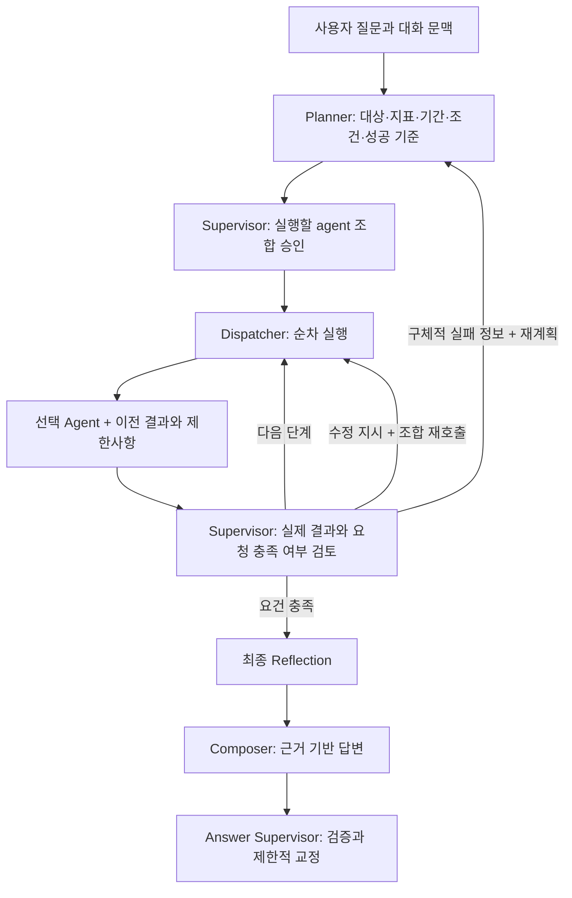

# Planner / Supervisor 고도화 — 2026-09-08

- 브랜치: `fix/adv_pl_sp`
- 기준: `feat/adv_integrate`, `7f85aaa033b7fd5c47aa9706975bd1b515d5a3e7`
- 작업 폴더: `/private/tmp/master_pjt_pl_sp`
- 시작: 2026-09-08 15:23:35 KST. 요청한 90분 동안 구현·검증·정리 진행.
- 기존 `fix/adv_t2s` 작업 폴더의 수정 파일과 미추적 결과물은 보존했다.

## 변경된 동작

사용자 질문 → 의도와 필수 조건 추출 → 전체 계획 → Supervisor의 agent 선택 → 순차 실행과 근거 전달 → 결과 검토 → 필요한 재호출 또는 재계획 → Composer → 답변 검증으로 연결했다.



### Planner

- `IntentAnalysis`에 FAB, 제품/설비 전체 목록, 공정, 라인, 지표, 기간, 날짜 기준, 집계 단위, 임계값, Top-N을 구조화한다. SQL agent와 같은 파서를 사용해 해석이 갈라지는 것을 줄였다.
- LLM은 `extracted_slots`와 원문의 `raw_text`, `success_criteria`를 반환한다. 원문에 없는 근거 span과 parser가 이미 결정한 값의 덮어쓰기는 거절한다.
- 현재 질문의 FAB을 화면 기본값보다 우선한다. `FAB-13`, `팹 13`, `13팹` 및 `fab10 말고 fab12` 같은 제외 표현을 처리한다.
- 여러 FAB의 진짜 비교 요청은 단일 FAB 조회로 축소하지 않고 확인 질문을 반환한다. 지원 FAB 범위는 기존 `fab10`~`fab13`이다.
- lotrelease 추세의 `start_date`/`due_date`가 없으면 실행 전에 확인한다. 사용자가 SQL 테이블/컬럼명을 모르더라도 그것만을 이유로 재질문하지 않는다.
- 각 agent의 답변 요건, 선행 입력, 성공 기준을 계획에 남긴다. Impact/Visualization은 SQL 결과를 필요로 한다.
- 확정한 FAB 등은 일반 API와 SSE 양쪽의 다음 대화 문맥에도 저장한다.

### Supervisor와 실행 상태

- 계획 승인을 별도로 수행하고, 허용된 추가 agent를 선택하거나 요청하지 않은 선택적 agent를 제외할 수 있다. 필수 조합은 누락할 수 없으며 `proceed=false`를 실행 승인으로 잘못 처리하지 않는다.
- 실패 결과뿐 아니라 **성공한 결과도 매번 검토**한다. 원 질문, 구조화된 계획, 현재 시도의 실제 근거, 남은 단계, 요건 충족 상태를 함께 받는다.
- `continue`, `retry_same_agent`, `retry_agents`, `replan`, `alternate_agent`, `compose`를 구분한다.
- 조합 재호출에는 구체적 `repair_instructions`와 사용 가능한 재시도 예산이 필요하다. 재계획에는 이전 계획·결과·수정 사유를 전달한다.
- 명시 재시도는 agent당 1회/전체 2회, 재계획 1회, 대체 agent 1회로 제한한다. 상위 결과가 갱신되면 이미 실행한 소비자도 다시 계산한다.
- `active_results`와 전체 실행 이력을 분리한다. SQL을 다시 조회하면 이전 SQL 값, 검색 결과, 진단 합성, 영향 계산, 차트가 최종 답변에 섞이지 않는다.
- 대체 agent를 먼저 호출하더라도 아직 실행하지 않은 중간 단계를 건너뛰지 않는다.
- RAG/CaseSearch/Impact/Text2SQL에 구조화된 handoff를 전달한다. 가장 높은 대상 한 건을 조회한 경우 SQL의 실제 설비/제품 식별자가 후속 검색 조건으로 이어진다. 실패 결과나 자유로운 지시문은 검색 조건으로 승격하지 않는다.
- 반환된 SQL 계획의 FAB/대상/기간이 알려진 요청 조건과 다르면 행을 답변 근거에서 제외한다.
- 일시적인 SQL/검색 오류는 구조화된 실패로 바꿔 Supervisor가 복구를 판단하게 한다.

### Composer와 최종 검증

- 최종 생성 담당은 기존 `llm_nodes.compose_with_llm`의 **Composer**다. 별도 Decomposer를 추가하지 않고 Planner가 분해한 답변 요건과 성공 기준을 연결했다.
- 이미 결정한 확인 질문은 불필요하게 재작성하지 않는다.
- 최종 교정문에 제공된 제한사항만 빠진 경우 해당 제한사항을 복원하고 검증을 다시 통과해야 적용한다. 근거 없는 수치 교정을 승인하는 검사는 완화하지 않았다.
- Markdown 목록 번호를 실측 숫자로 오인하지 않도록 검증기를 보완했다. 교정문에 장비 다운·제품 mix 등 주요 진단 주제가 근거 없이 새로 추가되면 적용하지 않는다.
- Composer의 LLM/fallback 실행 모드를 다른 node 상태에서 추측하지 않고 실제 실행 결과로 기록한다.
- API와 SSE가 같은 graph 및 재귀 한도를 사용한다. 5개 agent와 복구 경로가 기본 25 node 한도에 걸리지 않게 100으로 명시했다.

## 검증 결과

최종 수치는 아래 결과 파일 및 마지막 실행 기록을 기준으로 한다. 이 평가는 자체 작성 사례이며 일반적인 실사용 정확도를 보장하는 독립 평가가 아니다.

| 평가 | 결과 | 범위 |
|---|---|---|
| Planner/Supervisor 실제 LLM | 16/16 | 계획, 조건 보존, 경로, 확인 질문 |
| 추가 표현 실제 LLM | 12/12 | 한국어 FAB, 제외 대상, 복수 제품, 월별 집계 등 |
| 복구 판단 실제 LLM | 6/6 | 완료, 남은 단계, 일시 오류, 데이터 부재, 예산 소진 |
| 전체 graph + 합성 tool 결과 | 마지막 실행 4/4 | 실제 Planner/Supervisor/Reflection/Composer/Answer Supervisor, 실제 DB 조회는 대체 |
| Python 회귀 | 382 passed | 기존 테스트 + 새 계약 테스트 |
| 로컬 DB release 비교 | 47개 지표 모두 기준 브랜치와 동일 | 아래 미통과 사항 포함 |

초기 실제 LLM 평가에서는 기존 기대값과 14/16이 일치했다. PS-002는 `status`로 분류하면서 SQL/Visualization을 모두 선택한 유효한 현재값 비교였다. 그래서 분류 허용값만 `status/trend`로 명시했고 agent·대상 조건은 유지했다. PS-012의 lotrelease 날짜 기준 누락은 실제 결함으로 수정했다. 원래 기대값과 최초 결과는 보존했다.

초기 합성 graph 평가는 3/4였다. 한 건의 최종 교정문이 제한사항을 누락해 거절되었으며, 복원 로직과 별도 회귀를 추가했다. 초기 실패와 교정 후 실행을 별도 파일로 보존했다. 반복 실행에서는 진단 답변의 목록 번호를 관측 숫자로 오인하는 오류와 교정문의 새로운 원인 추가 시도도 발견해 각각 수정·차단했다. 중간 반복은 3/4 및 2/4였으며 차트 축 범위 발명도 검출됐다. 마지막 실행은 4/4였지만 반복 결과의 변동성을 숨기지 않으며, 이 소규모 결과를 안정적인 100% 정확도로 해석하지 않는다.

**DB release gate 자체는 통과하지 못했다.** 기준 브랜치에서도 동일한 7개 지표가 미달한다. 예를 들어 Text2SQL EX/semantic 0.2278, EM 0.5443, intent 0.7215였다. 이번 변경 전후의 47개 측정값은 완전히 같지만 이것을 실제 DB 통합 품질 통과로 표현하지 않는다. 다른 작업 브랜치의 Text2SQL 고도화를 임의로 합치지 않았다.

## 결과 파일과 재실행

결과는 `apps/assistant/output/evals/planner_supervisor_*`에 있다.

- `live_v2.json`: 최초 실제 LLM 14/16 원본
- `original_rubric.json`: 최초 16문항 기대값
- `live_v4.json`: 보완 후 실제 LLM 16/16, LLM 완료 횟수도 검사
- `variants_live.json`: 추가 표현 12건
- `recovery_live.json`: 합성 복구 상황 6건
- `graph_live.json`, `graph_repair_live.json`, `graph_final_live.json`, `graph_verified_live.json`, `graph_last_live.json`: 최초/교정/반복/마지막 합성 graph 실행
- `baseline_comparison.json`: 기준/변경 후 DB release 지표 원본 비교
- `pytest_final.txt`: 최종 Python 회귀 로그

`live_v1.json`과 `live_v3.json`은 샌드박스 네트워크 차단으로 실제 LLM 실행이 되지 않았던 기록이다. 실제 LLM 성능 수치에 포함하지 않는다. 평가기는 이제 fallback을 live 성공으로 세지 않는다.

```bash
# DB 및 LLM 없이 planner 계약 확인
python apps/assistant/scripts/evaluate_planner_supervisor.py \
  --output apps/assistant/output/evals/planner_supervisor_deterministic.json

# 설정된 LLM으로 질문과 계획만 평가
python apps/assistant/scripts/evaluate_planner_supervisor.py --live \
  --output apps/assistant/output/evals/planner_supervisor_live_check.json

# 실제 LLM + 합성 tool 결과. 실제 DB 결과를 보내지 않는 통합 평가
python apps/assistant/scripts/evaluate_planner_supervisor.py --suite graph --live \
  --output apps/assistant/output/evals/planner_supervisor_graph_check.json

python -m pytest -q
```

## 남은 범위

- 복수 FAB를 한 답변에서 실제 조회·비교하는 계획은 아직 지원하지 않는다.
- graph는 기존 agent 종류와 순서를 기반으로 한다. 같은 agent의 서로 다른 SQL 작업 여러 개를 독립 step ID로 관리하는 일반 DAG는 이번 변경 범위에 포함하지 않았다.
- 실제 DB를 포함한 full graph의 정확도는 기준 브랜치의 Text2SQL/DB release 실패를 해결한 뒤 다시 측정해야 한다.

로컬 전체 테스트에서 필요한 미추적 SMT2020 데이터는 기존 작업 폴더의 데이터를 읽는 링크로 제공했다. 해당 절대 경로 링크와 `.env`는 커밋에 포함하지 않는다.
