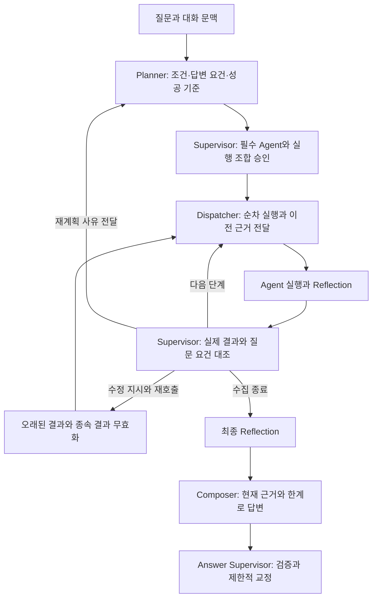
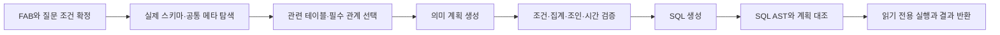
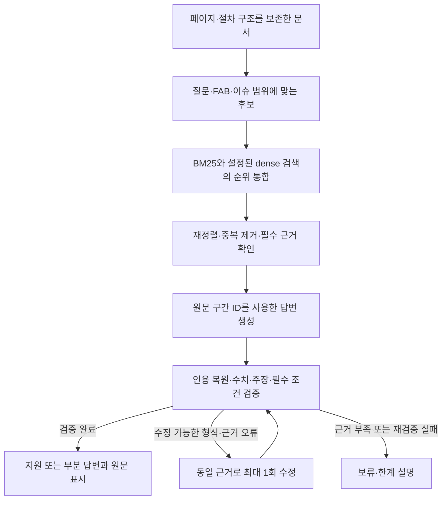
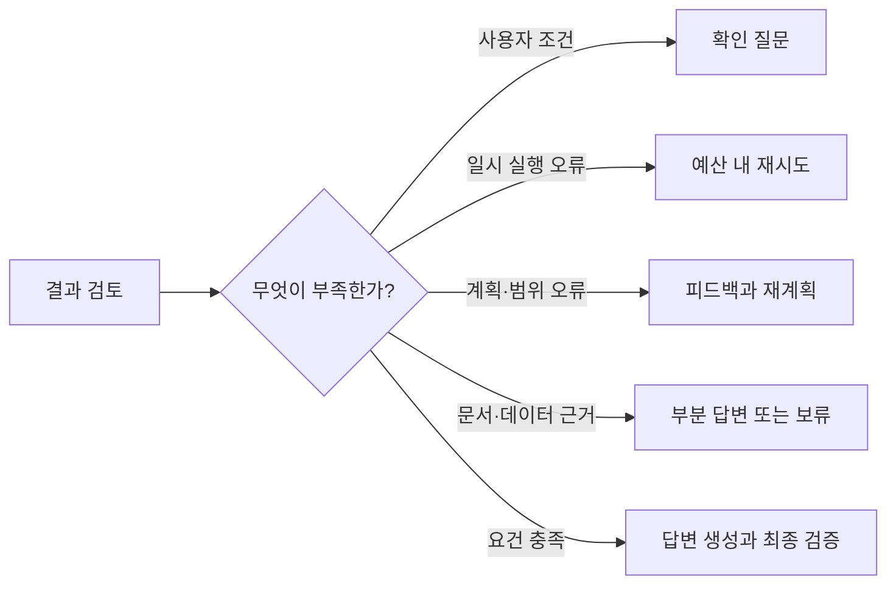
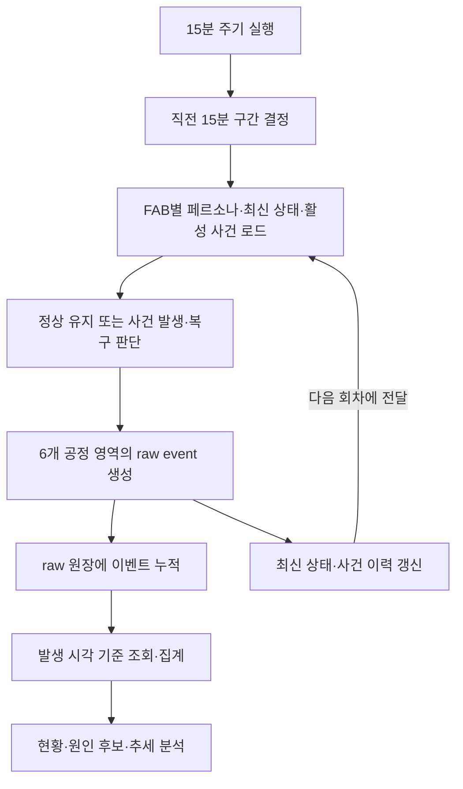

# FAB AI Assistant — 질문의 의도부터 답변의 근거까지 연결한 테스트와 고도화

## 주요 문제 해결 및 기술 리서치 (테스트 단계)

### 테스트에서 확인하고 싶었던 것

FAB 운영자가 “WIP가 늘어난 원인을 알려줘”라고 질문하면, 시스템은 먼저 어느 FAB의 어느 기간을 조회할지 결정해야 한다. 이후 실제 데이터를 찾고, 관련 문서와 사례를 확인하고, 관측한 사실과 가능한 원인을 구분해 설명해야 한다. 마지막으로 사용자가 그 설명의 근거를 직접 확인할 수 있어야 한다. 질문은 짧지만, 답변이 만들어지는 동안 유지해야 할 조건은 많다.

이번 테스트는 이 연결이 어디에서 끊어지는지를 확인하는 데 초점을 맞췄다. SQL이 정상 실행됐는데 기간 기준이 다르거나, 필요한 문서를 찾았는데 최종 답변에서 승인 조건이 빠지거나, 재조회한 결과에 이전 차트가 남는 문제는 개별 기능의 성공 여부만으로 발견하기 어렵다. **따라서 질문 해석, 근거 수집, 실행 복구, 최종 설명, 사용자 확인을 하나의 품질 흐름으로 보고 개선했다.**

개선은 다섯 영역에서 진행했다. Planner·Supervisor는 질문의 조건과 실행 결과를 연결하고, Text2SQL은 데이터의 의미를 확인하며, RAG는 문서의 조건과 출처를 보존하도록 강화했다. 화면은 답변과 근거를 사용자가 읽는 순서로 재구성했다. 데이터 측면에서는 서로 다른 페르소나를 가진 FAB10~13에 15분마다 이벤트가 쌓이도록 해, 시간에 따른 변화와 사건 복구를 분석할 기반을 마련했다.

| 이슈 구분 | 문제 상황 및 원인 | 리서치 및 해결 과정 (Reference & Solution) |
|---|---|---|
| 품질/질문 해석 | Agent가 성공해도 요청한 FAB·대상·기간이나 복합 질문의 일부 요구가 누락될 수 있었다 | 계획과 실행 분리, 구조화 출력, 단계별 성공 기준을 검토했다. Planner에 답변 요건을 명시하고 Supervisor가 성공 결과까지 검토하도록 변경했다 |
| 품질/SQL 의미 | 실행 가능한 SQL이 NULL 개수·시간 기준·조인 집계를 잘못 해석하는 사례가 있었다 | PANDA·MARS/TriSQL의 메타 기반 탐색·계획 아이디어를 참고했다. 실제 메타 탐색, 의미 계획 선검증, SQLGlot AST 대조를 적용했다 |
| 품질/검색·환각 | 문서가 검색 후 필터에서 소실되거나, 요약 과정에서 승인 조건이 누락됐다 | BM25·dense 검색 결합, RRF, 구조 보존 청크, 원문 span 검증을 적용했다. 후보 필터 순서와 생성 후 조건 검토를 보완했다 |
| 속도/비용 | 과도한 스키마 입력과 형식 오류 후 수정 호출이 불필요한 처리량을 만들었다 | 관련 스키마 선택, 요청 내 임베딩 재사용, 제한된 생성·재시도, RAG sampling·작성 범위 조정을 적용하고 입력량·호출 수·시간을 따로 측정했다 |
| 예외/가드레일 | 다른 범위의 조회, 근거 없는 원인 확정, 오래된 결과 혼입, 미완료 스트림 성공 처리 위험이 있었다 | SQL·근거·답변을 단계별로 검증하고, 현재 유효 결과와 실행 이력을 분리했다. 실패 유형에 따라 확인 질문·재시도·부분 답변·보류로 분기했다 |
| 사용성/데이터 | 기술 로그 중심 화면과 고정 데이터만으로는 운영자의 반복 분석 흐름을 확인하기 어려웠다 | 결과 중심 화면, 대화·재시도 상태 복원, FAB별 페르소나와 사건 생명주기를 가진 15분 raw event 시뮬레이션을 구현했다 |

이 문서는 2026-09-10까지의 저장된 개발·평가 기록을 바탕으로 작성했다. 각 평가의 코드 버전과 대상은 해당 절에 표시했다. 이번 문서 작성 중 외부 LLM·DB 평가를 다시 실행하지 않았다.

## 1. LLM 답변 품질 평가 및 개선

### 1-1. Planner·Supervisor — “도구가 성공했다”에서 “질문에 답할 준비가 됐다”로

#### 어떤 문제가 있었는가

> 대표 질문: “fab10 말고 M13 WIP 증가 원인 알려줘.”

이 질문에서는 FAB13을 선택하는 것뿐 아니라 FAB10을 제외한다는 표현까지 이해해야 한다. 화면에 기본 FAB10이 설정돼 있어도 현재 질문의 명시적 의도가 우선해야 한다. 또한 WIP를 조회한 뒤, 그 조회 대상과 관련된 문서·사례를 찾아야 한다. SQL과 검색이 각각 성공하더라도 두 결과가 서로 다른 대상을 설명하면 답변은 잘못된 방향으로 이어질 수 있다.

기존 구조에도 Planner, 실행 승인, Dispatcher, Agent Reflection, 제한된 재시도와 최종 답변 검증은 있었다. 다만 계획이 Agent 종류와 작업 설명 중심이어서, 실행이 끝났을 때 **질문의 어떤 요구가 충족됐고 무엇이 남았는지**를 일관되게 확인하기 어려웠다. 성공한 결과도 다시 검토하고, 상위 결과가 바뀌면 후속 결과를 갱신하는 계약이 필요했다.

#### 어떤 판단으로 구조를 바꿨는가

Planner의 출력을 실행할 Agent 목록보다 풍부하게 구성했다. FAB, 복수 제품·설비, 지표, 기간, 날짜 기준, 집계 단위, 임계값, Top-N을 구조화하고, 답변 요건과 성공 기준을 함께 남긴다. LLM이 보완한 조건에는 원문 구간을 요구하며 공통 파서가 확정한 값을 임의로 덮어쓰지 못하게 했다. 덕분에 후속 Agent와 검토 단계가 같은 질문 해석을 참조할 수 있다.

Supervisor는 계획을 승인한 뒤에도 역할을 이어간다. 매 Agent 실행 결과에 대해 원 질문, 현재 근거, 남은 단계, 요건 충족 상태를 함께 보고 다음 단계를 결정한다. 필요한 경우 같은 Agent 또는 조합을 다시 호출하고, 계획 자체가 잘못됐으면 구체적 피드백과 함께 Planner로 돌아간다. 재시도에는 수정 지시와 예산을 요구해 이유 없는 반복을 막았다.

**As-Is:** 질문 유형·Agent 계획 → 실행 → Reflection에서 문제 발견 시 복구 → 답변 생성

**To-Be:** 질문 조건·답변 요건 → 실행 승인 → 실제 근거 전달 → 성공·실패 모두 검토 → 필요한 재호출·재계획 → 유효 근거로 답변 생성

복구가 끝까지 성공하지 못한 경우에는 미충족 요건과 한계를 포함해 종료한다. 중간의 조기 답변 생성 선택으로 필수 요건을 건너뛰는 것은 차단한다.

#### 재시도할 때 이전 결과는 어떻게 처리했는가

예를 들어 SQL 재조회로 분석 대상 설비가 바뀌었다고 가정하자. 새 SQL 값만 교체하고 이전 설비의 문서·사례·차트를 그대로 두면 최종 답변에 두 시도의 결과가 섞인다. 이를 방지하기 위해 감사용 전체 실행 이력과 답변에 사용할 `active_results`를 분리했다. 상위 결과를 갱신하면 그 결과를 사용한 후속 산출물을 무효화하고 필요한 단계를 다시 계산한다.

이 변경은 재시도 횟수만 늘리는 접근과 차이가 있다. **재실행 이후에도 질문의 대상과 근거 사이의 연결이 유지되는지**를 실행 상태로 관리한다. 확인용 예시의 설비 변화는 구조 설명이며, 별도 실측 사례로 집계하지 않았다.

#### 검증에서 다시 발견한 문제

초기 실제 LLM 계획 평가에서는 16문항 중 14문항이 기대값과 일치했다. 두 불일치를 같은 종류의 결함으로 처리하지 않았다. 하나는 현재값 비교를 `status`로 분류했지만 SQL·Visualization을 모두 선택한 유효한 계획이었다. 이 경우 분류 허용 범위를 조정하되 대상·Agent 조건은 유지했다. 다른 하나는 lotrelease의 날짜 기준을 확인하지 않은 실제 결함이어서 구현을 수정했다.

전체 graph 검사에서는 최종 교정문이 제한사항을 누락하거나, Markdown 목록 번호를 관측 수치로 오인하거나, 교정 과정에서 근거 없는 진단 주제를 추가하는 문제도 발견했다. 제공된 한계만 빠진 경우 이를 복원해 재검증하고, 근거 없는 새 원인 추가는 거절하도록 보완했다. 교정 모델 역시 오류를 만들 수 있다는 점을 검증 과정에 반영한 것이다.

| 항목 | 평가 및 개선 결과 |
|---|---|
| 평가 대상 기능 | 조건 추출, Agent 조합·순서, 근거 전달, 복구, 최종 답변 요건 보존 |
| 개선 후 계획 평가 | 실제 LLM 기본 16/16, 표현 변형 12/12, 복구 판단 6/6 |
| graph 검사 | 실제 LLM + 합성 도구 결과 마지막 실행 4/4. 중간 3/4·2/4 실패 기록 보존 |
| 9월 10일 추가 평가 | 계획 계약·routing judge 28/28. 복합 최종 답변 judge 13/14, 실제 시스템 성공 10/14 |
| 다음 과제 | 복합 답변 적절성 92.86%와 시스템 성공 71.43%의 간격 축소. 미승인 답변 반환 정책과 복합 영향 계산 교정 실패 개선 |

계획·복구 수치는 병합 전 소규모 개발 평가이고, 9월 10일 복합 평가는 별도 실행이다. 동일 Agent의 여러 독립 작업을 일반 DAG로 관리하거나 여러 FAB를 한 답변에서 실제 동시 비교하는 기능은 아직 확장 과제다.

근거: [당시 Planner/Supervisor 상세보고서](planner_supervisor_hackathon_20260908.md), [9월 10일 Agent 평가](adv_integrate_agent_evaluation_20260910.md).

### 1-2. Text2SQL — 결과가 나오는 SQL과 의도에 맞는 SQL을 구분하다

#### 테스트에서 의미 오류를 찾은 방법

> 실제 화면 검증 사례: 화면의 FAB10 문맥에서 “FAB13의 lot_id가 NULL인 행 수”를 요청한 뒤, 같은 대화에서 새로운 `equipment_id IS NOT NULL` 질문을 이어갔다.

이 사례는 문법적으로 유효한 SQL을 만드는 것만으로 통과할 수 없다. 현재 질문의 FAB13을 우선해야 하고, NULL을 포함하는 행 개수를 세어야 하며, 후속 질문에 이전 `lot_id` 조건이 섞이지 않아야 한다. 당시 검증에서는 첫 결과 864, 후속 결과 2592를 확인했다. 이 값은 당시 데이터의 검증값이며 이후 누적 데이터에서도 유지되는 정답은 아니다.

별도 평가에서는 기간의 시작·종료 열을 혼용하거나, 명시된 NOT NULL 조건을 계획에서 빠뜨리는 문제도 발견했다. 이들은 DB가 정상 결과를 반환할 수 있는 오류다. 실행 예외만 감시해서는 잡기 어려워, SQL 이전에 질문의 의미를 검사할 구조가 필요했다.

#### 리서치를 실제 구조에 어떻게 적용했는가

Text2SQL 작업에서는 PANDA 및 MARS/TriSQL의 메타 기반 탐색·계획 아이디어를 참고했다. 프로젝트에 적용한 중심은 실제 스키마와 업무 의미를 제공하고, 계획·생성·검증을 분리하는 것이었다. 모델 학습이나 논문의 전체 절차를 재현하기보다 현재 데이터베이스에서 확인 가능한 테이블·컬럼·관계를 근거로 계획하도록 구성했다.

공통 메타에는 컬럼 이름 외에도 단위, 집계 규칙, 행의 의미, 날짜 기준, 조인 관계, 출처를 담았다. 예를 들어 “건수”는 `COUNT(*)`인지 NULL을 제외하는 `COUNT(column)`인지 구별해야 한다. 스냅샷을 상세 이벤트와 조인하면 스냅샷 값이 여러 행에 반복될 수 있으므로 단순 합산이 적절한지도 확인해야 한다. 메타는 이런 판단에 필요한 정보를 제공한다.

실제 메타 경로에서는 LLM이 의미 계획을 먼저 생성한다. 코드는 그 계획의 테이블·조건·집계·조인·최신 범위를 검증한 뒤 SQL 생성을 허용한다. 생성 후에는 SQLGlot AST를 이용해 실제 SQL이 검증한 계획과 일치하는지 다시 대조한다. 이미 규칙으로 확정할 수 있는 질문은 기존 fast path를 유지했다.

위 흐름은 메타 기반 LLM 경로다. 검증 실패에는 원인을 전달해 제한적으로 수정하고, 축소 스키마로 처리할 수 없으면 전체 스키마에서 다시 탐색한다. 후보 생성은 최대 2회로 제한한다.

#### 테이블 탐색의 책임도 바꿨다

실제 FAB12 기간 합계 질문에서는 Planner가 사용자에게 물리 테이블명을 요구해 조회가 막힌 사례가 있었다. 운영자는 확인할 지표와 기간을 말할 수 있지만 내부 테이블 이름까지 알 필요는 없다. 따라서 테이블·컬럼 탐색은 Text2SQL에 맡기고, 사용자에게는 FAB나 날짜 의미처럼 업무적으로 결정할 조건을 묻도록 보완했다. 같은 질문을 추가 힌트 없이 재실행해 당시 기준 결과 443과 종료 시각 기준의 설명을 확인했다.

이후 과거 조회 실패가 대화에 남아 있더라도 그것만으로 새 요청을 차단하지 않도록 했다. 현재 DB 메타와 실제 도구 결과가 가용성을 판단하는 근거가 되도록 역할을 정리했다.

| 항목 | 평가 및 개선 결과 |
|---|---|
| 평가 방식 | 별도 고정 문항과 기준 SQL, 실제 DB 결과 비교. 날짜·NULL·조인·집계·후속 문맥을 함께 확인 |
| 최초 별도 검증 | 14/16. 시작/종료 열 혼용과 NOT NULL 조건 누락 발견 |
| 수정 후 확인 | 개발 회귀 5/5, 동일 실패 문항 반복 2/2. 기존 실제 DB 회귀 79/79, 저장 SQL 재검증 43/43 |
| 9월 10일 추가 평가 | 정답 SQL 22문항의 EX 21/22(95.45%), EM 0/22, 구조 Soft-F1 0.4708. 별도 negative 2/2 |
| 남은 문제 | PM 조인 질의의 정렬·집계 별칭 검증 실패. 업무 지표 정의 검토와 더 큰 외부 평가 필요 |

EM이 0인데 EX가 높은 이유도 따로 확인했다. 생성 SQL은 전체 컬럼 경로·별칭·추가 FAB 조건을 사용해 기준 SQL과 구조가 달랐지만, 대부분 같은 결과를 반환했다. 그래서 SQL 형태의 일치, 실제 결과의 일치, 질문 의미의 적절성을 한 지표로 합치지 않았다. 최초 실패를 수정 후 수치로 덮어쓰지 않았으며, 서로 다른 평가셋을 직접 향상률로 비교하지 않았다.

근거: [메타 카탈로그 설계](text2sql_metadata_catalog_design.md), [일반화 작업 결과](text2sql_generalization_results_20260908.md), [추가 평가](adv_integrate_agent_evaluation_20260910.md).

### 1-3. RAG — 문서를 찾은 뒤에도 답변이 달라지는 이유를 추적하다

#### 첫 번째 문제: 검색 결과는 있는데 전달할 근거가 없었다

KB 업데이트 질문에서 검색 trace에는 후보 5개가 기록됐지만 실제 Agent에 반환된 evidence는 0개였다. 원인은 관련 문서의 부재만이 아니었다. 검색 결과가 top-k와 근거 예산을 소비한 뒤 이슈 불일치 필터에서 제거되고 있었기 때문에, 뒤에 있던 적절한 후보를 답변 근거로 사용하지 못했다.

이를 해결하기 위해 이슈 필터를 BM25 후보 선정과 dense 후보 병합 전으로 이동했다. 지식 문서·플레이북 업데이트, Hold 해제 표현도 보완했다. 변경 후에는 검색 후보 수와 실제 반환 근거 수를 구분해 남겨, 검색 과정의 어느 단계에서 근거가 사라졌는지 추적할 수 있게 했다.

#### 두 번째 문제: 필요한 문서를 찾아도 중요한 조건이 빠졌다

> 대표 질문: “PM을 연기하려면 어떤 승인과 기록이 필요해?”

이 질문에 “승인을 받고 기록을 남긴다”고 답하면 관련 내용처럼 보이지만 실무 판단에 필요한 조건은 부족하다. 현재 시뮬레이션 문서에는 Engineer 승인, 단기 연기의 low risk·Manager 승인·risk memo, 복구 후 qualification 또는 dummy run 기록 등의 조건이 있다. 요약이 짧아지면서 이 관계가 빠지면 출처가 붙어 있어도 원문을 충실히 전달한 답변으로 보기 어렵다.

그래서 검색과 생성 두 단계 모두를 바꿨다. 문서는 페이지·절차 단위로 분리해 조건들이 섞이지 않도록 하고, 키워드 검색과 의미 검색의 후보 순위를 RRF로 통합한 뒤 재정렬한다. 생성 후에는 주장·수치·인용뿐 아니라 질문이 요구한 역할과 조건이 보존됐는지 확인하도록 했다.

#### 원문 인용은 모델이 다시 쓰지 않게 했다

초기에는 모델이 인용문을 직접 작성하면서 PDF의 글머리표·따옴표 표현이 달라져 검증에 실패했다. 이를 계기로 서버가 원문 구간 ID를 만들고, 모델은 그 ID를 선택하며, 실제 인용문은 서버가 원문에서 복원하는 방식으로 변경했다. 문서의 존재, 인용문 일치, 주장의 의미적 타당성은 각각 별도로 확인한다.

#### 세 번째 문제: 검토 모델도 그럴듯한 설명을 통과시켰다

후속 KB 질문에서는 문서의 `draft/reviewed/approved` 상태를 버전 관리 정책으로 설명했고, 내부 검토 모델도 이를 통과시켰다. 문서 승인 상태와 버전 번호·개정 이력은 다른 개념이다. 원문에 버전 관리 기준이 없으면 그 부분은 답할 수 없다는 사실을 유지해야 했다.

이후 근거가 있는 업데이트 기준은 설명하되, 확인되지 않은 버전 정책은 제외해 부분 답변으로 반환하도록 보완했다. 답변을 전부 포기하거나 빈 부분을 상식으로 채우는 대신, 질문의 어느 부분까지 근거가 있는지를 표현하도록 만든 것이다. 검증 오류에 대한 수정도 같은 근거 안에서 최대 1회만 허용했다.

| 항목 | 개선 전 | PR #12 병합 후 재평가 |
|---|---:|---:|
| 필수 evidence marker 전체 확보 | 5/7 | 7/7 |
| Faithfulness | 0.8286 | 0.8881 |
| Answer Relevancy | 0.4425 | 0.4504 |
| Context Precision without reference | 0.8571 | 1.0000 |

동일 fixture·corpus의 답변 가능 7문항 기준이며 GPT-4.1, text-embedding-3-large, Ragas 0.2.15를 사용했다. 측정 경로는 로컬 검색·feature reranker·실제 LLM 생성 및 검토다. 하이브리드 검색은 구현돼 있지만 이 수치를 Milvus 성능으로 해석하지 않는다.

전체 10문항의 최종 상태는 supported 6개, partial 1개, insufficient 3개였고 반환 인용 32개가 모두 원문·문서·페이지와 일치했다. 답변 불가 3개를 포함한 전체 평균은 Faithfulness 0.6467→0.6550, Relevancy 0.3098→0.3153, Context Precision 0.6000→0.8000이다. 부분집합과 전체 결과를 함께 보존해 보류 문항을 제외한 점수만으로 품질을 설명하지 않았다.

**확인된 성과는 검색 근거 복구와 답변 근거 충실도의 평균 개선이다.** 관련성은 상승 폭이 작고 일부 문항은 하락했으므로, 다음 단계에서는 역할·조건별 요구사항을 얼마나 직접 충족했는지 더 세밀하게 평가할 필요가 있다. 중간 개발 버전의 더 높은 점수를 최신 결과로 재사용하지 않았다.

근거: [원문 인용 확장 기록](rag_extension_20260908.md), [검색·답변 후속 개선](rag_adv2_20260910.md), [병합 후 실제 재평가](pr12_rag_retest_20260910.md).

## 2. 성능 및 비용 최적화

### 2-1. 먼저 모델에 전달하는 정보의 양과 역할을 정리했다

FAB Agent의 지연을 줄일 때 모든 호출을 병렬화하는 것이 적절한 것은 아니다. 원인 진단에서는 SQL로 실제 대상을 확인한 뒤 그 대상의 문서·사례를 검색해야 하고, 영향 계산과 시각화는 앞 단계의 수치를 사용한다. 이런 의존성을 유지하면서 줄일 수 있는 입력과 호출부터 찾았다.

Text2SQL에서는 공통 메타 전체를 전달하는 대신 관련성 있는 테이블을 우선 선택했다. 다만 작은 입력만을 목표로 하면 필요한 관계 테이블이 사라질 수 있다. 그래서 양수 관련성 후보 최대 6개를 기본으로 선택하면서 명시 테이블·필수 후보·검증된 관계 이웃은 추가 보존했다. 축소 스키마가 부족한 경우에는 전체 스키마로 돌아갈 수 있도록 했다.

| 항목 | 내용 |
|---|---|
| 기존 병목 | 관련 없는 테이블과 중복 설명이 첫 계획 입력을 확대 |
| 개선 전략 | 관련 스키마 우선 선택 + 필수 관계 보존 + 필요 시 전체 재탐색 |
| 적용 기술 | 공통 메타, schema retrieval, 기존 deterministic fast path |
| 개선 결과 | 동일 질문 19개의 첫 계획 입력 문자 수 중앙값 33,906→18,823, 약 44.5% 감소 |

이 수치는 모델에 넘긴 입력 문자 수다. 이를 실제 청구 비용이나 전체 응답시간의 44.5% 절감으로 바꾸어 쓰지 않았다. 의미 검증 단계를 추가하면서 호출 구조도 달라질 수 있으므로, 입력량·호출 수·과금·시간을 각각 측정해야 한다.

### 2-2. RAG에서는 수정이 필요한 이유를 줄였다

없는 재가동 시간을 묻는 질문에서 모델이 `insufficient` 상태와 구체적인 claims를 동시에 생성한 사례가 있었다. 시스템은 검증 후 한 번 수정해 정상 보류했지만, 매번 같은 형식 오류를 고치기 위해 호출을 추가하는 것은 비효율적이었다. 또한 질문과 직접 관계없는 배경 설명이 길어지면 생성량뿐 아니라 검토할 주장도 늘어났다.

RAG 생성·검토에 temperature=0을 명시하고, 질문의 역할·의사결정에 맞춰 간결하게 작성하도록 보완했다. 검토 단계에는 생성된 배경 설명에서 새 요구를 만들기보다 원 질문에서 요구사항을 도출하도록 지시했다. 원문 승인 조건은 유지하면서 불필요한 설명과 형식 오류를 줄이는 방향이었다.

효과를 확인하기 위해 코드와 근거를 고정했다. 같은 6문항에 대해 변경 전후 각각 3회씩, 총 36회의 생성·검토를 실행했다. 서로 다른 코드 버전의 결과 차이와 동일 코드 안에서의 반복 변동을 구분하기 위한 실험이었다.

| 측정 항목 | 변경 전 | 변경 후 |
|---|---:|---:|
| 검증 오류 후 수정이 필요했던 실행 | 3/18 | 0/18 |
| 모델 호출 수 | 36 | 33 |
| 평균 생성·검토 시간 | 8.73초 | 6.16초 |
| 평균 최종 답변 길이 | 805자 | 608자 |
| 반복 간 상태가 일치한 문항 | 6/6 | 6/6 |

이 실험에서 상태 일관성은 전후 모두 같았다. 줄어든 것은 추가 수정 호출과 평균 분량·시간이었다. 서버 부하를 통제하지 않았고 sampling과 프롬프트를 함께 수정했으므로, 시간 감소 전체를 한 가지 코드 변경의 효과로 단정하지 않았다. 대체 장비 질문은 오히려 답변 길이 변동이 커져 복합 절차의 설명 범위에는 추가 개선이 필요했다.

### 2-3. 호출이 필요 없는 경로와 중단 조건을 명시했다

RAG에서 순수 playbook ID가 주어지면 해당 원문을 직접 조회해 임베딩·reranker 호출을 생략한다. 같은 요청이 여러 지식베이스를 검색할 때는 질문 임베딩을 요청 안에서 재사용한다. 전체 근거 문자 예산과 reranker 후보 상한도 두었다. 이는 요청 간 답변을 재사용하는 Semantic Cache와는 다른 범위의 최적화다.

실행 제어에서는 질문에 필요한 Agent만 호출하고, 동일 Agent·조합 재시도와 재계획에 명시적인 예산을 적용한다. SSE 취소·timeout 이후 다음 노드와 추가 모델 호출이 계속 진행되지 않도록 보완했다. 이미 외부로 전송된 동기 HTTP 요청 자체의 강제 취소까지 보장하는 것은 아니므로 그 경계도 실행 기록에서 구분한다.

| 실행 범위 | 기록된 시간 | 해석 |
|---|---|---|
| 9월 10일 복합 graph 14문항 | 평균 24.70초, 최대 53.27초 | Supervisor 진입부터 최종 결과까지. Judge·HTTP·브라우저 시간 제외 |
| PR #12 RAG 단독 10문항 | 평균 4.84초 | 검색·생성·내부 검토. Ragas 채점·전체 graph 제외 |

두 수치는 처리 범위가 다르므로 서로 비교해 전체 서비스가 빨라졌다는 근거로 사용하지 않는다. 다음 비용 평가는 공급자 보고 토큰, 실제 호출 수, 요청별 지연을 같은 조건으로 묶어 측정하는 것이 필요하다.

근거: [스키마 입력량 비교](text2sql_generalization_results_20260908.md), [RAG 반복 실험](rag_stability_20260910.md), [임베딩 재사용·중단 처리](rag_extension_20260908.md).

## 3. 예외 처리 및 가드레일

### 3-1. 검증을 어느 단계에 둘 것인가

이번 가드레일은 최종 문장만 검사하는 방식에서 더 나아가, 오류가 생길 수 있는 단계마다 계약을 확인하도록 구성했다. 잘못된 FAB를 조회한 뒤 마지막 문장만 고쳐도 이미 수집한 근거는 다른 FAB의 값이다. 따라서 조회 전에 범위를 확인하고, SQL 생성 후에는 계획과 대조하며, 실행 후에는 실제 반환 근거를 검토해야 한다.

문서 답변도 마찬가지다. 존재하는 인용문을 붙였다는 사실만으로 그 문장이 승인 조건을 정확히 설명한다고 볼 수 없다. 원문 존재와 수치 검증은 코드로 확인하고, 역할·조건·질문 충족 여부는 별도 검토 대상으로 둔다. 모델의 판단이 필요한 부분에서도 검토 결과를 무조건 신뢰하지 않고, 교정문을 다시 검증한다.

| 검증 위치 | 차단·탐지 대상 | 대응 로직 |
|---|---|---|
| 질문·계획 | FAB·날짜 기준의 모호성, 필수 Agent 누락, 원문에 없는 보완 조건 | 확인 질문, 필수 경로 보존, 조건 출처 검사 |
| SQL 실행 전 | 쓰기·비허용 SQL, 계획 외 조건·집계, 잘못된 조인·시간 기준 | read-only·allowlist 유지, 의미 계획과 AST 대조, 실패 사유 반환 |
| Agent 실행 후 | 요청 범위 불일치, 빈 근거, 실패 결과, 오래된 파생 근거 | 근거 제외, 구조화된 실패, 제한된 복구와 종속 결과 무효화 |
| 최종 답변 | 근거 없는 수치·확정 원인, 시뮬레이션의 실측 오인, 한계 누락 | 답변 승인 거절, 제한적 교정 후 재검증, 부분 답변·보류 |
| 화면·스트림 | 중단된 응답의 성공 처리, 재시도 범위 변경 | 완료 이벤트 확인, 실패·취소·중단 상태 구분, 원래 payload 재사용 |

### 3-2. 실패에 따라 다음 행동을 다르게 했다

일시적인 SQL·검색 오류와 실제 데이터 부재는 다른 상황이다. 전자는 같은 작업을 다시 실행해 복구할 수 있지만, 후자는 반복 호출만으로 정보가 생기지 않는다. 사용자 조건이 모호한 경우도 도구를 재시도할 것이 아니라 질문을 돌려줘야 한다.

그래서 `data_unavailable`, `unsupported`, `needs_clarification`, `skipped`는 동일 Agent 재시도 대상에서 제외했다. 재시도 가능한 상황에서도 Agent당 1회·전체 2회, 재계획 1회, 대체 Agent 1회로 제한한다. 조합 재호출에는 수정 지시를, 재계획에는 구체적인 실패 피드백을 요구한다.

### 3-3. 잘못된 답변을 넣어 검토 기능을 확인했다

정상 답변을 승인하는 테스트만으로는 Supervisor의 오류 탐지 능력을 확인하기 어렵다. 따라서 합성 근거를 사용해 잘못된 값, 다른 FAB, 시뮬레이션의 실측 주장, 확정 원인, 요청 내용 누락을 의도적으로 포함한 답변을 검토시켰다.

정상 답변 1건은 승인됐고, 잘못된 답변 5건은 모두 탐지·교정 적용을 확인했다. 별도 judge의 최초 집계는 5/6이었는데, 입력에 주입한 오류를 Supervisor 자체의 오류로 오인한 사례가 있었다. 평가 대상을 명확히 한 rubric으로 6문항 전체를 judge만 재평가해 6/6을 얻었다. Agent를 다시 실행한 성과처럼 기록하지 않고 원 판정과 보정 판정을 함께 남겼다.

| 항목 | 테스트 결과 |
|---|---|
| Supervisor 오류 주입 | 정상 1/1 승인, 오류 5/5 탐지·교정 적용. 보정 rubric의 judge 6/6 |
| RAG 답변 불가 질문 | PR #12 재평가 3/3 insufficient 유지 |
| RAG 인용 검사 | 반환 32/32 인용의 원문·문서·페이지 일치 |
| 웹 예외 복구 | 테스트 25개·build 통과. mock으로 실패·재시도·취소·비정상 SSE 종료·피드백 복구 확인 |

이와 별개로 실제 복합 영향 질문에서는 검증에 실패한 원래 답변 문자열이 실패 결과에 남는 문제를 발견했다. 검증기가 오류를 찾았다는 것과 사용자에게 안전한 결과만 노출된다는 것은 별도의 계약이다. 다음 개선에서는 미승인 원문을 어떤 형태로 반환·표시할지 우선 정리해야 한다. 프롬프트 인젝션이나 시스템 프롬프트 유출 전용 공격 평가의 방어율은 이번 자료로 산출하지 않았다.

근거: [오류 주입 및 미승인 답변 사례](adv_integrate_agent_evaluation_20260910.md), [RAG 인용 검증](pr12_rag_retest_20260910.md), [화면 예외 검증](frontend_adv_review.md).

## 4. 기타 문제 해결 사례

### 4-1. 서로 다른 네 공장을 만들어 시간에 따른 변화를 테스트하다

고정된 데이터에서도 SQL과 검색의 기본 동작은 확인할 수 있다. 하지만 “이전 구간보다 나아졌는가”, “같은 사건이 아직 진행 중인가”, “다른 공장은 왜 상대적으로 안정적인가” 같은 질문을 검토하려면 공장별 특성과 상태의 연속성이 필요하다. 이에 FAB10~13을 서로 다른 운영 페르소나로 설정하고 15분마다 raw event가 누적되는 시뮬레이션을 구성했다.

기존 스냅샷 생성기에도 FAB별 프로파일이 있었다. 이번 확장은 이를 이벤트 원장과 최신 상태·사건 이력으로 나누어, 이전 회차를 읽고 다음 구간을 생성하도록 한 것이다. 모든 FAB에 매번 장애를 넣지 않고 정상 이벤트를 기본으로 생성하며, 사건이 있는 공정에만 심각도와 영향을 반영한다.

#### FAB10 — 안정적인 대량·소품종 생산을 맡는 공장

`stable_hvlm`은 검증된 공정으로 소수 제품을 많이 생산하는 유형이다. 초기 수율이 상대적으로 높고 사건 발생 확률이 낮아, 안정 운영을 관찰하는 기준 공장으로 설정했다. 대표적으로 계측 재검사나 photo 대기열 증가처럼 작은 이상을 찾아보는 상황을 설명한다.

이 페르소나에서 확인할 질문은 “최근 1시간 photo 대기시간이 이전 구간보다 증가했는가”와 같은 정상 상태 대비 변화다. 큰 장애가 발생해야만 답변할 수 있는 테스트에 치우치지 않고, 정상 구간과 작은 변화를 구별하는 분석 기반을 제공한다.

#### FAB11 — 노후 설비와 정비 일정을 관리하는 공장

`aging_lvhm`은 여러 제품을 소량 생산하면서 설비 유지보수를 관리하는 유형이다. PM 시간이 길어지거나 장비가 멈췄을 때 해당 공정의 대기와 복구 상태를 함께 보는 상황에 초점을 맞췄다. 기존 페르소나의 대표 사건은 PM 초과, etch 장비 다운, carrier 대기다.

이 경우 단순히 “장비 다운이 있었다”는 답변보다 언제 시작했고 아직 활성 상태인지, 복구 단계로 넘어갔는지, 어느 공정의 대기가 동반됐는지를 확인하는 것이 유용하다. 사건 이력을 별도 테이블로 유지한 이유와 연결된다.

#### FAB12 — 신규 공정과 제품 조합을 안정화하는 공장

`new_process_mix`는 신규 공정·제품 구성이 혼합된 환경을 나타낸다. 레시피 튜닝, 수율 변화, 재작업 증가를 함께 살펴보는 공장으로 설정했다. 공정 조건을 조정한 전후에 어떤 이벤트가 나타났는지 확인하는 분석에 활용할 수 있다.

이 페르소나는 답변의 원인 표현도 시험한다. 레시피 조정과 재작업이 함께 나타났더라도 그것만으로 인과관계를 확정할 수 없다. SQL의 관측, 문서의 설명, 원인 후보를 구분하는 Planner·Supervisor·RAG 계약이 필요한 상황이다.

#### FAB13 — 높은 생산 부하와 병목을 관리하는 공장

`high_load_expansion`은 생산 물량이 몰리는 증설 국면을 가정한다. 네 FAB 중 초기 WIP와 신규 사건 기본 확률이 가장 높으며, WIP 증가·병목·hold·수율 저하 같은 상황을 분석하도록 구성했다.

여기서는 단발성 경보보다 사건이 다음 구간까지 지속되는지, 회복 중인지, 대기시간이 어떻게 달라지는지가 중요하다. “활성 병목 사건이 이전 구간보다 회복됐는지 보여줘” 같은 후속 분석을 위한 데이터를 제공한다. 실제 증설 설비의 투입 일정이나 물리적 공정 전체를 모델링한 것은 아니다.

| FAB | 페르소나 | 초기 WIP | 초기 수율 추세 | 신규 사건 기본 확률 |
|---|---|---:|---:|---:|
| FAB10 | 안정적인 대량·소품종 생산 | 1,260 | 97.3% | 10% |
| FAB11 | 노후 설비·정비 중심의 소량·다품종 생산 | 920 | 95.8% | 22% |
| FAB12 | 신규 공정·제품 혼합과 품질 안정화 | 1,110 | 96.2% | 25% |
| FAB13 | 고부하·증설과 병목 관리 | 1,460 | 96.7% | 32% |

수치는 raw 시뮬레이터 초기 설정이다. 신규 사건 기본 확률은 진행 중 사건이 없을 때 적용하고 건전성에 따라 가중한다. 위 대표 사건 설명은 기존 스냅샷 생성기의 FAB별 설정에 근거하며, 현재 raw 생성기는 공통 사건 후보에서 선택한다. FAB마다 특정 사건만 발생하거나 모든 프로파일 파라미터가 raw 분포에 반영된 것은 아니다.

#### 15분마다 무엇을 이어받는가

현재 실행 시각을 15분 경계로 정렬해 직전 구간을 정하고, FAB별 최신 상태와 활성 사건을 읽는다. 사건이 없다면 프로파일과 건전성을 바탕으로 발생 여부를 판단하고, 있다면 같은 사건 ID의 진행 상태를 이어간다. 이후 photo·etch·deposition·implant·cmp·metrology의 여섯 영역에서 정상·사건 이벤트를 생성한다.

| 저장 대상 | 역할 | 분석할 때의 의미 |
|---|---|---|
| `fab_process_raw_events_{fab}` | 이벤트 원장 | 언제·어느 공정·설비·lot에서 어떤 이벤트가 발생했는가 |
| `fab_simulation_state_{fab}` | FAB별 최신 상태 | 현재 WIP·수율 추세·건전성·활성 사건·복구 진행률은 무엇인가 |
| `fab_incidents_{fab}` | 사건 이력·진행 상태 | 동일 사건이 active→recovering→recovered 중 어디에 있는가 |

이벤트는 누적하고 상태·사건은 해당 키의 진행 정보를 갱신한다. 분석은 `created_at`이 아닌 `event_time`을 발생 기준으로 사용한다. 최신 상태의 WIP와 이벤트별 WIP 변화량, 평균 대기시간은 서로 다른 의미이므로 집계 방식도 구분해야 한다.

예약은 `--interval-minutes 15`로 생성기를 실행하도록 설정돼 있다. 일일 projection은 전날 raw를 조회용 스냅샷·이벤트로 변환하는 별도 후처리이며 9월 10일 기준 로컬 스크립트가 존재한다. 이번 보고서에서는 최신 DB 누적 행 수, 누락 없는 실행, 일일 처리 완료 여부를 새로 검증하지 않았다. 이 데이터는 현재 시각에 맞춰 갱신되는 합성 데이터이며 실제 MES·장비 센서 수집은 아니다.

근거: [raw 생성기](../apps/assistant/scripts/simulate_fab_raw_events.py), [사건 연속성 테스트](../apps/assistant/tests/test_fab_raw_event_simulator.py), [기존 페르소나 설정](../apps/assistant/scripts/insert_fab_live_process_snapshot.py), [일일 projection](../apps/assistant/scripts/project_fab_raw_events_daily.py).

### 4-2. 화면 — 분석 결과를 읽고 근거를 확인하는 순서로 바꾸다

기존 화면은 실행 로그와 원본 응답을 자세히 볼 수 있었지만, 사용자가 가장 먼저 찾는 답변·차트·표보다 기술 정보가 크게 드러났다. 분석 결과를 이해하려는 사용자에게는 어디부터 읽어야 할지 부담이 될 수 있었다. 그래서 사용자 작업 화면과 기존 평가 화면의 목적을 나누고, 결과를 먼저 읽은 뒤 필요한 상세 정보를 펼치는 구조로 재구성했다.

답변 아래에서 차트와 표를 전환하고, 긴 표는 검색·정렬·페이지 이동으로 탐색할 수 있게 했다. 근거 탭에서는 원문 인용을, 데이터/SQL 탭에서는 실제 조회 결과와 쿼리를 확인한다. Agent trace와 원본 응답도 남겨 사용성과 검토 가능성을 함께 유지했다. 기존 React 평가 화면은 `/trace`에 보존했다.

사용 흐름도 끝까지 확인했다. 실패한 질문을 재시도하기 전에 사용자가 FAB 설정을 바꾸면 원래와 다른 범위로 재요청될 수 있었다. 이를 막기 위해 메시지에 원래 payload를 보존했다. 재시도 중 다음 질문 초안이 지워지지 않도록 하고, 새로고침 후에는 활성 대화·대화별 초안·중단 상태를 복원했다.

| 사용자 상황 | 변경 전 문제 | 적용한 동작 |
|---|---|---|
| 분석 결과 확인 | 로그·원본 응답 사이에서 답변과 근거를 탐색 | 답변·차트·표 우선, 근거·SQL·trace는 상세 패널 |
| 긴 결과 표 검토 | 원하는 제품·설비를 찾기 어려움 | 검색·정렬·페이지 이동, 전체 데이터 CSV·복사 |
| 실패한 질문 재시도 | 현재 화면 설정이 원래 요청 범위를 바꿈 | 원래 FAB·대화 ID·요청 payload로 재시도 |
| 새로고침·대화 전환 | 초안·활성 대화·진행 상태 손실 | 대화별 UI 상태 복원, 중단된 요청을 성공으로 표시하지 않음 |
| 모바일·키보드 사용 | 상세 패널과 입력 이동에 제약 | 반응형 구성, 한글 조합 입력, 탭·dialog 포커스·Escape 동작 보완 |

웹 테스트 25개와 production build가 통과했고, 브라우저에서 모바일·데스크톱, 표 탐색, 초안 복원, 복사, 접힌 trace를 확인했다. 실패·취소·SSE 비정상 종료·피드백 오류 복구는 로컬 mock으로 검증했다. 실제 CSV 다운로드 완료와 운영 서버 피드백 저장 성공은 별도 확인이 남아 있다. 대화 UI 상태는 현재 탭의 sessionStorage 기반이다.

근거: [화면 개선·브라우저 검토 기록](frontend_adv_review.md).

### 4-3. 평가 점수도 원인을 확인해야 했다

RAG 개선 중에는 필요한 문서를 찾았는데 관련성 점수가 0인 답변이 있었다. KB 문서에 업데이트 기준은 있지만 버전 관리 정책은 없어, 시스템이 확인 가능한 부분만 설명하고 한계를 명시한 경우다. 이 결과를 그대로 “검색 실패”로 해석하면 정상적인 부분 답변을 잘못 개선할 수 있다.

설치된 Ragas 0.2.15 구현을 확인하고, 고정된 PM·KB 답변을 각각 3회 재채점했다. 관련성 평가는 답변에서 질문을 생성해 원 질문과의 임베딩 유사도를 계산하되, noncommittal 판정이 포함되면 최종 점수를 0으로 만들 수 있었다. KB 부분 답변은 평균 유사도 약 0.585~0.588이었지만 해당 판정으로 매번 0이 됐다.

이 분석 이후 검색 근거 확보, 원문 충실도, 질문 요구 충족, 보류의 적절성, 시스템 완료율을 분리해서 기록했다. 점수를 높이기 위해 한계 문구를 없애거나 부분 답변을 지원 완료로 바꾸지 않았다. 다만 이 재채점 결과가 과거 모든 0점의 원인이라는 뜻은 아니며, 내부 판단을 저장하지 않은 실행의 원인은 미확정으로 남겼다.

근거: [RAG 평가 변동 분석](rag_stability_20260910.md).

### 4-4. 다음 피드백에서 확인할 쟁점

이번 개선으로 질문의 조건이 도구 실행과 최종 답변까지 이어지는 구조, 메타와 원문에 근거한 검증, 시간에 따라 변화하는 FAB 데이터와 사용자 확인 화면을 연결했다. 다음 피드백은 아래 지점에 집중하면 후속 작업의 우선순위를 정하는 데 도움이 된다.

| 검토 쟁점 | 현재 확인한 상태 | 피드백이 필요한 내용 |
|---|---|---|
| 복합 질문의 완료 기준 | 답변 judge 13/14, 시스템 성공 10/14 | 근거가 부족한 요청에서 부분 설명과 실행 실패를 사용자에게 어떻게 구분할 것인가 |
| 업무 의미의 기준 | 메타에 지표·시간·조인 규칙을 구성 | 현장 기준의 WIP·건수·최신값·기간 합계를 담당자가 어떻게 검토·승인할 것인가 |
| 문서 답변의 충분성 | 근거 확보 개선, 관련성 상승은 제한적 | 승인자·전제조건·기록·역할별 필수 요구를 어떤 rubric으로 평가할 것인가 |
| 미승인 답변 처리 | 오류 탐지는 작동하지만 실패 결과에 원문이 남는 사례 존재 | 미승인 원문을 숨길지, 검토 필요 표시와 함께 제한적으로 보여줄지 결정 필요 |
| 데이터와 실무의 연결 | FAB 페르소나·15분 이벤트·사건 연속성 구현 | 실제 운영에서 반복되는 질문과 사건 분포를 평가셋에 어떻게 반영할 것인가 |

초기 4개 브랜치 통합은 Python 647개·웹 25개 회귀 통과를 기록했다. 후속 RAG 안정성 단계에서는 전체 Python 661개 통과와 기존 SQL 복구 회귀 1개 실패가 있었고, PR #12 병합 커밋의 RAG 전용 재평가는 149개가 통과했다. 서로 다른 시점·범위의 검사를 합산하거나 최신 전체 품질이 모두 통과한 것으로 해석하지 않는다. 소규모 개발 평가를 넘어 실제 사용자 질문, 별도 정답 주석, 사람 검토와 반복 측정을 확장하는 것이 다음 검증 과제다.

관련 자료: [사이트 항목별 요약본](talentlab_task_3342_test_report.md), [영역별 As-Is → To-Be](adv_integrate_as_is_to_be.md).
