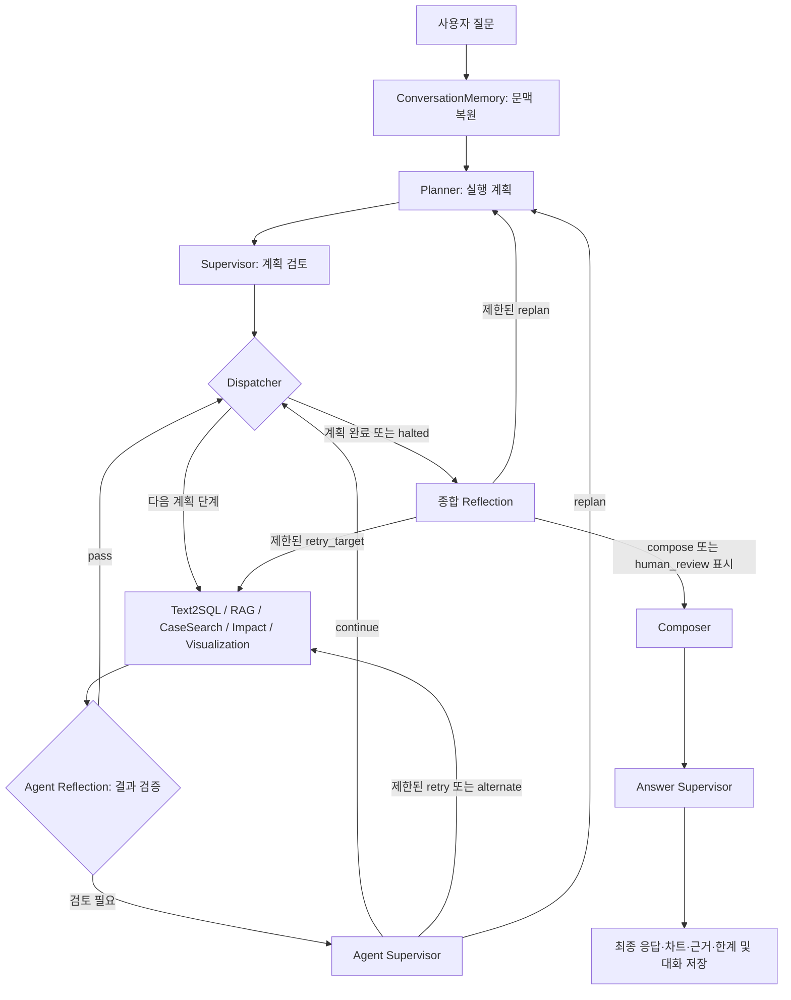

# 테스트 및 고도화

PoC 단계에서 구현한 FAB AI Assistant의 핵심 모듈을 대상으로, 에이전트별 처리 로직과 적용 방법론, 실제 프롬프트, 품질 검증 방식 및 한계 보완 내용을 정리한다. 질문을 처음 받는 단계부터 최종 답변 검증까지의 흐름을 따라 각 기능이 어떤 문제를 해결하도록 설계되었는지 설명한다.

> 작성 기준: 2026-09-07 현재 코드. 프롬프트는 실제 호출 코드에서 추출한 원문이다. 평가 수치는 저장된 로컬 평가 보고서와 이번 대화에서 실행한 테스트 결과를 구분해 기술했다. 실제 LLM 전체 흐름에서 측정하지 않은 정확도·지연·비용 개선율은 기재하지 않았다.

## 주요 문제 해결 및 기술 리서치

| 이슈 구분 | 문제 상황 및 원인 | 적용 방법론과 해결 로직 | 검증 방식 |
| --- | --- | --- | --- |
| 계획 누락·잘못된 라우팅 | 복합 질문에서 진단·영향·추세 중 일부 요청이 누락될 수 있음 | 계획과 실행 분리, JSON 구조화 출력, 필수 route 및 허용 조합 보정 | Planner·recovery routing fixture |
| SQL 정확도·환각 | 없는 컬럼 생성, 잘못된 지표·기간·데이터 소스 선택 위험 | slot 검증, schema grounding, deterministic SQL, 생성 후 read-only 검증 | Text2SQL 79개 로컬 평가 및 SQL validator 테스트 |
| 문서·사례 오검색 | 같은 단어가 있어도 다른 이슈이거나 부정된 원인을 검색 | KB 분리, 동의어·부정문 처리, 이슈·대상·기간 정합성 검증 | retrieval·negative-query fixture |
| 진단 과장 | 문서 가설이나 시뮬레이션 사례를 실제 원인으로 단정할 위험 | 관측·가설·사례 분리, 신뢰도 보정, candidate_only 및 충돌 탐지 | Diagnosis 및 최종 답변 검증 fixture |
| 계산·차트 오류 | 단위 혼동, 서로 다른 baseline 혼합, 누락값 오해 | deterministic 계산, 단위·차원 검증, chart schema와 coverage 검사 | Impact·Visualization 테스트 |
| 품질·안전 경계 | 중간 결과는 맞지만 최종 답변에 근거 밖 주장이나 한계 누락 | agent별 검사, 종합 Reflection, Answer Supervisor 및 수정 재검증 | 긍정/부정 답변·adversarial 테스트 |
| 속도·지연 | 모든 기능 호출과 불필요한 재시도로 호출 수 증가 | 필요한 agent만 실행, SQL fast path, 제한된 retry/replan, elapsed trace | 실행 경로·예산 회귀 검사; 실제 지연·비용은 별도 측정 필요 |

여기서 ‘방법론’은 현재 코드가 실제 사용하는 설계 방식을 뜻한다. 기존 PoC의 Text2SQL 참고 기록에는 MARS-SQL·TriSQL이 있지만, 본 구현에서 확인되는 적용 범위는 schema 축소와 생성·검증·실행 분리다. 강화학습, 학습형 schema selector, 별도 skeleton decoder까지 구현한 것으로 기술하지 않는다.

## 1. LLM 답변 품질 평가 및 개선

### 1.1 평가 대상과 전체 처리 구조

FAB AI Assistant는 **Planner가 계획하고, Supervisor가 검토하며, 필요한 전문 agent가 근거를 만들고, Reflection·Composer·Answer Supervisor가 답변을 검토·작성하는 구조**다.

모든 agent가 별도의 LLM을 호출하는 것은 아니다. Planner·Supervisor·LLM 경로의 Text2SQL·종합 Reflection·Composer·Answer Supervisor는 프롬프트를 사용한다. RAG·CaseSearch·진단 종합·Impact·Visualization은 검색 또는 규칙 기반 처리이며 별도 생성 프롬프트를 두지 않았다.




전문 agent 실행 순서의 기본 정렬은 `text2sql → rag → case_search → impact → visualization`이다. Dispatcher가 `execution_steps`의 다음 항목만 실행하므로 매 질문마다 다섯 개를 모두 호출하지 않는다. Agent Reflection은 각 agent wrapper 안에서 수행되며 독립 graph 노드가 아니다.

`human_review`는 사람이 검토해야 한다는 종료 상태를 만들고 Composer로 이어진다. 현재는 검토 필요 상태를 표시하는 경로이며 실제 승인 대기는 구현하지 않았다.

#### 질문 유형별 기본 경로

| 유형 | 기본 전문 agent | 업무 의미 |
| --- | --- | --- |
| `status` | Text2SQL | 적재 report의 상태·수치 조회 |
| `master_data_lookup` | Text2SQL | 모델 기준정보 조회 |
| `release_plan_lookup` | Text2SQL | 투입 계획 조회 |
| `knowledge_lookup` | RAG | 공정 개념·문서 설명 |
| `diagnosis` | Text2SQL → RAG → CaseSearch | 수치·문서·사례를 결합한 원인 후보 검토 |
| `impact` | Text2SQL → Impact | baseline 수집 후 영향도 계산 |
| `trend` | Text2SQL → Visualization | 기간·대상 비교와 차트 |
| `unsupported` | 전문 agent 실행 중단 경로 | 지원 범위 안내 |

진단 질문에 ‘영향 계산’ 또는 ‘추세·차트’가 포함되면 Impact/Visualization을 추가할 수 있다. Impact에 차트가 필요한 경우 Visualization을 추가한다. 허용된 조합은 `REQUIRED_AGENT_ROUTES`, `OPTIONAL_COMPOUND_AGENTS`에서 관리한다.

### 1.2 에이전트별 로직·방법론·프롬프트

아래의 프롬프트는 요약본이나 신규 제안이 아닌 현재 구현 원문이다. 각 역할의 입력 JSON과 출력 schema를 함께 설명해, 프롬프트만으로 제어하는 부분과 코드가 강제하는 부분을 구분했다.

#### 1.2.1 Planner — 질문을 실행 가능한 업무로 분해


**적용 방법론: 계획과 실행 분리 + 구조화 출력 + 규칙 기반 경로 보정**

자연어 질문을 바로 답변으로 보내면 필요한 SQL·검색·계산 중 일부를 빠뜨릴 수 있다. 먼저 실행 계획을 JSON으로 만들고, 질문 유형별 필수 agent를 코드에서 보완하도록 구성했다.

**구현 의도**: 질문 해석과 실제 도구 실행을 분리한다. LLM이 계획을 만들되, 핵심 기능 누락과 잘못된 조합은 코드의 route 계약으로 보정한다.

| 항목 | 내용 |
| --- | --- |
| 구현 | `agents/planner.py::create_plan()` |
| 입력 | 질문, FAB/line/process/product/route/equipment/date_basis/metric, 대화 이력, 재계획 피드백 |
| 출력 | `PlannerDecision`: status, query_type, intent, slots, selected_sub_agents, execution_steps, RAG KB, missing_slots, clarification_question, limitations |
| 판단 방식 | LLM structured output + deterministic route normalization |

처리 흐름:

1. 질문과 요청 context, 대화 이력, 이전 실행 실패 피드백을 구성한다.
2. 공통 LLM client로 Planner JSON을 생성한다. Planner가 직접 SQL을 실행하지 않는다.
3. FAB 및 요청 context를 slot으로 정리한다.
4. RAG가 필요하면 `incident_playbook` 또는 `process_basics`를 정한다.
5. `_normalize_agent_route()`가 유형별 필수 agent와 허용된 추가 agent를 선택하고 실행 순서를 정렬한다.
6. 정보 부족 여부와 clarification 질문을 포함한 계획을 Supervisor로 넘긴다.
7. LLM 호출이 `RuntimeError`로 실패하면 `_create_deterministic_fallback_plan()`을 사용한다. fallback은 전체 LLM과 동등한 자연어 이해를 보장하지 않는다.

**테스트 및 고도화 확인 항목**: 새 query type은 schema, 필수 route, 허용 조합, fallback을 함께 수정한다. `test_planner_supervisor_initial.py`, `test_recovery_routing.py`에서 분류·실행 단계 계약을 확인한다.


**프롬프트와 입출력 계약**

입력 context·history·execution_feedback를 user JSON으로 전달한다. 출력은 status, query_type, intent, fab_id, rag_knowledge_base, missing_slots, selected_sub_agents, execution_steps, clarification_question, limitations다.


```text
You are the Planner agent for a semiconductor FAB assistant.

Your job is to turn a user question into an execution plan. Do not execute tools
or write SQL directly. Classify the query, identify missing slots, choose the
minimum required sub-agents, and return a structured plan.

Required output fields:
- query_type: status | master_data_lookup | release_plan_lookup | diagnosis | impact | trend | knowledge_lookup | unsupported
- intent: concise task intent
- rag_knowledge_base: incident_playbook for incident response/manual guidance, process_basics
  for semiconductor basics/general reference, null when RAG is not selected
- missing_slots: required information that must be clarified before execution
- selected_sub_agents: ordered list from text2sql, rag, impact, case_search, visualization
- execution_steps: ordered actions for the Supervisor
- clarification_question: present only when required slots are missing
- limitations: known data or scope limitations

Policy:
- Use Text2SQL for database-backed status, master-data, route, release-plan, trend, and
  numeric evidence gathering.
- Use RAG for process knowledge and diagnosis support.
- Use RAG only for knowledge_lookup questions that ask concepts or basic explanations.
- For RAG, choose incident_playbook for response/manual/incident guidance and
  process_basics for basic semiconductor concepts or SMT2020/AutoSched documentation.
- Use Impact only for impact calculation questions.
- Use Visualization for trend/comparison or chartable tabular results.
- For an explicit compound request, choose one primary query_type and preserve additional compatible
  agents needed for every requested part; for example diagnosis+numeric impact also needs Impact,
  and diagnosis+trend also needs Visualization.
- If live/current operational data requires AutoSched autosched_* tables that are not
  available, plan a data_unavailable path. Do not fall back to General Data.
- Never plan direct equipment control or automatic production actions.
- When execution_feedback is present, revise the plan instead of repeating the failed
  combination without a material change.
- Use conversation_history to resolve follow-up references such as "that FAB", "same
  route", or "compare it", but never invent missing operational values from history.
- When an assistant history turn contains negative user_feedback, address the comment and
  materially revise the plan instead of repeating the same answer strategy.
```


프롬프트의 “minimum required sub-agents”는 불필요한 호출을 줄이기 위한 지시다. 복합 질문의 추가 요청 보존, 실패 feedback을 반영한 계획 수정, 부정적 사용자 피드백 반영도 명시했다.


#### 1.2.2 Supervisor — 계획을 실행해도 되는지 검토


**적용 방법론: 계획 생성자와 검토자 분리**

Planner가 생성한 계획을 그대로 실행하지 않고 별도의 LLM이 데이터 가용성과 지원 범위를 검토하도록 했다. 다만 두 역할이 서로 다른 모델을 사용한다는 뜻은 아니다.

**구현 의도**: Planner 계획을 별도 판단 단계에서 검토한다. 실제 실행 위치 이동은 Dispatcher가 담당한다.

| 항목 | 내용 |
| --- | --- |
| 구현 | `agents/supervisor.py::review_plan()`, `graph.py::_supervisor_node()` |
| 입력 | 원 질문, PlannerDecision |
| 출력 | 검토한 plan, 승인 사유, halted, 초기 안내 답변 |
| 판단 방식 | 독립 LLM 호출, 호출 장애 시 deterministic plan contract |

처리 흐름:

1. 질문과 계획을 Supervisor 프롬프트에 전달한다.
2. `ready / needs_clarification / data_unavailable / unsupported` 상태와 진행 여부를 검토한다.
3. 승인된 ready 경로에서는 Planner의 agent 순서를 유지한다. 실행 단계는 선택 목록에 맞춰 필터링한다.
4. ready가 아니면 `halted=True`로 두고 정보 부족·데이터 부족·범위 밖 안내를 준비한다.
5. Dispatcher로 넘긴다. halted 상태에서는 전문 agent를 실행하지 않고 종합 Reflection으로 간다.

**테스트 및 고도화 확인 항목**: plan status, selected list, execution_steps, state status의 일관성을 확인한다. 프롬프트의 ‘승인’ 표현만으로 실행 정책이 보장된다고 가정하지 말고 wrapper 분기도 확인한다.


**프롬프트와 입출력 계약**

question과 planner_decision을 전달하고 proceed, status, selected_sub_agents, reason, answer, limitations를 반환받는다.


```text
You are the Supervisor agent for a semiconductor FAB assistant.

Your job is to execute the Planner's structured plan by selecting and sequencing
sub-agents. After each sub-agent result, decide whether to continue, stop for
clarification, stop for data_unavailable, retry a sub-agent, or request replanning.

Required behavior:
- Follow selected_sub_agents in order unless a result requires early stop.
- If Text2SQL returns needs_clarification, stop and ask the clarification question.
- If Text2SQL returns data_unavailable for live/current status, do not fabricate a
  status answer from General Data.
- For diagnosis, try to combine SQL evidence with RAG knowledge. If one side is missing,
  continue only with an explicit limitation.
- For impact, require numeric input evidence or return a limitation.
- Send the drafted answer through self-reflection before final composition.
- If reflection finds missing evidence, unsafe claims, or missing limitations, repair the
  answer or request replanning.
- Never execute direct production actions or equipment control.
```


프롬프트는 전체 Supervisor의 정책을 설명한다. 실제 구현에서는 이 호출이 최초 계획 검토를 담당하고, 실행 후 복구와 최종 답변 검토는 별도 호출로 분리되어 있다.


#### 1.2.3 Dispatcher — 계획의 다음 단계 선택


**적용 방법론: 상태 기반 조건부 라우팅**

매번 모든 agent를 호출하면 질문과 관계없는 실행이 발생한다. 계획에 포함된 단계만 cursor로 순회하도록 구현했다.

**구현 의도**: 실행 순서와 다음 호출을 명시적인 cursor로 관리한다. LLM을 호출하지 않는 제어 노드다.

| 항목 | 내용 |
| --- | --- |
| 구현 | `graph.py::_dispatcher_node()`, `_route_dispatcher()` |
| 입력 | plan.execution_steps, execution_cursor, halted |
| 출력 | next_agent, 갱신된 execution_cursor |

처리 흐름:

1. halted면 다음 agent를 비워 Reflection으로 보낸다.
2. cursor가 계획 길이 이상이면 전체 실행 완료로 보고 Reflection으로 보낸다.
3. 아니면 해당 단계의 agent를 선택하고 cursor를 1 증가시킨다.
4. conditional edge가 선택한 전문 agent로 이동한다.
5. 전문 agent 검증이 통과하거나 복구 정책이 continue면 다시 돌아온다.

**테스트 및 고도화 확인 항목**: 새 agent를 추가할 때 노드 등록, dispatch/recovery target, 허용 agent schema, 성공 기준을 함께 등록한다. 현재 구조는 전문 agent 병렬 실행 구조가 아니다.


**프롬프트와 입출력 계약**

LLM 프롬프트 없음. execution_steps, execution_cursor, halted를 입력으로 받는 Python 조건문과 LangGraph conditional edge를 사용한다.


다음 agent 선택은 LLM의 자유 텍스트를 해석하지 않고 정해진 State 값과 등록된 target을 사용한다.


#### 1.2.4 Text2SQL — 자연어를 안전한 조회 결과로 변환


**적용 방법론: Schema grounding + deterministic fast path + 생성 후 검증**

허용되지 않은 테이블·컬럼을 생성하거나 날짜·지표를 잘못 선택하는 문제를 줄이기 위해 slot과 데이터 소스를 먼저 고정했다. 반복 가능한 질문은 코드로 SQL을 생성하고 나머지 질문에 LLM을 사용한다.

**구현 의도**: 범위·단위·데이터 소스를 먼저 확정한다. 규칙으로 정확히 처리할 수 있는 질문은 deterministic SQL로 만들고, 나머지는 제한된 schema 안에서 LLM이 생성한다.

| 항목 | 내용 |
| --- | --- |
| 구현 | `sub_agent/text2sql.py::answer_question()`, `plan_text2sql()` |
| 입력 | 질문과 context, query_type, 대화 이력, 재시도 피드백 |
| 출력 | `Text2SQLResult`: status, answer, SQL, rows, columns, row_count, confidence, limitations, QueryPlan |
| 실행기 | `db/read_only.py::ReadOnlyQueryExecutor` |

```text
질문 정규화
 → slot 추출
 → FAB·기간·단위·범위 검증
 → 데이터 소스와 query type 결정
 → deterministic fast path / LLM schema-grounded SQL
 → SQL·table 검증
 → read-only DB 실행
 → 오류 또는 빈 결과의 제한된 보정
 → 결과·출처·한계 반환
```

단계별 로직:

1. `_normalize_question()`과 `_extract_slots()`에서 FAB, 제품, route, 설비, metric, 기간, ranking 개수, 임계값 등을 추출한다.
2. FAB 누락, 잘못된 날짜, 비교 기간 중복, Top N의 1~200 범위 위반, percent 단위·0~100 범위 위반을 확인한다.
3. 투입 계획의 `start_date / due_date`가 모호하거나 범위 제한 조건이 부족하면 SQL을 만들기 전에 질문한다.
4. 직접 조회할 Queue Time 지표가 catalog에 없으면 `data_unavailable`을 반환한다.
5. 기본 경로에서 `_deterministic_fast_path()`가 master/release/status/trend 등의 지원 질문을 처리한다. 테스트용 명시 LLM client를 주입하는 경우의 경로는 별도다.
6. 규칙으로 처리되지 않으면 `_schema_context_for_question()`으로 관련 table/column과 허용 table 목록을 좁힌다. LLM이 이 context 안에서 structured SQL JSON을 반환한다.
7. read-only validator와 table allowlist를 적용한다. 실행 시 외부 LIMIT wrapper와 transaction read-only, statement timeout을 적용한다.
8. 실행 오류·0행 결과에는 `_execute_empty_result_repairs()`의 정해진 보정 후보를 적용할 수 있다. 임의로 사용자 조건을 삭제해 결과를 만드는 정책으로 확대하면 안 된다.
9. rows, columns, SQL, QueryPlan을 evidence로 남긴다. graph는 evidence에 최대 20행 sample을 담고 trace에는 더 작은 sample을 전달한다.

분기·주의사항:

| 조건 | 동작 |
| --- | --- |
| 정보 부족·모순 | `needs_clarification` |
| 지원 table/질문 계약 없음 | `unsupported` |
| 필요한 운영 데이터 없음 | `data_unavailable` |
| LLM·검증·DB 실행 실패 | `failed` 및 limitation |
| DSN 미설정 또는 execute=False | SQL 계획만 반환 가능; 실제 조회 완료로 해석 금지 |
| SQL 0행 | 보정 시도 후에도 비면 빈 결과와 한계 유지 |
| 진단에서 SQL 실패 | graph가 다른 진단 근거 수집을 계속할 수 있음 |
| 진단 + 시각화 | Text2SQL query type을 trend로 매핑 |

**테스트 및 고도화 확인 항목**: catalog, slot parser, SQL 경로, 데이터 기준 설명, fixture를 함께 수정한다. `test_text2sql_initial.py`, `test_read_only_db.py`, `test_sc001_sql_templates.py` 및 deterministic evaluator가 주요 검증 지점이다.


**프롬프트와 입출력 계약**

question, query_type, fab_id, slots, schema_context를 user JSON으로 전달한다. strict JSON Schema로 SQL과 지원 여부·설명·chart intent 등 정의된 필드를 받는다.


```text
You are the Text2SQL agent for a read-only semiconductor FAB analytics system.

Write the PostgreSQL SQL directly. Do not choose or mention named templates.
Use only the schema-qualified tables and columns supplied in schema_context.
Return only the structured JSON schema.

Hard rules:
1. Generate exactly one SELECT or WITH query.
2. Every table reference must be schema-qualified and present in allowed_table_refs.
3. Do not generate DDL, DML, COPY, comments, SET, locks, or multiple statements.
4. Preserve explicit user constraints. If the request cannot be answered from the allowed schema, set supported=false.
5. Add a LIMIT no higher than 200 unless the query is an aggregate time series.
6. For SC-001 current status, prefer latest non-WarmUp operational report rows.
7. For trend chart requests, include chart_intent with the output x/y column aliases. For a
   multi-metric comparison, set y to all requested numeric aliases and use grouped_bar unless the
   x-axis is temporal. Set series to a result column only when that column identifies categories.
8. Prefer schema_context.primary_table_refs when present.
9. Do not select columns that are absent from the selected table.
```


이 프롬프트는 LLM SQL 생성 경로에만 사용한다. 기본 deterministic fast path에서 처리된 질문에는 호출되지 않는다. 명시 조건 보존, 허용 schema, 최신 non-WarmUp report, 다중 지표 차트 규칙을 지시한다.


#### 1.2.5 RAG — 질문에 맞는 문서 근거 검색


**적용 방법론: Retrieval grounding + 지식 베이스 분리 + 이슈 정합성 필터링**

단순 단어 일치나 vector 유사도만으로는 다른 이슈 문서가 검색될 수 있다. 공정 기초/대응 지식을 분리하고 질문의 이슈와 부정 표현을 반영해 근거를 선별한다.

**구현 의도**: 공정 기초 지식과 사건 대응 문서를 나눈다. 검색 점수가 높더라도 질문의 이슈와 어긋난 문서를 근거로 채택하지 않는다.

| 항목 | 내용 |
| --- | --- |
| 구현 | `sub_agent/rag.py::retrieve_knowledge()` |
| 입력 | query, knowledge_base, top_k(기본 5), 선택적 store_path |
| 출력 | `Evidence` 목록; source_type=`rag_chunk` |
| 저장 경로 | Milvus 또는 로컬 JSONL |

처리 흐름:

1. Planner가 지정한 KB를 사용하거나 질문으로 KB를 추론한다.
2. 토큰·동의어·이슈 유형을 추출하고 부정된 이슈를 검색 의도에서 제외한다.
3. `VECTOR_DB_URL`이 있고 store_path가 따로 없으면 질문을 embedding하여 Milvus에서 KB filter를 적용한 vector 검색을 한다.
4. 그렇지 않으면 JSONL에서 해당 KB만 읽고, 토큰 중복·문서 빈도·이슈 정합성을 반영한 점수로 정렬한다.
5. 로컬 경로는 양수 점수 문서를 근거로 변환하고 중복을 제거한 뒤 top_k로 제한한다. incident 문서는 이슈 정합성을 엄격히 확인한다.
6. 문서명·source·chunk·KB·검색 점수·이슈 metadata를 Evidence에 포함한다.
7. 관련 문서가 없으면 `data_unavailable`과 한계를 남긴다. 진단용 playbook을 사용하면 실제 원인 확정에는 SQL/운영 로그가 필요하다는 한계를 추가한다.

**문서 적재 흐름**: `.md/.pdf/.txt/.docx` → 텍스트 추출 → chunk → JSONL → 필요 시 embedding → Milvus. 현재 `rag/ingest.py` 기본 chunk는 **2,400문자, overlap 300문자**다. 토큰 단위 800→500 개선이 적용되었다고 쓰면 안 된다. 설정 기본 embedding은 `text-embedding-3-large`, 3,072차원이고 Milvus 색인은 COSINE을 사용한다.

**실패 정책**: Milvus 경로에서 검색 결과가 없을 때 자동으로 로컬 검색으로 재전환하는 구현은 아니다. 저장소 장애와 관련 근거 부재도 구분해서 운영해야 한다.

**테스트 및 고도화 확인 항목**: `test_rag_initial.py`, `test_issue_intent.py`, RAG retrieval/abstention evaluator. 로컬 평가 통과를 Milvus 검색 품질로 일반화하지 않는다.


**프롬프트와 입출력 계약**

독립 답변 생성용 LLM 프롬프트 없음. Planner가 knowledge_base를 선택하며, RAG는 검색 결과를 Evidence로 반환한다. Milvus의 embedding 호출은 생성형 채팅 프롬프트와 구분한다.


검색된 문서를 답변으로 바꾸는 지시는 뒤의 Composer 프롬프트에 있다. RAG 검색 평가와 최종 답변 Faithfulness 평가는 별개의 검증이다.


#### 1.2.6 CaseSearch — 출처가 있는 유사 사건 검색


**적용 방법론: 출처 검증 기반 검색 + 기간 정합성 보정**

문서의 일반 설명을 실제 사고 사례처럼 취급하거나, 시뮬레이션을 검증된 사고로 인용하지 않도록 사례 저장소와 검증 조건을 분리했다.

**구현 의도**: 일반 대응 문서와 실제 사건 사례를 구분한다. 검증된 사례를 주장하려면 검증자·시점·증빙을 갖춰야 한다.

| 항목 | 내용 |
| --- | --- |
| 구현 | `sub_agent/case_search.py::find_similar_cases()` |
| 입력 | 질문, top_k(기본 5), incident JSONL 경로 |
| 출력 | `similar_case` Evidence 목록 |
| 필수 사례 필드 | case_id, case_type, summary, cause, actions, outcome, source |

처리 흐름:

1. 사례 저장소 파일과 레코드를 읽고 필수 필드 및 중복 case_id를 검사한다.
2. case_type을 `verified / simulated_reference`로 제한한다.
3. verified 사례는 simulation 계열 source를 거절하고 `incident_at`, `verified_at`, `verified_by`, `evidence_refs`를 검사한다. 날짜는 timezone을 포함해야 하고 검증 시점이 사건보다 앞설 수 없다.
4. 질문의 FAB·설비·공정 조건과 사례 metadata를 대조한다.
5. 이슈 정합성, 질문 토큰과 사례 요약의 중복 등으로 점수를 계산한다. 질문 기간 밖 과거 사례는 점수에 0.8을 곱한다.
6. 양수 점수의 상위 사례를 선택한다. 선택 결과에 verified 사례가 없고 검증 사례 점수가 마지막 선택 점수의 75% 이상이면 마지막 자리에 포함할 수 있다.
7. 검증 metadata·원인·출처·기간 정합성을 함께 반환한다. graph의 CaseSearch 노드는 진단 질문이면 Diagnosis Synthesis까지 호출한다.

**실패 정책**: 저장소 없음·비어 있음·관련 사례 없음·잘못된 검증 metadata를 실제 사례 검색 성공으로 처리하지 않는다.

**테스트 및 고도화 확인 항목**: `test_case_search.py`, case retrieval evaluator. 최신 사례·과거 사례·시뮬레이션의 순위 및 출처 표기 계약을 함께 확인한다.


**프롬프트와 입출력 계약**

독립 LLM 프롬프트 없음. JSONL 레코드 검증, 검색 점수, verification과 temporal_alignment를 처리하는 코드 기반 검색이다.


verified라는 문자열만 확인하지 않고 검증자·사건/검증 시점·증빙을 검사한다. 기간 밖 사례는 현재 원인 확정에 사용하지 않는다.


#### 1.2.7 Diagnosis Synthesis — 관측과 원인 후보를 분리해 종합


**적용 방법론: 관측·가설 분리 + 출처 신뢰도 보정 + 상충 근거 탐지**

여러 근거를 한 문장으로 합치면서 원인 확정으로 과장되는 문제를 막기 위해 구조화된 evidence matrix와 후보 우선순위를 계산한다.

**구현 의도**: 수치가 관측되었다는 사실과 특정 원인이 입증되었다는 사실을 구분한다. LLM 자유 추론 대신 출처별 근거 구조와 점수 계산을 사용한다.

| 항목 | 내용 |
| --- | --- |
| 구현 | `sub_agent/diagnosis.py::synthesize_diagnosis()` |
| 호출 위치 | `graph.py::_case_search_node()`의 diagnosis 분기 |
| 입력 | SQL·RAG·CaseSearch evidence |
| 출력 | `diagnosis_synthesis` evidence, `conclusion_level=candidate_only` |

처리 흐름:

1. 성공한 SQL의 sample rows를 observations로 정리한다.
2. RAG 문서의 진단 이슈 유형과 질문 정합성을 검사해 원인 후보를 만든다.
3. 사례를 시간 정합 verified, 기간 밖 verified, simulated, unverified로 구분한다.
4. 후보와 사례를 각각 최대 3개씩 종합하고 제외·잘림 건수도 기록한다.
5. 출처의 신뢰 수준별 가중치로 후보를 정렬한다. 현재 주요 가중치는 verified 3.0, historical verified 1.5, guidance 1.0, unverified 0.5, simulation 0.25다.
6. 관련 관측 column이 있으면 0.5, 복수 출처가 후보를 지지하면 1.0을 추가한다. 이는 근거 우선순위 점수이며 원인 발생 확률이 아니다.
7. verified 사례 간 같은 이슈의 원인이 다르면 충돌로 표시한다. 근거 수준을 strong/moderate/weak/conflicting candidate로 구분한다.
8. 부족한 근거와 필요한 추가 확인을 반환한다. `can_confirm_root_cause=False`를 유지한다.

**테스트 및 고도화 확인 항목**: 실제 원인 확정 기능을 추가하려면 사건·정비·지표의 시간 연결 계약부터 별도로 설계해야 한다. `test_diagnosis.py`, diagnosis synthesis evaluator에서 후보 순위·출처 충돌·기간 밖 사례를 검증한다.


**프롬프트와 입출력 계약**

독립 LLM 프롬프트 없음. synthesize_diagnosis()가 evidence를 입력받아 후보·관측·사례·추가 검증 항목을 코드로 생성한다.


가중치는 코드에 정의된 휴리스틱 점수다. 학습한 확률이나 인과 추론 결과로 해석하지 않는다.


#### 1.2.8 Impact — 검증 가능한 범위에서 수치 계산


**적용 방법론: 근거 제한형 what-if 민감도 계산 + 단위·차원 검증**

LLM이 영향 수치를 만들어 내는 것을 막기 위해 baseline과 계산식을 고정한다. %와 %p, 서로 다른 제품·기간의 혼합 여부를 먼저 검증한다.

**구현 의도**: LLM에게 영향 숫자를 만들어 달라고 하지 않는다. SQL baseline, 변화량, 단위, 명시된 계산식을 사용하는 deterministic 계산이다.

| 항목 | 내용 |
| --- | --- |
| 구현 | `sub_agent/impact.py::estimate_output_delta()` |
| 입력 | baseline(rows·출처), scenario(question) |
| 출력 | status, baseline, parsed_changes, inputs, estimates, formulae, provenance, assumptions, limitations |

처리 흐름:

1. baseline의 유효 수치를 모으고 FAB·제품·route·설비·기간 등 서로 다른 차원이 섞였는지 검사한다.
2. 질문에서 지표, 변화량, 증가/감소 방향, `% / %p / hour`를 파싱한다.
3. 차원이 혼합되면 단일 평균 영향값을 계산하지 않는다. 같은 지표 변화가 중복되거나 방향이 모호한 경우도 제한한다.
4. 지표별 허용 함수로 계산한다. 예상 가동률의 0~100 범위, cycle time 양수 조건을 검증한다.
5. 계산값이 있으면 succeeded, 없으면 data_unavailable로 반환한다. 일부 계산만 가능하면 나머지 한계도 함께 반환한다.

| 지원 계산 | 현재 식·조건 |
| --- | --- |
| 가동률 p%p 변화 | 예상 가동률 = 기준 가동률 + 부호 있는 p |
| 가동률 r% 변화 | 예상 가동률 = 기준 가동률 × (1 + r/100) |
| capacity 민감도 | (예상 가동률 / 기준 가동률 − 1) × 100 |
| lotcomps 변화 | lotcomps baseline이 있으면 기준 완료량 × capacity 변화율 / 100 |
| cycle time r% 변화 | 기준 cycleavg × (1 + r/100) |

예: 가동률 80%에서 5%p 증가는 85%이고, 동일 기간 capacity가 가동률에 비례한다는 가정 아래 변화율은 6.25%다. **설명용 계산 예시이며 실제 FAB 측정값은 아니다.**

**미지원 경계**: Queue Time→output, downtime 시간→output, cycle time→납기 준수율의 보정된 인과 모델이 없으면 해당 영향을 계산하지 않는다. 서로 다른 기간의 지표를 무조건 합성하지 않는다.

**테스트 및 고도화 확인 항목**: 새 계산식을 추가할 때 baseline 출처·단위·대상/기간 정합성·물리 범위·가정을 함께 정의한다. `test_impact.py`, deterministic impact evaluator가 검증 지점이다.


**프롬프트와 입출력 계약**

독립 LLM 프롬프트 없음. 질문 변화량 parser와 지표별 계산 함수를 사용한다. 결과 해석은 계산식·가정과 함께 Composer에 전달한다.


승인된 식이 없는 인과 영향은 계산하지 않는 것이 성공적인 보류 동작이다. 계산 결과가 나왔다는 사실만으로 실제 생산 영향이 입증되지 않는다.


#### 1.2.9 Visualization — 조회 결과와 일치하는 차트 생성


**적용 방법론: 데이터 계약 기반 시각화 + 결측·coverage 검증**

차트가 실제 조회 결과와 다른 column을 사용하거나 누락 날짜를 0으로 오해하는 문제를 줄이기 위해 chart intent와 rows를 함께 검증한다.

**구현 의도**: SQL 결과에 없는 column이나 수치를 만들어 차트를 그리지 않는다. 이 agent는 렌더링된 이미지 대신 프런트가 사용할 chart spec을 만든다.

| 항목 | 내용 |
| --- | --- |
| 구현 | `sub_agent/visualization.py::build_chart_spec()` |
| 입력 | title, rows, chart intent(type/x/y/series/기간/누락 정책) |
| 출력 | type, encoding, rows, series, 필요 시 trend_summary·series_gaps·coverage·imputed_points |

처리 흐름:

1. graph에서 SQL 결과와 chart_intent를 준비한다. rows가 없으면 차트 생성 경로를 건너뛰거나 한계로 처리한다.
2. 차트 유형을 bar/grouped_bar/line 중에서 선택하고 x/y/series가 실제 column에 있는지 확인한다.
3. 수치 타입, 비정상 값, 동일 key 중복, series 충돌을 검사한다.
4. line은 시간·숫자 축으로 정렬한다. 명시된 기간·주기가 있으면 기대되는 x축을 만든다.
5. `missing_policy=zero`가 명시되고 기대 축이 있을 때만 누락값을 0으로 보충하고 imputed_points를 기록한다.
6. 다중 y는 long format으로 변환하고, 필요 시 grouped_bar 또는 series를 만든다.
7. 추세 요약, 누락 구간, coverage를 계산해 답변 근거에 연결한다. 최소 추세 coverage 기준은 0.5다.

**테스트 및 고도화 확인 항목**: `test_visualization.py`에서 숫자가 아닌 y, 날짜 역순, 중복, 누락 기간, 다중 series, 0 기준 변화 등을 확인한다. 새 chart type은 React 렌더러에서도 지원해야 한다.


**프롬프트와 입출력 계약**

독립 LLM 프롬프트 없음. Text2SQL의 chart_intent를 받아 코드로 bar/grouped_bar/line spec을 만든다.


차트 생성은 숫자 생성 작업이 아니다. field 존재, 자료형, 중복, 시간 순서, 명시된 결측 정책을 확인한다.


#### 1.2.10 Agent Reflection + Agent Supervisor — 단계별 실패 검토와 복구


**적용 방법론: 계약 기반 self-check + 제한된 복구**

한 agent의 실패를 전체 실패로 끝내거나 무한 반복하지 않도록 결과를 검사하고 복구 가능한 실패만 재시도한다.

**구현 의도**: 개별 기능의 산출물이 계약을 지켰는지 먼저 규칙으로 검사하고, 실패 후 진행 방법은 별도 Supervisor가 판단한다. 복구 횟수는 코드가 제한한다.

| 컴포넌트 | 책임 |
| --- | --- |
| `reflect_agent_output()` | intent·성공 기준·status·산출물 존재 검증 |
| `_agent_reflection_patch()` | 검토 기록과 pending review를 State에 누적 |
| `review_agent_result()` | continue/retry_same_agent/replan/alternate_agent 판단 |
| `_agent_supervisor_node()` | 예산 차감, feedback, forced_agent, 검토 해결 기록 반영 |

검증 흐름:

1. agent 이름·계획 의도·실행 결과·성공 기준·evidence·limitations를 공통 형식으로 전달한다.
2. status가 succeeded가 아니거나 intent/summary/성공 기준이 비면 검토 대상으로 만든다.
3. SQL은 SQL 문자열, RAG/CaseSearch는 근거, Impact는 inputs/formulae/estimates, Visualization은 chart 존재를 추가 확인한다.
4. 문제가 없으면 pass → Dispatcher, 문제가 있으면 needs_supervisor_review → Agent Supervisor로 간다.
5. Agent Supervisor가 복구 action을 결정하되 코드가 횟수·상태·호환성을 다시 검사한다.

| action | 의미·제약 |
| --- | --- |
| continue | 남은 계획 또는 종료 검토로 진행; 문제 해결 성공이라는 뜻은 아님 |
| retry_same_agent | 피드백을 반영해 같은 agent 재실행; 전체 2회·agent별 1회 |
| replan | Planner로 돌아가 계획 재작성; 1회 |
| alternate_agent | 호환되는 미시도 agent로 대체; 1회 |

현재 진단에서만 Text2SQL→RAG, RAG→CaseSearch, CaseSearch→RAG 대체 후보를 허용하며 이미 시도한 후보는 제외한다. Impact와 Visualization은 대체 후보가 없다. 불가능한 retry/alternate는 정책에 따라 replan 또는 continue로 보정된다.

**테스트 및 고도화 확인 항목**: `test_reflection.py`, `test_recovery_routing.py`. 재계획·대체·최종 Reflection의 retry가 같은 budget을 공유하는지 확인한다.


**프롬프트와 입출력 계약**

Agent Reflection은 규칙 검사이므로 프롬프트가 없다. Agent Supervisor에 planner_decision, agent_reflection, retry_count, 각 budget, allowed_alternate_agents를 전달한다. action, alternate_agent, reason, planner_feedback, limitations를 받는다.


```text
You are the post-execution Supervisor for a semiconductor FAB assistant.

Review one agent's self-reflection result and choose exactly one bounded recovery action:
- continue: accept the limitation and proceed to the next planned step
- retry_same_agent: retry only when the failure is plausibly repairable with another attempt
- replan: ask Planner for a materially different plan using the failure feedback
- alternate_agent: run one compatible alternate agent from allowed_alternate_agents

Rules:
- Never retry data_unavailable, unsupported, needs_clarification, or skipped results.
- Never exceed the supplied retry, replan, or alternate budgets.
- Do not choose the same agent as its own alternate.
- RAG cannot replace missing operational SQL evidence for current status or numeric claims.
- Prefer continue with an explicit limitation when no safe recovery can improve the result.
- Never authorize direct production action or equipment control.
```


“Never retry data_unavailable…”로 데이터 부재와 일시적 실패를 구분한다. 예산 준수는 프롬프트뿐 아니라 코드에서도 다시 강제한다.


#### 1.2.11 종합 Reflection — 전체 근거를 검토하고 답변 방향 결정


**적용 방법론: 규칙 검증과 LLM 종합 검토의 결합**

개별 agent가 성공해도 원 질문의 모든 조건을 충족하지 못할 수 있다. 규칙 검사와 전체 근거 검토를 결합해 작성·재계획·재시도·사람 검토를 결정한다.

**구현 의도**: 에이전트마다 성공하더라도 전체 질문에 충분히 답할 수 있는지 별도로 확인한다.

| 항목 | 내용 |
| --- | --- |
| 구현 | `agents/llm_nodes.py::reflect_with_llm()`, `graph.py::_reflection_node()` |
| 입력 | 질문, query type, answer_parts, evidence, limitations, 개별 검토 및 대화 이력 |
| 출력 | is_supported, warnings, composer_instructions, action, retry_target, reason |

처리 흐름:

1. 도구 요약을 모아 초안 재료를 구성한다.
2. `verify_response()`가 빈 답변, 근거 없는 운영 수치, General Data의 live 표현, 진단 단정, 시뮬레이션 미표기, 영향도 가정 누락 등을 확인한다.
3. LLM이 deterministic 검사 결과와 전체 근거를 받아 종합 검토한다.
4. 미해결 pending review가 있으면 근거 충분성을 낮추고 Composer에 명시하도록 지시한다.
5. compose/replan/retry_target/human_review 중 하나를 선택한다.
6. graph가 retry 대상과 예산을 다시 검사한다. 불가능한 재시도나 예산 소진 replan은 human_review로 바꾼다.
7. LLM 장애 시 deterministic 결과와 근거 보존 지시로 fallback한다.

**테스트 및 고도화 확인 항목**: 단순한 ‘답변 재작성 노드’로만 이해하지 않는다. 이 노드는 재계획과 특정 agent 재실행도 요청한다. 실제 최종 문장은 다음 Composer가 생성한다.


**프롬프트와 입출력 계약**

question, query_type, draft_tool_summary, evidence, limitations, agent_reflections, supervisor_reviews, conversation_history, deterministic_safety_check를 전달한다. is_supported, warnings, composer_instructions, action, retry_target, reason을 받는다.


```text
You are the self-reflection agent for a semiconductor FAB assistant. Check whether tool evidence supports the answer. Never invent values. General Data is simulation/model input, not live factory state. Return concise repair instructions.RAG-only diagnosis may suggest possible causes but cannot confirm the actual root cause. Incident playbook evidence must be framed as review guidance, not automatic execution. Process-basics evidence must stay educational and must not become operational control. Use supervisor_reviews as agent-level review history and treat only pending reviews as unresolved findings. Choose compose, bounded replan, bounded retry_target, or human_review. Never request a retry for unavailable or unsupported data.
```


이 단계에서 검토하는 것은 최종 사용자 문장 이전의 도구 요약이다. 최종 문장 검증은 Answer Supervisor에서 수행한다.


#### 1.2.12 Composer — 근거를 사용자 답변으로 작성


**적용 방법론: 근거 기반 답변 작성 + 관측·가설·한계 명시**

검색·계산 결과를 그대로 나열하지 않고 사용자가 이해할 수 있게 설명하면서도 근거 밖 정보를 추가하지 않도록 했다.

**구현 의도**: 제공된 근거 안에서 질문 언어로 설명한다. 관측값·가설·계산 가정·제한사항을 사용자에게 읽히는 문장으로 만든다.

| 항목 | 내용 |
| --- | --- |
| 구현 | `agents/llm_nodes.py::compose_with_llm()` |
| 입력 | 질문, plan, tool summaries, evidence, limitations, reflection, history |
| 출력 | answer 문자열 |

처리 흐름:

1. Planner 의도, SQL/검색/계산 요약과 evidence를 구성한다.
2. Reflection의 수정 지시와 한계를 함께 전달한다.
3. LLM structured output의 answer를 얻는다.
4. LLM 장애 시 요약을 중복 제거하고 요청 범위·조회 sample 최대 5행·한계를 조합해 답변한다.
5. 답변을 Answer Supervisor에 보낸다.

**테스트 및 고도화 확인 항목**: 프롬프트 수정 후 `test_answer_quality_evaluator.py`와 실제 대표 질문의 최종 수치·출처·한계 표시를 확인한다. LLM 호출 모드 표기만으로 해당 Composer 호출 성공을 단정하지 않는다.


**프롬프트와 입출력 계약**

question, plan, tool_summaries, evidence, limitations, reflection, conversation_history를 전달하고 answer 하나를 갖는 JSON을 반환받는다.


```text
You are the final answer Composer for a semiconductor FAB assistant. Answer in the user's language using only supplied tool evidence. Include concrete query results when present, data basis, and material limitations. Follow reflection instructions. Do not refer to internal evidence objects; present their values directly to the user. For diagnosis, distinguish observations from hypotheses and explicitly label simulated reference cases; simulation-only evidence never confirms a root cause.
```


“using only supplied tool evidence”와 “distinguish observations from hypotheses”를 통해 사실·가설·시뮬레이션을 구분하도록 했다.


#### 1.2.13 Answer Supervisor — 최종 문장 검증 및 종료 상태 확정


**적용 방법론: 작성 후 독립 검토 + 수정 답변 재검증**

중간 근거가 정확해도 최종 답변에서 대상·숫자·기간이 누락되거나 바뀔 수 있다. 원 질문과 최종 문장을 직접 대조한다.

**구현 의도**: 중간 근거가 올바르더라도 최종 문장에서 숫자·범위·출처가 달라질 수 있으므로 작성 후 다시 검사한다.

| 항목 | 내용 |
| --- | --- |
| 구현 | `agents/supervisor.py::review_final_answer()`, `graph.py::_answer_supervisor_node()` |
| 입력 | 원 질문, 최종 answer, plan, evidence, limitations |
| 출력 | approved, issues, corrected_answer, correction_applied, status, termination_reason |

처리 흐름:

1. `verify_response()`로 답변을 원 질문·근거와 대조한다.
2. 별도 LLM이 승인 여부와 필요 시 수정 답변을 반환한다.
3. deterministic 경고와 LLM issues를 합친다. 둘 중 문제가 남으면 최초 답변은 미승인이다.
4. 수정 답변이 있으면 deterministic 검사를 다시 통과한 경우에만 적용한다.
5. 끝내 승인되지 않고 기존 human_review_required 종료가 아니면 `status=failed`, `termination_reason=answer_review_failed`로 종료한다.
6. 승인된 경우 최종 답변과 검토 이력을 반환한다.

**현재 한계**: 미승인 답변도 현재 State의 answer 문자열에 남을 수 있다. 프런트·연동 서비스는 문자열 존재만 보고 성공으로 표시하지 말고 status, answer_review, termination_reason을 확인해야 한다.


**프롬프트와 입출력 계약**

question, planner_decision, final_answer, evidence, limitations, deterministic_check를 전달하고 approved, issues, corrected_answer, reason을 받는다.


```text
You are the final-answer Supervisor for a semiconductor FAB assistant.

Compare the final answer directly with the user's question, the approved plan, tool evidence,
and limitations. Approve only when the answer addresses every requested FAB/product/route/lot/
equipment identifier, metric, comparison target, and date basis without inventing facts.

When the answer is incomplete or unsupported, return a corrected answer in the user's language.
The correction must use only supplied evidence, state unavailable facts plainly, preserve material
limitations, and never expose internal object names or authorize production/equipment actions.
For diagnosis, preserve the distinction between observed metrics, playbook hypotheses, verified
incidents, and simulated reference cases. Never present corroboration from simulation-only evidence.
```


수정 답변도 즉시 채택하지 않고 deterministic 검사를 다시 통과한 경우에 적용한다. 이를 검증된 수정 경로로 사용한다.


### 1.3 평가 방식과 결과


| 항목 | 현재 프로젝트 내용 |
| --- | --- |
| 평가 대상 기능 | Text2SQL, RAG, 유사 사례, 진단 종합, 영향도, 문맥, 최종 답변 규칙, adversarial·검색 보류 |
| 평가 방식 | 질문·기대 계약 fixture, deterministic evaluator, 긍정/부정 답변 검사, unit/routing 테스트 |
| 평가 결과 | 아래 저장 보고서 수치와 이번 pytest 결과 참조 |
| 개선 조치 | deterministic SQL, 이슈 정합성·부정문 처리, 출처·기간 검증, 후보 보정, 혼합 baseline 거절, chart coverage, 답변 검증·복구 |
| 개선 후 결과 | 현재 snapshot의 회귀 통과는 확인. 동일 조건의 개선 전/후 실측 수치가 없으므로 향상 폭은 기재하지 않음 |
| 미측정 | 실제 Azure Planner/Supervisor/Composer 전체 답변 품질, Milvus vector retrieval 품질, LLM-as-a-Judge Faithfulness/Relevance |

저장된 `apps/assistant/output/evals/release_quality.json`의 기록:

| 평가 | 건수 | 기록된 결과 | 해석 범위 |
| --- | --- | --- | --- |
| Text2SQL | 79 | semantic/EX/EM/intent/coverage 1.0 | 저장 보고서의 local_execution 결과 |
| RAG | 15 | Recall@3, MRR, incident issue alignment 1.0 | local lexical retrieval |
| CaseSearch | 11 | Recall@3, MRR 1.0 | local provenance retrieval |
| Impact | 17 | contract pass rate 1.0 | deterministic 계산·보류 계약 |
| Diagnosis | 14 | contract, candidate-only 등 등록 지표 1.0 | deterministic calibration fixture |
| Context Memory | 10 | context·정규화·switch·override·상속 지표 1.0 | deterministic multiturn fixture |
| Answer Quality | 70 | 분류·긍정 허용·부정 거절 지표 1.0 | deterministic positive/negative fixture |
| Adversarial | 57 | pass rate 1.0 | 등록된 deterministic 변형 fixture |
| Retrieval Abstention | 15 | abstention rate 1.0 | local negative-query fixture |

보고서의 baseline version은 73, passed=True, full_graph는 not_measured다. 위 결과는 **기존 보고서를 읽은 값**이며 이번 보고서 작성 중 DB·외부 LLM 평가를 재실행한 결과가 아니다. 특정 fixture에서 1.0이라는 사실을 임의 질문 전체의 100% 정확도로 일반화하지 않는다.

이번 대화에서 직접 실행한 회귀 테스트: `.venv/bin/python -m pytest -q` → **341 passed, 2 warnings, 2.33초**. 경고는 LangChain 및 Starlette 의존성 deprecation 안내다. 2.33초는 테스트 실행시간이며 서비스 응답시간이 아니다. 공통 테스트 fixture는 agent LLM 호출과 graph SQL 호출을 대체하므로 실제 외부 서비스 품질 측정을 대신하지 않는다.


### 1.4 평가 결과 해석과 남은 검증

Recall@3는 기대 문서·사례가 상위 3개 검색 결과에 포함되는지를, MRR은 기대 결과가 얼마나 앞에 위치하는지를 평가한다. 검색 성능이 높더라도 이를 바탕으로 생성한 답변의 정확성이 자동 보장되지는 않으므로 최종 답변 검증을 별도로 수행한다.

Answer Quality의 70개 평가는 사전에 준비한 좋은/나쁜 답변을 규칙 검증기가 올바르게 허용·거절하는지 측정한다. 실제 LLM이 생성한 70개 답변의 정확도나 LLM-as-a-Judge 점수가 아니다. Adversarial의 Planner 평가는 offline fallback 경로를 사용하므로 실제 LLM의 prompt injection 방어율로 해석하지 않는다.

현재 결과는 정의한 회귀 질문과 계약의 충족 여부를 보여준다. 향후 실제 LLM 평가에서는 동일한 질문 세트로 계획 정확도, 최종 수치·대상·기간 보존율, 근거 일치도, 한계 표시율, 수정 후 통과율을 측정해야 한다. 개선 전후를 비교하려면 모델·프롬프트 버전·데이터·질문 세트를 동일하게 고정하고 이전 결과도 함께 보존해야 한다.


### 1.5 현재 Agent별 성능과 해석

**전문 agent의 정해진 검색·조회·계산 기능은 로컬 테스트를 통과했지만, 실제 LLM 답변과 최종 검증을 연결하는 부분에는 보완이 필요하다.** 저장된 최신 기준선은 **v73, 품질 지표 47/47 통과**이며, 앞서 실행한 회귀 테스트는 **341개 통과**다. 47개는 평가 지표 수이며 질문 수가 아니다.

아래 표는 새 평가를 실행한 결과가 아니라 기존 평가 보고서·fixture·실제 호출 기록을 확인해 정리한 현황이다. ‘통과’는 각 평가에 정의된 계약 충족을 뜻하며, 실제 서비스 전체 정확도나 실제 생산 예측 정확도를 의미하지 않는다.

| 노드 / Agent | 앞서 확인된 성능 | 현재 수준과 해석 |
| --- | --- | --- |
| **Conversation Memory** | 문맥 평가 **10/10** | FAB·대상·기간 변경, 명시적 조건 우선 적용, 선택 대상 상속을 검증했다. 실제 장기 대화 품질은 추가 검증이 필요하다. |
| **Planner** | 경계·변형 질문 **9/9** | 복합 질문의 필요한 agent 보존과 경로 보정을 검증했다. **오프라인 fallback 평가**이므로 실제 LLM 분류 정확도와 구분한다. |
| **Supervisor — 계획 검토** | 계획 상태·실행 경로 회귀 검사 포함 | 실행 허용·중단 로직은 검증했지만 실제 LLM의 계획 검토 정확도는 독립 수치가 없다. |
| **Dispatcher** | 순서 실행·중단·복구 경로 회귀 검사 포함 | 계획에 따른 제어 흐름을 검증했다. 별도 정확도·처리시간 지표는 없다. |
| **Text2SQL** | 로컬 평가 **79/79**, EX·EM·의도 일치 지표 **100%** | 지원 질문의 규칙 기반 경로를 검증했다. **61개 SQL과 18개 확인 질문·지원 불가 등 처리**를 합친 결과로, 79개 모두 SQL을 실행했다는 뜻은 아니다. |
| **RAG** | 기대 문서 1위 검색 **15/15**, Recall@3·MRR **1.0**, 검색 보류 **5/5** | 로컬 키워드 검색에서 기대 결과를 얻었다. Milvus 벡터 검색 및 실제 운영 문서 전체 성능은 미측정이다. |
| **CaseSearch** | 기대 사례 1위 검색 **11/11**, 검색 보류 **10/10** | 이슈·FAB·대상 불일치 방어를 검증했다. 검색 평가의 **시뮬레이션 참고 사례**와 실제 사고 사례 검색 품질을 구분한다. 검증 metadata를 검사하는 코드의 존재만으로 실제 사고 데이터 평가가 완료되었다고 볼 수 없다. |
| **Diagnosis — 진단 종합** | 계약 평가 **14/14** | 원인 후보 순위, 근거 충돌, 신뢰 수준, 원인 단정 방지를 검증했다. 실제 원인 적중률 측정 결과는 아니다. |
| **Impact** | 계산·보류 계약 **17/17**, 경계 평가 **6/6** | 정의된 계산식과 단위·방향·혼합 baseline 방어를 검증했다. 실제 생산 영향 예측 정확도는 미측정이다. |
| **Visualization** | 경계·변형 평가 **22/22** | 차트 데이터·추세 요약·누락·0 채움 처리를 검증했다. 실제 호출에서도 차트 생성 성공 기록이 있다. |
| **Agent Reflection / Agent Supervisor** | 결과 검사·재시도·재계획 회귀 검사 포함 | 복구 제어는 검증했지만 실제 실패 복구율과 오판율은 별도 집계가 없다. |
| **종합 Reflection** | 근거 부족·원인 단정·시뮬레이션 고지 등 회귀 검사 포함 | 규칙 검사 근거는 있으나 실제 LLM 검토 성능의 독립 점수는 없다. |
| **Composer** | 실제 답변 생성 기록 있음 | 전체 평가셋 기준 답변 정확도·근거 충실도는 **미측정**이다. |
| **Answer Supervisor** | 준비된 정상·오류 답변 판별 **70/70** | 정해진 검증 사례는 통과했지만 **실제 답변에서 오탐으로 보이는 최종 실패 기록**이 있어 우선 보완이 필요하다. |

주요 근거:

- [저장된 최신 평가 결과](/Users/a11549/Desktop/skax-git/master_pjt/apps/assistant/output/evals/release_quality.json): baseline version 및 47개 지표의 현재값·통과 여부.
- [경계·변형 질문 fixture](/Users/a11549/Desktop/skax-git/master_pjt/apps/assistant/tests/fixtures/adversarial_agent_eval.json): Planner·Impact·Visualization 등 agent별 평가 구성.
- [검색 보류 fixture](/Users/a11549/Desktop/skax-git/master_pjt/apps/assistant/tests/fixtures/retrieval_abstention_eval.json): RAG·CaseSearch의 negative query 구성.
- [기존 측정 기록](/Users/a11549/Desktop/skax-git/master_pjt/docs/development_todo.md): 로컬 기준선과 이전 실제 LLM 평가의 구분.

### 1.6 실제 호출에서 확인한 실패 구간

로컬 계약 평가와 별개로, 실제 LLM이 작성한 답변을 최종 검증기에 연결했을 때 아래 문제가 기록되어 있다. 개별 agent 성공과 최종 응답 성공을 분리해 집계해야 한다.

| 실제 호출 | 성공한 단계 | 최종 실패 및 해석 | 보완 방향 |
| --- | --- | --- | --- |
| **FAB10 Dry_Etch toolgroup 목록** | Text2SQL **32행 조회**, 개별 agent 검증 통과 | 최종 검증에서 `General Data must not be described as live/current factory state.` 경고로 미승인. 답변에는 ‘실시간 … 실제 운영 상태가 아니며’라는 설명이 있어, 부정·한계 표현을 잘못 해석한 오탐으로 보인다. | live/current 단어의 등장 여부뿐 아니라 문장 내 부정 표현과 simulation 고지의 의미를 구분하도록 검증 보완 |
| **FAB11 시뮬레이션 WIP 추세** | Text2SQL **18행 조회**, Visualization **line chart 생성**, 개별 검증 통과 | 최종 검증에서 반올림 값과 시간 문자열 일부를 근거 없는 숫자로 판정. SQL·차트 생성 실패가 아닌 **최종 답변 검증 단계의 실패**다. | 시간·식별자와 측정값 분리, 표시 정밀도에 따른 수치 비교, 근거에서 계산한 변화량 검증 보완 |

첫 사례의 [실제 호출 기록](/Users/a11549/Desktop/skax-git/master_pjt/apps/assistant/output/evals/data_access_recovery_live.json)에는 SQL succeeded와 최종 answer review 미승인이 함께 남아 있다. 현재 기록의 경고는 오탐으로 보이지만, 이 해석만으로 답변의 모든 문장이 검증되었다고 결론 내리지는 않는다.

두 번째 [실제 호출 기록](/Users/a11549/Desktop/skax-git/master_pjt/apps/assistant/output/evals/data_access_simulation_live.json)의 grounded 값에는 시작값 `196.6667`, 종료값 `181.6667`, 최대값 약 `310.8333`, 변화율 `-7.6271%` 등이 있다. 답변의 `196.67`, `181.67`, `310.83`, 약 `7.6%` 표현과 시간의 `00`, `06`, `10` 등이 검증 경고에 함께 등장한다. 따라서 숫자 추출과 정밀도 비교에서 오탐 가능성이 확인된다. 동시에 실제 근거 밖 수치는 계속 거절해야 하므로 허용 오차를 무조건 넓히는 방식으로 해결하지 않는다.

두 기록만으로 전체 오탐률이나 전체 서비스 실패율을 산출할 수는 없다. 실제 답변 생성 → 최종 검증의 연결부를 보완할 구체적인 회귀 사례로 사용한다.

### 1.7 이전 실제 LLM 평가와의 비교 범위

| 구분 | 평가 범위 | 결과 | 비교 시 유의사항 |
| --- | --- | --- | --- |
| 이전 실제 LLM Text2SQL | 이전 fixture **47문항** | EX **29/47(61.7%)**, EM **17/47(36.2%)**, 의도 일치 **47/47(100%)** | LLM SQL 생성 경로의 과거 측정 결과 |
| 최신 로컬 Text2SQL | 현재 fixture **79문항** | EX·EM·의도 일치 등 등록 지표 **100%** | deterministic 경로와 확인 질문·지원 불가 처리를 포함 |
| 실제 LLM 전체 graph | 대표 개별 호출 기록 존재 | 평가셋 전체의 품질 지표 **미집계** | 개별 성공·실패 기록과 전체 평가를 구분 |

문항과 실행 방식이 다르므로 ‘EX가 61.7%에서 100%로 향상되었다’고 직접 비교하지 않는다. 노드별 응답시간·토큰 비용·전체 답변 정확도 또한 현재 보고할 수 있는 집계 수치가 없다.

### 1.8 성능 결과에 따른 고도화 우선순위

| 우선순위 | 보완 작업 | 검증 기준 |
| --- | --- | --- |
| 1 | **Answer Supervisor 오탐 보정**: 부정문·simulation 고지·반올림·시간 문자열 처리 | 위 실제 실패 답변을 올바르게 판정하면서, 반대 의미 문장·변조 수치 등 기존 부정 사례는 계속 거절 |
| 2 | **동일 질문셋으로 실제 LLM 전체 경로 평가** | 데이터·모델·prompt version을 고정하고 agent별 상태와 최종 승인 여부를 함께 저장 |
| 3 | **검증·복구 성능 분리 집계** | 정상 답변 오탐률, 오류 답변 누락률, 수정 후 통과율, 재시도·재계획 복구율 측정 |
| 4 | **지연·비용 및 실제 검색 품질 측정** | node별 elapsed·token usage와 Milvus·실제 운영 문서/사례 검색 결과를 별도 집계 |

이 표는 현재 성능 기록에서 도출한 후속 작업이며, 오탐 보정이나 실제 LLM 재평가를 완료했다는 의미는 아니다.

## 2. 성능 및 비용 최적화


| 항목 | 현재 프로젝트 내용 |
| --- | --- |
| 기존 병목 | 계획·승인·종합 검토·작성·최종 검토의 연속 LLM 호출, SQL·retrieval, 복구 반복이 잠재 병목 |
| 개선 전략 | 정확히 정의된 SQL의 fast path, 최소 agent 선택, 불필요한 동일 실패 반복 제한, source/schema 범위 축소 |
| 적용 기술 | deterministic 함수, LangGraph conditional edge·Dispatcher, budget, DB timeout/limit, SSE trace |
| 개선 결과 | 코드 경로는 확인했으나 end-to-end 응답시간·비용 개선율은 미측정 |
| 후속 측정 | 유형별 p50/p95, node별 elapsed, LLM 호출·입출력 token 수, 재시도율, 실패율, cache 후보 반복률 |

**Semantic Cache/Redis 기반 답변 재사용과 전문 agent 병렬 실행은 확인한 현재 요청 경로에 구현되어 있지 않다.** 대화 이력 저장은 질문 의미 유사도 기반 캐시와 다르다. 실제 병목을 측정한 뒤 병렬화·캐시가 데이터 freshness와 근거 출처를 보존하는지 검토한다.


### 2.1 호출 수를 줄이는 구체적 로직

1. Planner가 질문 유형별 필요한 기능만 선택한다. 예를 들어 개념 설명은 RAG만, 상태 조회는 Text2SQL만 실행한다.
2. Text2SQL은 규칙으로 처리 가능한 질문에 대해 LLM SQL 생성 호출을 생략한다. 이는 답변 캐시가 아니라 SQL 생성 경로의 최적화다.
3. Schema context를 관련 테이블·컬럼으로 좁혀 불필요한 입력을 줄인다.
4. 데이터 부재는 같은 agent 재시도로 해결되지 않으므로 재시도하지 않는다. 전체 retry 2회, agent별 1회, replan 1회, alternate 1회의 예산을 적용한다.
5. DB는 기본 5초 timeout·200행 cap으로 조회 범위를 제한한다. 단, 200행 제한은 대용량 결과의 완전성에도 영향을 주므로 차트·집계 해석에서 주의해야 한다.

### 2.2 지연 관측과 최적화의 한계

SSE는 node별 실행 요약과 elapsed time을 전달하고 기본 120초 stream timeout을 확인한다. 다만 확인은 graph update 경계에서 이루어지므로 진행 중인 동기 LLM 호출을 즉시 끊는 hard cancellation은 아니다.

종합 Reflection과 최종 Answer Supervisor는 품질 검증을 강화하지만 추가 LLM 호출을 발생시킨다. 따라서 호출 수 감소만으로 비용 절감을 단정하지 않고, 질문 유형별 정상 경로·재시도 경로의 총 token과 지연을 측정해야 한다. 현재 구조에서 전문 agent를 병렬 실행했다고 기술하지 않는다.


## 3. 예외 처리 및 가드레일


| 차단·보류 대상 | 탐지 방식 | 대응 로직 | 검증 근거 |
| --- | --- | --- | --- |
| DDL/DML·다중 SQL·범위 밖 schema/table | token/정규식 및 allowlist | 검증 오류, read-only 실행 | `test_read_only_db.py`, Text2SQL tests |
| FAB 누락·잘못된 날짜·단위·Top N | slot validation | needs_clarification | Text2SQL tests |
| 지원하지 않는 운영 지표 | catalog·query contract | data_unavailable 및 필요 데이터 안내 | Text2SQL/SC-001 관련 tests |
| 관련 없는 문서·사례 | 이슈·대상·부정문·점수 검증 | 빈 검색 결과 및 한계 | RAG/CaseSearch/abstention tests |
| simulation을 실제 사고로 표기 | case_type·source·verification | 거절 또는 참고 근거로 보정 | CaseSearch/Diagnosis tests |
| 원인 확정·근거 없는 운영 수치 | deterministic Reflection + LLM 검토 | 보정 지시, 재계획/재시도, 미승인 종료 | Reflection/recovery/answer tests |
| 혼합 baseline·잘못된 변화 단위 | 차원·방향·물리 범위 검증 | 해당 영향 계산 보류 | Impact tests |
| chart 필드 불일치·빈 행·중복 | chart contract 검증 | 생성 실패·건너뛰기·한계 | Visualization tests |
| 무한 복구 루프 | budget와 agent별 횟수 | retry/replan/alternate 제한 | recovery routing tests |
| LLM 장애 | 호출부 예외 처리 | 역할별 fallback 또는 failed | LLM·Planner·Supervisor 관련 tests |
| SSE timeout·연결 종료 | update 경계 elapsed/disconnect 확인 | error/cancelled event | API 관련 tests 및 추가 live 확인 |

프롬프트 인젝션·시스템 프롬프트 노출에 대해 범용 입력 필터가 모든 공격을 막는다는 주장은 하지 않는다. 현재 확인되는 정책·SQL 실행 제한·결과 검증과 별개로, 실제 LLM 공격 평가가 필요하다.


### 3.1 상태별 대응 기준

| 상태 | 의미 | 처리 |
| --- | --- | --- |
| needs_clarification | 대상·기간·조건이 부족하거나 모순됨 | 필요한 조건을 사용자에게 질문 |
| data_unavailable | 지표·테이블·문서·계산 근거가 없음 | 부족한 근거와 필요한 데이터를 명시 |
| unsupported | 지원하는 질문·계산 계약 밖 | 지원 범위와 제한을 안내 |
| failed | 실행 또는 최종 검증 실패 | 복구 가능한 경우 제한된 재시도, 아니면 실패 상태 유지 |
| succeeded | 해당 단계의 정의된 작업 완료 | 다음 검토 단계로 진행; 최종 답변 승인과는 구분 |

진단에서는 SQL이 실패해도 문서·사례를 수집할 수 있지만, 이를 실제 관측이나 원인 확정으로 바꾸지 않는다. 최종 답변 미승인 시 answer 문자열이 존재할 수 있으므로 status와 answer_review를 함께 확인하도록 응답 계약을 유지한다.


## 4. 기타 문제 해결 사례


| 사례 | 원인 | 적용 로직 | 검증 포인트 |
| --- | --- | --- | --- |
| ‘고장이 아니라 납기 문제’에 고장 문서 검색 | 키워드 등장만으로 이슈 판단 | issue_intent 부정문 및 issue alignment | 한·영 부정문 fixture 유지 |
| 과거 verified 사례로 현재 원인 단정 | 검증 여부만 보고 기간을 무시 | temporal_alignment, historical 감점·한계 | verified여도 기간 일치 확인 |
| verified 사례끼리 원인이 다름 | 사례를 하나로 결론화 | conflict metadata 및 추가 event log 검토 요구 | 충돌을 답변에서 숨기지 않음 |
| 여러 제품·기간의 baseline 평균 영향 계산 | 서로 다른 대상을 하나의 기준값으로 결합 | mixed_dimensions 검사 | 대상·기간별 baseline 요구 |
| 누락 날짜를 0으로 오인 | 관측 부재와 0 관측 혼동 | missing policy, gaps, coverage, imputed_points | 0 보충 여부와 출처 표시 |
| 동일 agent 실패 반복 | 데이터 부재에도 재시도 | 상태별 재시도 금지, 총 예산 | transient 오류와 data unavailable 분리 |
| 후속 질문의 FAB·제품 소실 | 단일 질문만 처리 | SQLite history 및 context 복원 | 신규 대상 명시 시 이전 context override 확인 |


### 4.1 후속 질문 문맥 처리

후속 질문에서 FAB·제품·route·설비가 생략되면 ConversationMemory가 SQLite 이력을 읽어 요청 context를 보완한다. 주요 필드는 명시 request context, 현재 질문 파싱, 이전 이력 순서로 적용하며 metric은 질문 형태에 따라 선택적으로 상속한다. 새로 지정한 대상이 과거 값에 덮이지 않는지, ‘그 제품’, ‘같은 기간’처럼 생략된 조건이 유지되는지를 문맥 fixture로 검증한다.

부정적 피드백은 다음 Planner 입력의 history에 전달하며, 프롬프트에서 같은 답변 전략을 반복하지 않고 계획을 수정하도록 지시한다. 이는 피드백 기반 재계획이며 모델 가중치 자동 학습이나 강화학습은 아니다.

### 4.2 주요 구현·검증 근거

| 구분 | 파일 |
| --- | --- |
| 실행 구조 | `apps/assistant/src/app/agents/graph.py` |
| Planner·Supervisor | `apps/assistant/src/app/agents/planner.py`, `supervisor.py`, `prompts.py` |
| Reflection·Composer 프롬프트 | `apps/assistant/src/app/agents/llm_nodes.py` |
| 전문 agent | `apps/assistant/src/app/sub_agent/`의 text2sql, rag, case_search, diagnosis, impact, visualization, reflection |
| SQL 안전 실행 | `apps/assistant/src/app/db/read_only.py` |
| RAG 적재·검색 | `apps/assistant/src/app/rag/ingest.py`, `milvus_store.py` |
| 평가 스크립트·fixture | `apps/assistant/scripts/evaluate_*.py`, `apps/assistant/tests/fixtures/` |
| 저장된 평가 결과 | `apps/assistant/output/evals/release_quality.json` |
