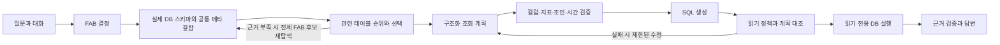

# FAB Text2SQL 고도화 검증 현황

사용자가 변경한 마감인 2026-09-08 01:00 KST에 `fix/adv_t2s`에서 마무리했다. 해커톤 자동 반복은 중지했으며 main에 병합하거나 배포하지 않았다.

공통 메타테이블을 기반으로 실제 FAB 스키마를 확인하고, 질문에 필요한 테이블을 선택한 뒤 SQL 작성 전에 조회 계획을 검증하는 흐름을 구현했다. 논문의 학습 모델 재현이 아니라 MARS-SQL·TriSQL의 구조와 Toss PANDA의 메타데이터 정비 원칙을 응용했다.



## 적용 내용

- `agent_meta.table_catalog`의 32개 논리 정의가 FAB10~13의 78개 물리 테이블을 관리한다. 이름은 `{fab}.<logical_table>_{fab}` 패턴이다.
- 현재 질문의 FAB를 우선하고 컨텍스트와 대화 이력을 보완 근거로 사용한다. 불명확하거나 지원 범위를 벗어난 FAB를 임의로 선택하지 않는다.
- 저장된 메타가 오래됐더라도 현재 DB에 있는 테이블·컬럼이 가용성의 기준이다. 업무 설명·동의어·지표 의미·논리 관계를 결합한다.
- 계획은 테이블, 출력 컬럼, 집계, 그룹, 필터, 조인, 최신 시각과 결과 단위를 명시한다. 생성 SQL은 계획의 실제 구조와 대조한다.
- snapshot WIP/평균/비율 구분, 복합 조인 키, detail 조인 후 snapshot 중복 합산, 변경된 필터·집계식 등을 검사한다.
- 과거 조회 오류가 새 질문에서 가짜 접근 금지 정책으로 이어지는 경로를 수정했다. 실제 오류·빈 결과·미지원 의미는 구분한다.
- 최종 답변에 인용한 실행 SQL의 LIMIT 숫자가 근거 없는 업무 수치로 오인되지 않도록 했다. 실제 화면에서 최신 시각/집계 표현의 검증 충돌도 수정했다.

## 확인한 결과

| 검증 | 결과 | 해석 |
| --- | --- | --- |
| 최종 전체 테스트 | 443 passed | 핵심 변경 파일 Ruff/diff check 통과 |
| 기존 실제 DB 회귀 | 79/79 | 고정 계약 회귀 |
| 개발 의미 회귀 8문항 | 최초 6/8 → 수정 후 8/8 | 같은 개발셋에 대한 회귀이며 일반 정확도 아님 |
| 추가 조인·집계 정렬 2문항 | 2/2 strict 일치 | 구현 후 별도로 작성한 소규모 탐색 질문 |
| 실제 모델+DB 직접 경로 지연 | 4.799~11.130초 | 8문항 측정, UI 전체 응답 지연과 다름 |
| 모델 호출 수 | 7문항 2회, 1문항 4회 | 계획+SQL, 실패 사례는 제한된 재시도 |
| 저장된 실제 SQL 재검증 | 11/11 | 기존·추가·정렬 사례의 저장 SQL, 모델/DB 재호출 없음 |
| 실제 Streamlit 화면 | fab12 최신 WIP 1,183롯 정상 답변 | 시뮬레이션 출처와 snapshot 시각 명시 |
| 실제 DB 보존 감사 | 78개 동일 OID, 행 수 감소 없음 | 전체 내용 체크섬은 아님 |

추가 두 질문의 근거는 `apps/assistant/output/evals/hackathon_additional_probe_v1.json`에 보존했다.

실제 회귀: `apps/assistant/output/evals/hackathon_semantic_regression_v4.json`.
상위 3개 정렬 계약은 실제 모델/DB에서 별도 검증했다. 요청한 area/WIP 값과 순서는 일치했으며, 추가된 interval_end 때문에 원래의 엄격한 컬럼 수 비교는 실패했다. 평가셋에 이 선택적 조회 시각 컬럼만 명시적으로 허용하고 재검증했다. 엄격한 비교 결과와 요청 값 비교 결과를 함께 보존한다. 근거: `hackathon_ranking_contract_live.json`, `hackathon_ranking_contract_revalidated.json`. 이는 평가 계약의 보완이며 전체 8문항의 신규 실측을 뜻하지 않는다.

저장 SQL 검사: `apps/assistant/output/evals/hackathon_final_saved_sql_replay.json`.
최종 테스트 원문과 코드/환경 해시: `hackathon_final_pytest.txt`, `hackathon_validation_manifest.json` (같은 evals 디렉터리).
DB 감사: `apps/assistant/output/evals/hackathon_data_preservation_audit.json`.
세부 변경과 테스트 수: [해커톤 작업 기록](text2sql_hackathon_20260907.md).

## 남은 한계

8문항의 정답 일치만으로 PANDA 수준의 일반 성능을 주장할 수 없다. 업무 전문가가 검토한 독립 질문셋, 지표/용어/관계의 SSOT 승인, 복수 FAB 비교, 복잡한 SQL 표현식·윈도 함수·조인 전 집계의 의미 계약이 추가로 필요하다. 현재 검증기는 지원하지 않는 동등 SQL을 보수적으로 거절할 수 있다.

정렬 방향·동률 기준·상위 N개·OFFSET은 이제 typed plan과 SQL을 대조한다. 출력 컬럼/집계 별칭에 대한 정렬을 지원하며, 임의 표현식 정렬은 별도 계약이 필요하다. 결정론적 경로와 LLM 생성 경로는 완전히 같은 의미 계획 검증을 공유하지 않는다. 일반 DB 실행 오류에서의 자동 수정과 스키마 변경 영향 재검토도 후속 범위다. 토큰 사용량 자체는 측정하지 않았으며 입력 문자 수를 토큰 수라고 보고하지 않는다.

## 재검증

프로젝트 루트에서 기존 환경 설정을 사용한다.

```bash
.venv/bin/pytest apps/assistant/tests -q --disable-warnings
.venv/bin/python apps/assistant/scripts/sync_metadata_catalog.py
.venv/bin/python apps/assistant/scripts/evaluate_text2sql_semantics.py --output apps/assistant/output/evals/semantic_recheck.json
```

메타 동기화는 공통 메타를 갱신하고 업무 데이터는 수정하지 않는다. 마지막 명령은 설정된 외부 LLM과 DB를 실제로 호출하므로 결과가 변했을 때 필요한 검증으로만 사용한다.
